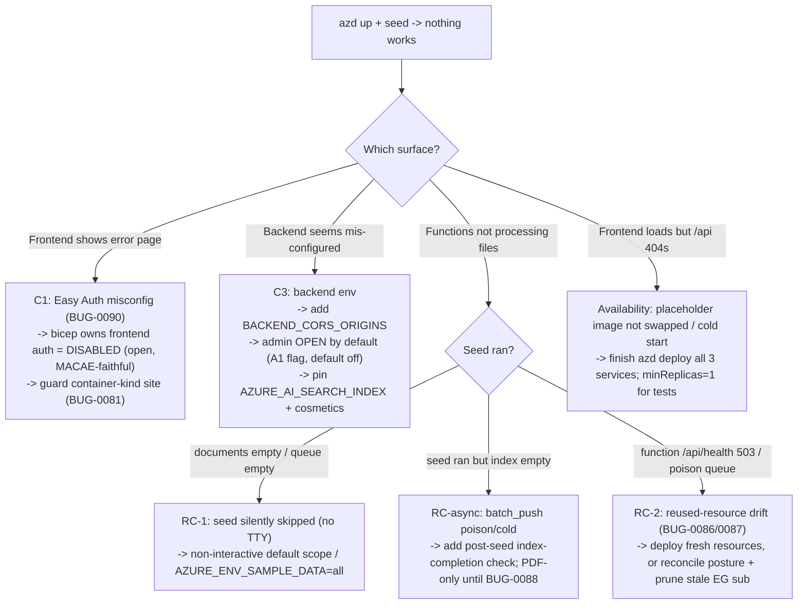

<!-- markdownlint-disable-file -->
# Task Research: CWYD v2 `azd up` end-to-end deployment + frontend/backend communication (vs. MACAE)

CWYD v2 is nearly code-complete but the Azure deployment is broken: after `azd up`, the
frontend and backend cannot communicate, and some configuration appears to be missing. The goal
is a single `azd up` that provisions all infrastructure + configuration, builds and deploys the
frontend, backend, and functions, and yields a working system reachable from the frontend URL.
MACAE (Multi-Agent Custom Automation Engine Solution Accelerator) is the reference architecture
to compare against and port patterns from.

## Task Implementation Requests

* Find the root cause(s) of why CWYD v2 frontend and backend cannot communicate after `azd up`.
* Identify the missing configuration that prevents an end-to-end working deployment.
* Compare CWYD v2's infra + app wiring against MACAE's; enumerate the main differences.
* Determine which MACAE patterns to bring into CWYD v2 so `azd up` deploys all infra, config,
  frontend, backend, and functions, and the system is immediately usable.
* All validation must be against a real cloud deployment (`azd up` to Azure).

## Scope and Success Criteria

* Scope: CWYD v2 (`v2/`) infra (`v2/infra/**`), `v2/azure.yaml`, container apps wiring, env-var
  injection, ingress/CORS, frontend API client (`/config` + `VITE_BACKEND_URL`), backend CORS +
  settings, admin auth gate, functions deploy, and the MACAE reference pattern. Excludes v1.
* Assumptions:
  * `azd up` is the only supported deploy path for v2 (no ARM "Deploy to Azure" button).
  * Managed identity + RBAC + no Key Vault for app secrets (Hard Rule #7).
  * Backend headless; frontend learns the backend URL at runtime via `/config` (`BACKEND_API_URL`).
  * Code defaults are dev/local; prod is flipped only by IaC-set env vars (user memory:
    config-defaults-dev-first).
* Success Criteria:
  * Root cause(s) of the communication failure identified with file + line evidence. ✅
  * The missing configuration enumerated with file + line references. ✅
  * A concrete, MACAE-aligned change set that makes `azd up` work end-to-end, respecting CWYD v2
    conventions (registry, pillars, naming, no banned tech). ✅ (selected approach below)
  * One recommended approach selected with rationale; alternatives retained. ✅

## CRITICAL CAVEAT — the MACAE reference source is NOT on disk

The user named `c:\workstation\Microsoft\github\cwyd-cdb\data\sample_code\macae` as "the latest
valid branch." **That folder does not exist in the working tree right now.** `list_dir` on
`data/sample_code/` returns only `prototypes-main/` and
`python_agent_framework_dev_template-main/`. It was scrubbed (per the 2026-06-25 reference-removal
tracking) and is gitignored, so it is not even re-clonable as tracked content. All MACAE findings
in this document are reconstructed from two high-fidelity sources that agree on every mechanism:

1. Prior local subagent research captured on 2026-06-25 while the clone existed (exact MACAE file
   paths + line numbers): see `.copilot-tracking/research/subagents/2026-06-25/macae-*.md` and
   `.copilot-tracking/research/2026-06-25/macae-infra-parity-research.md`.
2. The public MACAE GitHub `main` branch (the sanctioned read-only pattern source named in
   `.github/copilot-instructions.md`), fetched 2026-06-28.

One single MACAE expression (`var frontendAppUrl = …`) was never captured verbatim and is flagged
as an inference where it appears. **Action item for the user:** if byte-exact MACAE line numbers
matter for the port, re-clone MACAE into an untracked scratch dir. Nothing in the recommended fix
set depends on the unconfirmed line.

## Confirmed scope + user decisions (2026-06-28, round 2)

The user clarified the failure is NOT just a CORS/comms edge — it is the whole `azd up → seed →
usable` flow failing across all three services. Verbatim symptoms:

> "we do azd up and the frontend is not deployed, shows error page, backend seems missing
> variables, and functions are not processing the files. So, we do azd up and we do after-deploy
> script to load data and that should have a fully functional site ready to use. But, nothing is
> working and then we need to dig what is happening."

Confirmed decisions:

* **Mirror MACAE's DEFAULT `azd up` configuration** — public profile, `enablePrivateNetworking=false`.
  ("we should do the same that MACAE does when azd up, default configuration".) → **RC-3
  (private-networking reverse proxy) is OUT of scope for the default fix.**
* **Admin/ingest surface OPEN by default (MACAE-faithful, `AUTH_ENABLED=false` equivalent).** This
  single decision resolves BOTH the frontend error page (remove Easy Auth) AND the backend admin
  401 (relax the fail-closed gate). → **Selected RC-1 sub-option is A1, not A2.**

The three symptoms map to three independent root-cause clusters, each verified by a dedicated
subagent (reports listed under "Subagent reports" below):

| Symptom (user words) | Cluster | Primary root cause | Confidence |
|---|---|---|---|
| "frontend not deployed, shows error page" | **C1 Frontend** | Easy Auth enabled in the live env but its Entra identity provider reads back **unconfigured** (empty `clientId`/issuer) → every visit `302`-redirects into a broken Entra login → error page. Easy Auth is **not in `main.bicep`**, so it's an env-state leftover `azd up` never reconciles. (BUG-0090.) Secondary: container-`kind` site ignoring the code deploy (BUG-0081). | High |
| "functions are not processing the files" | **C2 Functions** | The post-deploy seed is **silently skipped** under `azd up` (no TTY + no `AZURE_ENV_SAMPLE_DATA` override → `input()` EOF → swallowed by `continueOnError: true`) → 0 blobs, 0 queue messages. Compounded by **reused-resource network drift** (BUG-0086 reused storage `publicNetworkAccess=Disabled` blocks the non-VNet Flex host → `503`; BUG-0087 stale v1 Event Grid subscription poisons `doc-processing`) and the **async-index silent-empty** risk (seed reports success while `batch_push` poisons every message). | High |
| "backend seems missing variables" | **C3 Backend env** | The only functionally-missing var is **`BACKEND_CORS_ORIGINS`** (never set in `v2/infra/**`). Plus `AZURE_AI_SEARCH_INDEX` works only by default-coincidence, and an admin-display cluster (`AZURE_SOLUTION_SUFFIX`, `AZURE_RESOURCE_GROUP`, `AZURE_LOCATION`, …) reads empty in the cloud and makes `GET /api/admin/status` *look* half-configured. **No required var is missing — the backend boots cleanly.** | High |

Key reframing vs. the original (round-1) research: the frontend "error page" is an **Easy Auth
misconfiguration**, not a deploy-mechanism failure — and the open-by-default decision fixes it the
MACAE way. The functions failure is dominated by the **silently-skipped seed**, not trigger/RBAC
wiring (all correctly configured). The backend "missing variables" reduces to **CORS + cosmetics**.

## Outline

1. Deployment topology — CWYD v2 vs MACAE (both: App Service frontend + Container App backend). ✅
2. The frontend→backend URL handshake (runtime `/config`) — CWYD matches MACAE. ✅
3. **C1 Frontend** — error page = Easy Auth misconfig (BUG-0090), not a deploy failure; open-by-
   default fix (MACAE `AUTH_ENABLED=false` equivalent). Secondary container-`kind` (BUG-0081).
4. **C2 Functions** — not ingesting: seed silently skipped under `azd up` (RC-1) + reused-resource
   drift (RC-2/BUG-0086/0087) + async-index silent-empty (RC-async); triggers/RBAC are correct.
5. **C3 Backend env** — "missing variables" = `BACKEND_CORS_ORIGINS` (only functional gap) + admin
   open-by-default (A1) + cosmetic display cluster; backend boots cleanly.
6. The backend→frontend CORS edge — deterministic, cycle-free `BACKEND_CORS_ORIGINS` literal.
7. Backend availability — placeholder image / scale-to-zero cold start.
8. Private-networking reverse proxy (`PROXY_API_REQUESTS`) — **deferred, out of scope** per the
   user's MACAE-default decision; documented as the future private-mode path only.
9. The default-`azd up` symptom→fix decision tree (C1/C2/C3).
10. Selected approach: MACAE-parity end-to-end `azd up`, decisions resolved (open by default).

## Potential Next Research

* Live diagnosis against the user's `azd` environment (read-only): `azd env get-values`, the active
  parameters file (confirm `enablePrivateNetworking=false`), `GET <frontend>/config`,
  `GET <backend>/api/health`, `GET <function>/api/health`, `documents` blob count + `doc-processing`
  queue depth, the frontend `az webapp auth show` / `--query kind`, and the browser devtools error
  class. This picks the exact decision-tree node (C1 auth wall vs C2 seed-skip/503 vs availability).
  * Reasoning: the research narrows the cause to a small decision tree; the live state picks the
    exact node. This is the decisive next step and matches the user's "deploy to cloud and test."
  * Reference: `cwyd-v2-frontend-deploy.md`, `cwyd-v2-functions-ingestion.md` (confirmation recipes).
* Planner-only structural choices (Hard Rule #10), now NARROWED (auth model already settled as A1):
  * The exact mechanism to clear stale Easy Auth — explicit disabled `authSettingV2Configuration` in
    bicep vs a postprovision `az webapp auth update --enabled false` reconcile.
  * Whether to validate against **fresh** data resources (preferred — v2 Bicep owns full posture) vs
    add the reused-resource self-heal to `post_provision.py` (only if reuse is mandatory).
  * Reference: §C1/§C2 of this doc + `cwyd-v2-azd-flow-seeding.md` §9.

## Research Executed

### File Analysis

* `v2/azure.yaml` — three services: `backend` (`host: containerapp`, `Dockerfile.backend`,
  `remoteBuild: true`), `frontend` (`host: appservice`, build-from-source, `dist: ./build-output`,
  prepackage hook), `function` (`host: function`, `project ./build-functions`). Matches MACAE's
  mixed-hosting `azure_custom.yaml` (App Service frontend, Container App backend).
* `v2/infra/main.bicep`:
  * Backend Container App `module backendContainerApp` ~L1742; name `ca-backend-${solutionSuffix}`
    L1585; ingress L1770-1779 (`ingressTargetPort: 8000`, `ingressExternal: !enablePrivateNetworking`,
    `ingressAllowInsecure: false`, `ingressTransport: 'auto'`); **no `corsPolicy`**.
  * Backend env array L1820-1916: identity, endpoints, DB routing, storage — **no
    `BACKEND_CORS_ORIGINS`**; `AZURE_ENVIRONMENT=production` hard-pinned L1845.
  * Frontend App Service `module frontendWebApp` ~L1962; name `app-frontend-${solutionSuffix}`
    L1939; `linuxFxVersion: 'PYTHON|3.11'`; `appCommandLine: uvicorn frontend_app:app … --port 8000`
    L1994; `BACKEND_API_URL = 'https://${backendContainerApp.outputs.fqdn}'` L2009-2012;
    `SCM_DO_BUILD_DURING_DEPLOYMENT=true` L2021.
  * Function App (Flex Consumption FC1) ~L2102; `AZURE_ENVIRONMENT=production` L2186.
  * Outputs: `AZURE_BACKEND_URL` L2581; `AZURE_FRONTEND_URL` L2583-2584 with the description
    "Backend CORS must allow this origin" — **emitted as output only, never fed into backend env**.
  * Feature-flag defaults: `enableMonitoring=true` L215, `enableScalability=false` L218,
    `enableRedundancy=false` L221, `enablePrivateNetworking=false` L224.
  * Placeholder backend image `mcr.microsoft.com/k8se/quickstart:latest` L1801-1803 on first deploy.
  * No `authsettingsV2`/`identityProviders`/Easy Auth on frontend or backend (only Postgres
    `authConfig` L1503).
* `v2/src/frontend/frontend_app.py` (66 lines) — defines exactly `GET /config`
  (`FrontendConfig(backend_url=os.environ["BACKEND_API_URL"])`) and `GET /{full_path:path}` SPA
  catch-all. **No `/api/{path}` reverse proxy, no `PROXY_API_REQUESTS` flag.**
* `v2/src/frontend/src/api/runtimeConfig.tsx` — `getBackendUrl()` returns cached `/config` value,
  else build-time `import.meta.env.VITE_BACKEND_URL` (empty in the App Service build).
* `v2/src/frontend/src/api/auth.tsx` — `userIdHeaders()` sends `x-ms-client-principal-id` =
  `getUserId()`, default `DEFAULT_USER_ID = 00000000-0000-0000-0000-000000000000` when `/.auth/me`
  is null; `streamChat.tsx` L246 spreads it onto `POST /api/conversation`.
* `v2/src/backend/app.py` L241-263 — `origins = list(network.cors_origins) or ["*"]`;
  `allow_credentials = origins != ["*"]`; `CORSMiddleware(allow_origins=origins, …)`.
* `v2/src/backend/core/settings.py` — `NetworkSettings.cors_origins` reads `BACKEND_CORS_ORIGINS`
  L317-320; `Environment.LOCAL` default L534 (enum L41-52).
* `v2/src/backend/dependencies.py` — `requires_role` L425-486 raises 401 when claims blob absent and
  `environment != LOCAL` (L450-457); `REQUIRE_ADMIN_USER` L494 gates only `routers/admin.py`;
  `get_user_id` L346-378 also fails closed in prod but is satisfied by the SPA's self-supplied id.

### Code Search Results

* `BACKEND_CORS_ORIGINS` → only `v2/.env`, `v2/.env.sample`, `v2/docs/**`, `v2/tests/**`; **zero
  matches in `v2/infra/**`**. The backend env var is never set by infra.
* `corsPolicy|allowedOrigins|ingressCorsPolicy` over `v2/infra/main.bicep` → no matches (only a
  storage-account `corsRules` type schema in compiled `main.json`, and the output-comment string).
* `PROXY_API_REQUESTS|proxy` over `v2/src/frontend/**` → only doc-comment / Vite-dev-proxy uses; no
  runtime reverse proxy.
* `authsettingsV2|authConfig|identityProviders|easyAuth|x-ms-client-principal` over `v2/infra/**` →
  only Postgres/ACR module `authConfig`; no app Easy Auth.
* `REQUIRE_ADMIN_USER|requires_role|AdminUserIdDep` over `v2/src/backend/**` → consumed only by
  `routers/admin.py`; `/api/conversation` is identity-gated (`UserIdDep`) but not role-gated.

### External Research

* MACAE public GitHub `main` (`microsoft/Multi-Agent-Custom-Automation-Engine-Solution-Accelerator`):
  `src/App/frontend_server.py` `/config` runtime endpoint; `PROXY_API_REQUESTS` two-mode design;
  `src/backend/app.py` FastAPI `allow_origins=["*"]`; backend Container App ingress
  `corsPolicy.allowedOrigins = [https://<webSiteResourceName>.azurewebsites.net]`;
  `FRONTEND_SITE_NAME` backend env. Sources captured in the subagent reports below.

### Project Conventions

* Standards referenced: `.github/copilot-instructions.md` (Hard Rules #4 registry, #7 no-banned-tech /
  no Key Vault, #10 ask-before-structure, #11/#16/#18 naming + no env-specific content), and the
  `v2-infra` / `v2-backend` / `v2-frontend` / `v2-functions` instruction files.
* User memory followed: `config-defaults-dev-first` (do NOT invert the code default to production;
  flip via IaC env var — already done in bicep), `azure-env-ids-never-commit` (placeholders only).

### Subagent reports (full detail)

Round 1 (comms layer):

* `.copilot-tracking/research/subagents/2026-06-28/cwyd-v2-infra.md` (incl. §12 default-path verify).
* `.copilot-tracking/research/subagents/2026-06-28/cwyd-v2-app-config.md`.
* `.copilot-tracking/research/subagents/2026-06-28/macae-infra.md`.
* `.copilot-tracking/research/subagents/2026-06-28/macae-app-config.md`.

Round 2 (full azd-up failure map — C1/C2/C3):

* `.copilot-tracking/research/subagents/2026-06-28/cwyd-v2-frontend-deploy.md` — C1: frontend
  error page = Easy Auth misconfig (BUG-0090); deploy mechanism is correct + MACAE-aligned.
* `.copilot-tracking/research/subagents/2026-06-28/cwyd-v2-functions-ingestion.md` — C2: seed
  silently skipped (RC-1) + reused-resource drift (RC-2/BUG-0086/0087); triggers/RBAC are correct.
* `.copilot-tracking/research/subagents/2026-06-28/cwyd-v2-azd-flow-seeding.md` — the full
  `azd up → postprovision → deploy → postdeploy seed` lifecycle, hooks, and MACAE divergence.
* `.copilot-tracking/research/subagents/2026-06-28/cwyd-v2-backend-env-diff.md` — C3: complete
  reads-vs-sets env diff; only `BACKEND_CORS_ORIGINS` is functionally missing.

## Key Discoveries

### Project Structure — CWYD v2 already mirrors MACAE's hosting model

Both use **App Service for the frontend** (build-from-source Python/uvicorn) and **Container App for
the backend**. This is deliberate: App Service hostnames are deterministic
(`<site>.azurewebsites.net`), which is what lets the backend learn the frontend origin without a
module-output cycle. CWYD adopted this split (bicep comments cite "the reference architecture" =
MACAE). So the topology is correct — the failures are in the wiring *between* the apps, not the
hosting choice.

### Implementation Patterns — what matches, what is missing

| Concern | MACAE | CWYD v2 | Status |
|---|---|---|---|
| Frontend host | App Service (uvicorn `frontend_server.py`) | App Service (uvicorn `frontend_app.py`) | ✅ match |
| Backend host | Container App, port 8000 | Container App, port 8000 | ✅ match |
| Frontend→backend URL | runtime `/config` ← `BACKEND_API_URL` app setting | runtime `/config` ← `BACKEND_API_URL` app setting | ✅ match |
| Build-time bake of URL | none (only localhost fallback) | none (only empty `VITE_BACKEND_URL` fallback) | ✅ match |
| Backend ingress CORS | `corsPolicy.allowedOrigins = [frontend FQDN]` | **none** | ❌ **gap** |
| Backend CORS env | `FRONTEND_SITE_NAME` (read; wildcard backstop) | `BACKEND_CORS_ORIGINS` (**never set by infra**) | ❌ **gap** |
| Circular FQDN break | deterministic `https://app-${suffix}.azurewebsites.net` | frontend origin emitted as **output only**, not injected | ❌ **gap** |
| Admin/ingest auth | `AUTH_ENABLED=false` → no fail-closed gate | `AZURE_ENVIRONMENT=production` → `requires_role` **fails closed 401**, no Easy Auth | ❌ **gap (certain blocker)** |
| Private-networking mode | `PROXY_API_REQUESTS=true` → same-origin reverse proxy in frontend server | `frontend_app.py` has **no reverse proxy** | ❌ **gap (fires only if private)** |
| Default `enablePrivateNetworking` | (mode toggled by flag) | `false` → backend **external**, browser-reachable | ✅ default OK |
| Managed identity + RBAC, no Key Vault | yes | yes | ✅ match |
| Data seeding | manual post-deploy script | (out of scope here) | — |

### The four concrete gaps (missing configuration)

1. **RC-1 — Admin surface fails closed (CERTAIN for `/api/admin/*`).** Backend is pinned
   `AZURE_ENVIRONMENT=production` (`main.bicep` L1845, correct per config-defaults-dev-first), so
   `requires_role("admin")` (`dependencies.py` L450-457) demands the Easy Auth `x-ms-client-principal`
   *claims blob*. No `authsettingsV2`/identity provider is attached to either app
   (`main.bicep` — confirmed absent), so nothing injects that header → every admin/upload/ingest
   call returns **401**. The SPA's self-supplied `x-ms-client-principal-id` clears the *chat*
   identity gate but cannot satisfy the *admin role* gate (which needs the claims blob). MACAE
   sidesteps this entirely by shipping `AUTH_ENABLED=false`.

2. **RC-2 — Backend CORS never wired (latent in default, breaks under credentialed/private).**
   `BACKEND_CORS_ORIGINS` is never set in `v2/infra/**`, and the backend ingress has no `corsPolicy`.
   The backend falls back to `allow_origins=["*"], allow_credentials=False`. The current SPA sends
   **non-credentialed** fetches, so the wildcard *does* admit them — meaning CORS is **not** the hard
   blocker in the default profile, but it is the literal "missing configuration" the infra author
   flagged (output comment L2583) and it breaks the moment the deployment is private, credentialed,
   or origin-restricted. The MACAE-faithful fix is deterministic and cycle-free.

3. **RC-3 — Private networking dead-ends the browser (fires ONLY if `enablePrivateNetworking=true`).**
   Then backend ingress is internal-only, the SPA's `/config` returns the internal CAE FQDN the
   browser cannot reach, and `frontend_app.py` has no reverse proxy (unlike MACAE's
   `PROXY_API_REQUESTS=true`). Total comms failure for chat *and* admin. Default is `false`, so this
   only fires if a WAF/private parameters file was used.

4. **Availability — placeholder image / cold start (the most likely cause if EVEN CHAT fails on a
   default deploy).** First `azd up` boots the backend on `mcr.microsoft.com/k8se/quickstart:latest`
   (`main.bicep` L1801-1803); only the subsequent `azd deploy backend` swaps in the real image. If
   that step has not completed or failed, `/api/*` 404s. `enableScalability=false` →
   `minReplicas: 0`, so the first request after idle pays a cold start that can read as "can't
   communicate."

### Full azd-up failure map (C1 / C2 / C3) — round-2 detail

This is the decisive, symptom-aligned layer added in round 2. It supersedes the round-1 framing
that treated the failure as purely a comms edge.

#### C1 — Frontend shows an error page (Easy Auth misconfig, not a deploy failure)

The frontend deploy pipeline is **correct and MACAE-aligned** — the SPA builds (`tsc --noEmit`
exit 0), the staged layout / served dir / start command all line up
(`build-output/dist/` == `dist: ./build-output` == `frontend_app.py` served dir ==
`uvicorn frontend_app:app`), and the frontend was verified live-working on 2026-06-25
(`HTTP 302` → Entra login = app up). The staged-dir-vs-dist mismatch hypothesis is **disproved**.

* **PRIMARY (BUG-0090, open):** the live frontend App Service has **Easy Auth enabled with an Entra
  identity provider that reads back unconfigured** (empty `clientId`/issuer), so every visit
  `302`-redirects into a broken Entra login → error page. **Easy Auth is not wired in `main.bicep`**
  (the `frontendWebApp` module has no `authSettingV2Configuration`), so it is an env-state leftover
  that `azd up` never reconciles away. MACAE avoids this entirely by running the frontend with
  `AUTH_ENABLED=false` and **no Easy Auth** — the SPA loads directly. This is the decisive
  divergence and exactly what the open-by-default decision fixes.
* **SECONDARY (BUG-0081, open):** if the live `app-frontend-<SUFFIX>` was first created as
  `kind: 'app,linux,container'`, the bicep `kind: 'app,linux'` may not flip in place (site `kind`
  is effectively immutable) → a container-kind site that ignores the code deploy and serves the App
  Service placeholder page (a *different* page than the Easy Auth redirect — use that to tell them
  apart). Disambiguate with `az webapp show -g <RESOURCE_GROUP> -n app-frontend-<SUFFIX> --query kind`.
* **Parity hardening (not the root cause):** add `WEBSITES_PORT=8000` + `ENABLE_ORYX_BUILD=True`
  to the frontend App Service to harden the build-from-source path.

#### C2 — Functions are not processing files (seed skipped + reused-resource drift)

Two independent high-confidence causes, both of which `azd up` reports as **success**. Notably the
trigger env vars, `host.json` `messageEncoding=none`, the UAMI role set, and the Event Grid
subscription are all **present and correct** — the operator's suspicions about missing
triggers/RBAC/event-source/wrong-container are all **refuted**.

* **RC-1 — the post-deploy seed is SILENTLY SKIPPED under `azd up` (most probable cause of an empty
  site).** `upload_sample_data.py` resolves scope as `--set` → `AZURE_ENV_SAMPLE_DATA` env →
  interactive `input()` menu → **skip**. Under `azd up` there is no TTY and no override, so it
  returns `SeedScope.SKIP` and exits `0`; the `postdeploy` hook is `continueOnError: true`, so the
  skip is invisible. **No blobs uploaded, nothing enqueued → the function has nothing to process.**
  Confirmed in `v2/docs/worklog/2026-06-25.md` Gotcha 2. The supported unattended path today is
  `azd env set AZURE_ENV_SAMPLE_DATA all` (or `--set all`) before deploy.
* **RC-2 — reused-resource network/topology drift (this env reuses pre-existing data resources).**
  The v2 Bicep guards every storage/cosmos module `if (!useExisting*)`, so it never manages a reused
  account's network posture. A reused storage account left `publicNetworkAccess=Disabled` from a
  prior life is unreachable by the non-VNet (`enablePrivateNetworking=false`) Flex host → host `503`,
  `azd deploy function` package upload refused `403` (BUG-0086). A leftover **v1 Event Grid
  subscription** also dumps raw `BlobCreated` envelopes onto `doc-processing` → poison (BUG-0087).
* **RC-async — silent empty index even when the seed DOES run.** CWYD's seed is **asynchronous**:
  it only uploads blobs + enqueues `doc-processing` messages; the parse→chunk→embed→index work is
  the `batch_push` queue-trigger's job. If `batch_push` is broken/cold/poisoning, the seed reports
  success while **the index stays empty**. (This is the core divergence from MACAE, whose
  `index_datasets.py` builds the index **synchronously in-script** with no function in the loop.)
  Live caveat: `.docx` ingestion still fails (BUG-0088, open) and observability is effectively off
  (BUG-0055/0089), so a `.docx` in the seed corpus (e.g. `MSFT_FY23Q4_10K.docx`) silently fails;
  PDFs are the guaranteed-happy path.

Fastest confirmation: (a) `documents` blob count + `doc-processing` queue depth right after deploy
— both empty ⇒ RC-1; (b) `GET <function>/api/health` — `503` ⇒ RC-2; (c) `doc-processing-poison`
depth > 0 with raw `BlobCreated` envelopes ⇒ RC-2's stray v1 EG subscription (BUG-0087) or `.docx`.

#### C3 — Backend "seems missing variables" (CORS + cosmetics; boots fine)

Complete reads-vs-sets diff (every `BaseSettings` field vs the backend Container App `env` array):

* **MISSING & REQUIRED:** none. Every field has a safe default; the only boot validator
  (`DatabaseSettings._enforce_mode_consistency`) is satisfied. `AppSettings()` constructs cleanly —
  **the backend is not failing to boot.**
* **MISSING & OPTIONAL, functional:** **`BACKEND_CORS_ORIGINS`** (the one true gap; empty → wildcard
  CORS + credentials-off; surfaces as `cors_origins: []` in `GET /api/admin/status`). Plus
  **`AZURE_AI_SEARCH_INDEX`** — works *only* because the settings default `cwyd-index` happens to
  equal the provisioned index name (fragile: one infra rename from silently breaking retrieval).
* **MISSING & OPTIONAL, cosmetic** (read empty in cloud, make config *look* half-configured — the
  likely source of the "seems missing" impression, but no functional impact):
  `AZURE_SOLUTION_SUFFIX`, `AZURE_RESOURCE_GROUP`, `AZURE_LOCATION`, `AZURE_AI_SERVICE_LOCATION`,
  `AZURE_UAMI_PRINCIPAL_ID`, `AZURE_UAMI_RESOURCE_ID`, `AZURE_COSMOS_ACCOUNT_NAME`,
  `AZURE_FUNCTION_APP_NAME`, `AZURE_BACKEND_URL`, `AZURE_FRONTEND_URL`.
* **SET-BUT-UNREAD (harmless):** `AZURE_OPENAI_ENDPOINT` (no matching field — the OpenAI base URL is
  derived from `AZURE_AI_SERVICES_ENDPOINT + /openai/v1`); `AZURE_CLIENT_ID` (consumed directly by
  the Azure SDK credential to pin the UAMI — intended).
* **All load-bearing values cross-checked green:** Foundry/OpenAI endpoint + deployments, Search
  endpoint + `AZURE_INDEX_STORE`, Cosmos/Postgres endpoints, Storage account/container/queue,
  `CWYD_ORCHESTRATOR_NAME`, and identity vars are all set in bicep AND read under the same name. The
  backend can reach every data store.

### Complete Examples — the MACAE patterns to port

**(A) Backend learns the frontend origin via deterministic construction (no cycle) — MACAE backend
Container App env:**

```bicep
// MACAE infra/bicep/main.bicep (backend env array)
{ name: 'FRONTEND_SITE_NAME', value: frontendAppUrl }   // frontendAppUrl ≈ 'https://app-${solutionSuffix}.azurewebsites.net'
```

CWYD already names the frontend `frontendAppName = 'app-frontend-${solutionSuffix}'`
(`v2/infra/main.bicep` L1939), so the cycle-free literal to inject into the backend is
`'https://app-frontend-${solutionSuffix}.azurewebsites.net'` — settable as `BACKEND_CORS_ORIGINS`
on the backend Container App env and/or as the ingress `corsPolicy.allowedOrigins`.

**(B) MACAE's real public-mode CORS gate is the Container Apps ingress policy (FastAPI wildcard is a
backstop):**

```bicep
// MACAE backend Container App ingress (GitHub main)
ingressTargetPort: 8000
ingressExternal: true
corsPolicy: {
  allowedOrigins: [ 'https://${webSiteResourceName}.azurewebsites.net' ]
  allowedMethods: ['GET','POST','PUT','DELETE','OPTIONS']
}
```

**(C) MACAE's two-mode frontend server (`PROXY_API_REQUESTS` flips cross-origin ↔ same-origin
proxy):**

```py
# MACAE src/App/frontend_server.py /config + conditional reverse proxy
@app.get("/config")
async def get_config():
    if PROXY_API_REQUESTS:            # private/WAF: same-origin
        api_url = "/api"
    else:                            # public default: cross-origin to backend FQDN
        api_url = os.getenv("BACKEND_API_URL", "http://localhost:8000") + "/api"
    return {"API_URL": api_url, "ENABLE_AUTH": os.getenv("AUTH_ENABLED", "false")}

if PROXY_API_REQUESTS:               # routes mounted ONLY in proxy mode
    @app.api_route("/api/{path:path}", methods=["GET","POST","PUT","DELETE","PATCH"])
    async def proxy_api(request, path): ...   # httpx forward to private backend over VNet
    @app.websocket("/api/{path:path}")
    async def proxy_websocket(websocket, path): ...
```

### API and Schema Documentation

* Frontend `/config` wire shape: CWYD returns `{"backendUrl": <BACKEND_API_URL>}`; MACAE returns
  `{"API_URL": <BACKEND_API_URL>+"/api", "ENABLE_AUTH": …}`. (Different field names; both runtime.)
* Backend routers (CWYD): `/api` (health, conversation, files), `/api/admin`, `/api/history`,
  `/api/speech`. No FastAPI `root_path`. Frontend composes `${getBackendUrl()}/api/...` — paths
  align; the only failure mode is origin (empty backend URL → SPA catch-all returns HTML → JSON
  parse throws).

### Configuration Examples — env-var mismatch (expects vs provides), CWYD

```text
Backend reads BACKEND_CORS_ORIGINS  →  infra sets: (nothing)            ❌ RC-2
Admin gate needs x-ms-client-principal (Easy Auth) → infra: no authConfig ❌ RC-1
Frontend reads BACKEND_API_URL      →  infra sets: backend FQDN          ✅
Backend AZURE_ENVIRONMENT           →  infra sets: 'production'          ✅ (correct; needs RC-1 fix to be usable)
```

## Technical Scenarios

### Scenario: make a default `azd up` (+ seed) yield a fully usable CWYD v2 — full MACAE-parity flow

CWYD v2's hosting topology and the frontend→backend runtime-`/config` handshake already match MACAE.
The deployment is broken across **three independent clusters** (C1 frontend / C2 functions / C3
backend env) plus a deploy-availability nuance. With the user's two decisions locked in
(**mirror MACAE's default public profile**, **admin open by default**), the selected approach closes
every cluster so a default `azd up` followed by the seed yields a working site — no private-
networking work required.

**Requirements:**

* Default `azd up` (no WAF/private flags) + the post-deploy seed must yield: frontend loads (no auth
  wall), chat works, admin/upload works, functions ingest the seeded docs — reachable from the
  frontend URL.
* No Key Vault; managed identity + RBAC; deterministic, cycle-free bicep; dev/local code defaults
  with prod flipped by IaC env vars (do NOT invert the `Environment.LOCAL` default — user memory
  config-defaults-dev-first); no banned tech; no new top-level structure without user sign-off
  (Hard Rule #10).

**Preferred Approach — "MACAE-parity end-to-end `azd up`" (recommended).** Ordered by symptom; each
step is independently shippable as a one-unit-per-turn change in the downstream implementer phase.

1. **C1 — Frontend loads (open by default, MACAE `AUTH_ENABLED=false` equivalent).** The error page
   is Easy Auth (BUG-0090), not a deploy failure. Make the deployed frontend serve the SPA directly:
   * Ensure `azd up` reconciles Easy Auth **off** on the frontend App Service. Because Easy Auth is
     not in `main.bicep` today, the leftover live config is never cleared — the fix is to make bicep
     explicitly own the frontend auth state as disabled (an `authSettingV2Configuration` with
     `globalValidation.requireAuthentication: false` / unauthenticated action `AllowAnonymous`), so a
     reprovision deterministically clears the stale provider. (This is the MACAE-faithful, open-by-
     default posture the user chose.)
     -> The actual mechanism (explicit disabled `authSettingV2Configuration` vs an `az webapp auth
     update --enabled false` postprovision reconcile) is an infra-design choice to settle in the
     planner; both achieve "no auth wall."
   * Disambiguate / guard BUG-0081: confirm the live site `kind` is `app,linux` (not container); if a
     container-kind site exists, it must be recreated (kind is immutable) so the code deploy lands.
   * Parity hardening: add `WEBSITES_PORT=8000` + `ENABLE_ORYX_BUILD=True` to the frontend App
     Service env.
2. **C3 — Backend has its variables (CORS + admin-open + cosmetics).**
   * **`BACKEND_CORS_ORIGINS` (functional, #1):** add the deterministic, cycle-free literal
     `'https://app-frontend-${solutionSuffix}.azurewebsites.net'` to the backend Container App env
     (and/or the ingress `corsPolicy.allowedOrigins`, MACAE pattern B). No module-output reference →
     no cycle.
   * **Admin open by default (A1, the chosen RC-1 model):** relax the admin fail-closed gate so it
     only fails closed when an auth provider is actually configured — gate the fail-closed behavior
     on an explicit `AZURE_REQUIRE_ADMIN_AUTH`-style flag that bicep leaves **off** by default. Keep
     the code default `local` (do not invert). This makes admin/upload usable without Easy Auth,
     matching MACAE.
   * **Defensive pin:** add `AZURE_AI_SEARCH_INDEX = 'cwyd-index'` so a future index rename can't
     silently break retrieval.
   * **Cosmetic completeness (optional):** add the admin-display cluster
     (`AZURE_SOLUTION_SUFFIX`, `AZURE_RESOURCE_GROUP`, `AZURE_LOCATION`, `AZURE_AI_SERVICE_LOCATION`,
     …) so `GET /api/admin/status` stops *looking* half-configured.
3. **C2 — Functions actually ingest the seeded files.**
   * **Make the seed run unattended (RC-1, the dominant cause):** a bare `azd up` must seed without a
     TTY. Either set a non-interactive default scope (default `all`, drop the `interactive` menu
     dependence) or have `azure.yaml` / the env set `AZURE_ENV_SAMPLE_DATA=all` so the `postdeploy`
     hook seeds deterministically instead of silently skipping. (Match MACAE's "seed leaves a
     populated site" intent.)
   * **Make the seed fail loudly on an empty index (RC-async):** because CWYD seeds asynchronously
     via `batch_push`, add a post-seed completion check (poll the index / `list_sources`) so a
     poisoned/cold pipeline surfaces instead of reporting false success. (MACAE indexes synchronously
     in-script; CWYD's async path needs the verify step to be equally trustworthy.)
   * **Reused-resource self-heal (RC-2, cloud-only):** if the target env reuses pre-existing data
     resources, reconcile their network posture (so the non-VNet Flex host can reach storage) and
     prune the stale v1 Event Grid subscription (BUG-0086/0087). The cleanest path for the user's
     "mirror MACAE default" goal is to **deploy against fresh resources** (no reuse) so the v2 Bicep
     owns the full posture; the self-heal is only needed when reuse is mandatory.
   * **`.docx` caveat (BUG-0088, open):** scope the default seed to PDFs until the `.docx` parser is
     fixed, or fix the parser — otherwise a `.docx` in the corpus silently poisons.
4. **Availability + ordering.** Ensure `azd up` provisions then deploys all three services so the
   real backend image replaces the placeholder (`mcr.microsoft.com/k8se/quickstart:latest`); the seed
   `postdeploy` already runs after all deploys. For test runs, consider `minReplicas: 1` to avoid
   cold-start false negatives. Private networking stays **off** (user's MACAE-default decision), so
   RC-3 (the `PROXY_API_REQUESTS` reverse proxy) is **not** implemented now — keep it documented as
   the future private-mode path only.

```text
v2/infra/main.bicep
  frontendWebApp:              + explicit disabled authSettingV2Configuration (clear stale Easy Auth)  [C1]
  frontendWebApp appSettings:  + WEBSITES_PORT=8000, ENABLE_ORYX_BUILD=True                            [C1 hardening]
  backendContainerApp env:     + BACKEND_CORS_ORIGINS (deterministic frontend origin)                  [C3]
                               + AZURE_AI_SEARCH_INDEX='cwyd-index' (defensive pin)                    [C3]
                               + admin-display cluster (optional, cosmetic)                            [C3]
                               + AZURE_REQUIRE_ADMIN_AUTH=false (or omit; default off)                 [C3/A1]
  backendContainerApp ingress: + corsPolicy.allowedOrigins (optional, MACAE-style)                     [C3]
v2/src/backend/dependencies.py
  admin fail-closed gated on explicit require-admin-auth flag, default OFF                             [C3/A1]
v2/azure.yaml  (or env)
  postdeploy seed: non-interactive default scope / AZURE_ENV_SAMPLE_DATA=all                           [C2 RC-1]
v2/scripts/upload_sample_data.py
  + post-seed index-completion check (fail loudly on empty index); PDF-only default until BUG-0088    [C2 RC-async/.docx]
v2/scripts/post_provision.py  (only if reuse is mandatory)
  + reconcile reused-resource network posture + prune stale v1 EG subscription                         [C2 RC-2]
(NOT NOW) v2/src/frontend/frontend_app.py
  PROXY_API_REQUESTS reverse proxy — deferred; private-mode only, out of scope per user decision        [RC-3]
```



**Implementation Details:**

* Every bicep edit is deterministic (string literals from `solutionSuffix`), avoiding the
  frontend↔backend module-output cycle that blocked the original author (who left the frontend origin
  as an output with a "CORS must allow this origin" comment at L2583).
* The auth model is now **settled** (A1, open by default) per the user's decision — it is no longer a
  blocking question. The only remaining open product/structural choices (Hard Rule #10 territory,
  for the planner) are: (a) the exact mechanism to clear stale Easy Auth (explicit disabled
  `authSettingV2Configuration` in bicep vs a postprovision `az webapp auth update` reconcile), and
  (b) whether to seed against fresh resources (preferred) vs add the reused-resource self-heal.
* Do NOT invert the `Environment.LOCAL` code default — the prod flip is the IaC-set `AZURE_ENVIRONMENT`
  env var (user memory config-defaults-dev-first; the bicep pin is already correct).
* Validation is live-only per the user's directive ("we deploy our new cwyd v2 code to the cloud and
  we test. Any other approach it is not valid"): `azd up` against Azure → run the seed → exercise the
  frontend URL (load → chat → admin upload → confirm ingested docs answer in chat). The decision tree
  maps each observed surface failure to its fix. **Clean up any test artifacts after validation**
  (test blobs, ingested test docs via the admin delete-by-source endpoint, poison-queue messages) —
  user memory cleanup-before-next-step.

#### Considered Alternatives

* **Wire Easy Auth / require sign-in as the default (A2).** Rejected by the user's decision (open by
  default, MACAE-faithful). A2 needs an app registration + `azd`-provisioned identity provider and
  conflicts with the open-by-default posture. Keep as a documented future opt-in only.
* **Keep the async Functions seed without a completion check.** Rejected: it produces the
  silent-empty-index failure the user is hitting (seed reports success, index stays empty). Either add
  the verify step or index synchronously in-script (MACAE style). The verify step is the smaller,
  convention-preserving change.
* **Implement the `PROXY_API_REQUESTS` reverse proxy now.** Rejected for the default fix: the user
  chose MACAE's default public profile, so private networking is out of scope. Adding the proxy now
  is unused complexity; document it as the private-mode path only.
* **Add the reused-resource self-heal as the primary functions fix.** De-prioritized: the dominant
  cause is the silently-skipped seed (RC-1), not reuse drift. Prefer deploying against fresh resources
  so the v2 Bicep owns the full network posture; only add the self-heal if reuse is a hard requirement.
* **Same-origin reverse proxy as the DEFAULT / wildcard CORS forever / second backend Container App
  referencing the frontend FQDN both ways.** All rejected as in round 1 (extra hop + latency;
  not MACAE-faithful; reintroduces the FQDN cycle). The deterministic `BACKEND_CORS_ORIGINS` literal
  remains the chosen CORS fix.
