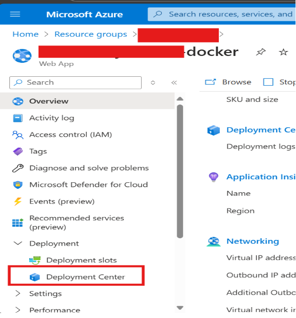
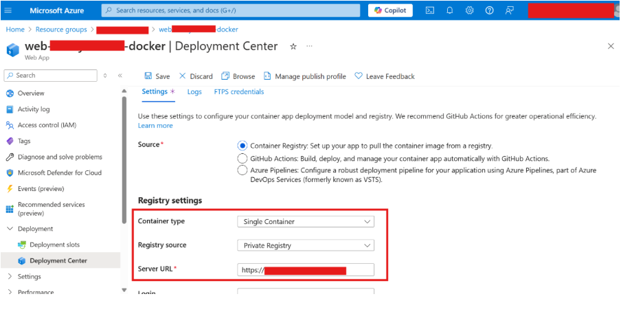

# Guide: Migrating Azure Web App Service to a New Container Registry

## Overview

### Current Problem:
- The **CWYD Container Image** is being published in the **GBB ACR** (Azure Container Registry).
- The **Doc Gen** image is published in **James Hunter ACR**, but this is less severe than the CWYD issue.

### Goal:
- The goal is to **migrate container images** from various applications to a common **CSA CTO Production Azure Container Registry**, ensuring all the different images are consolidated in one centralized location.

---

## Step-by-Step Guide: Migrating Azure Web App Service to a New Container Registry

This guide will help you seamlessly switch the container registry for your **Azure Web App Service** from Azure Container Registry (ACR) to the new registry, **csactoprod**.

Follow the steps below to ensure a smooth migration.

### Prerequisites:
Before you begin, ensure you have the following:
- Access to the **Azure Portal**.
- **Credentials** for the new container registry (**csactoprod**).
- **Permissions** to update the Azure Web App Service settings.
- The **container image** in the new registry is ready and accessible.

---

### Step 1: Obtain Details for the New Registry

Before you begin, ensure you have the following information:
- **Registry URL**: The URL of the new registry (e.g., `csactoprod.example.com`).
- **Image Name and Tag**: The full name and tag of the image you want to use (e.g., `csactoprod.example.com/myapp:latest`).

---

### Step 2: Update Azure Web App Service Configuration Using Azure Portal

1. **Log in to Azure Portal**:
   - Open [Azure Portal](https://portal.azure.com/).

2. **Locate Your Web App Service**:
   - In the search bar, type your **Web App Service name** and select it from the list.

3. **Go to the Deployment Center**:
   - In the left-hand menu, click on **Deployment**.

   

4. **Update Image Source**:
   - Change the **Registry Source** to **Private**.
   - Set the **Server URL** to the new container registry (`csactoprod`), as shown in the screenshot below.
   - Leave **Full Image name** and **tag** as it is.

   

5. **Save Changes**:
   - Click **Save** to save the configuration.

---

### Step 3: Restart the Web App Service

After updating the configuration, restart your **Web App Service** to apply the changes:

1. In the **Web App Service overview page**, click on **Restart**.
2. Confirm the restart operation.

---

### Step 4: Update Azure Admin Web App Service Configuration

1. **Locate Your Admin Web App Service**:
   - In the search bar, type your **Admin Web App Service name** and select it from the list.

2. **Repeat Steps 2.3 to 2.5**:
   - Repeat the steps mentioned in **Step 2** for your **Admin Web App** and follow the same process.

---

### Step 5: Restart the Admin Web App Service

After updating the configuration, restart your **Admin Web App Service** to apply the changes:

1. In the **Admin Web App Service overview page**, click on **Restart**.
2. Confirm the restart operation.

---

### Step 6: Validate the Deployment

1. **Access Your Web App**:
   - Open the **Web App URL** in a browser to ensure it’s running correctly.

2. **Access Your Admin Web App**:
   - Open the **Admin Web App URL** in a browser to ensure it’s running correctly.

---

By following these steps, your **Azure Web App Service** will now use the new container from the **CWYD registry**.

For further assistance, feel free to reach out to your support team or log an issue on GitHub.

---

## Additional Notes

- **Ensure the image is accessible** from the new registry before attempting the migration.
- You may need to **adjust permissions** to ensure proper access to the new container registry (csactoprod).
- Always validate your deployment after making these changes to avoid service disruptions.

---

This is the full process for migrating an Azure Web App Service to a new container registry in a detailed, step-by-step format. You can now copy this directly into your `README.md` file.

---

Let me know if you'd like to adjust anything or need help with other sections of your `README` file!
