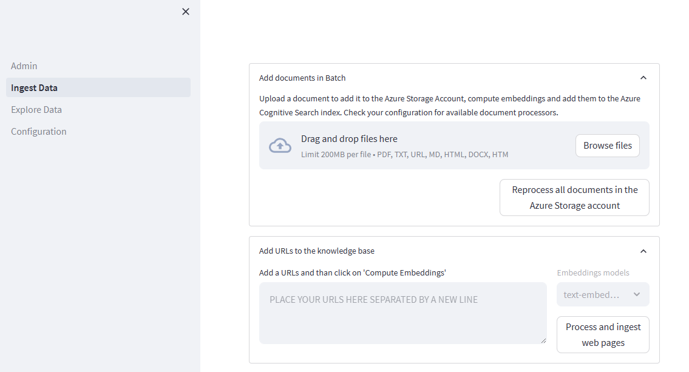
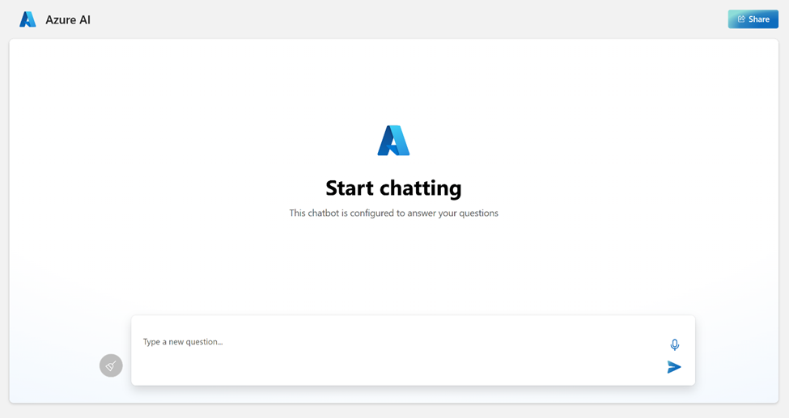

# Chat with your data - Solution accelerator

[**USER STORY**](#user-story) | [**ONE-CLICK DEPLOY**](#one-click-deploy) | [**SUPPORTING DOCUMENTATION**](#supporting-documentation) | [**CUSTOMER TRUTH**](#customer-truth)

## User story
Welcome to the *Chat with your data* Solution accelerator repository! The *Chat with your data* Solution accelerator is a powerful tool that combines the capabilities of Azure AI Search and Large Language Models (LLMs) to create a conversational search experience. This solution accelerator uses an Azure OpenAI GPT model and an Azure AI Search index generated from your data, which is integrated into a web application to provide a natural language interface, including speech-to-text functionality, for search queries. Users can drag and drop files, point to storage, and take care of technical setup to transform documents. There is a web app that users can create in their own subscription with security and authentication.

### About this repo

This repository provides a template for setting up the solution accelerator, along with detailed instructions on how to use and customize it to fit your specific needs. It provides the following features:

* Chat with an Azure OpenAI model using your own data
* Upload and process your documents
* Index public web pages
* Easy prompt configuration
* Multiple chunking strategies

### When should you use this repo? 

If you need to customize your scenario beyond what [Azure OpenAI on your data](https://learn.microsoft.com/azure/ai-services/openai/concepts/use-your-data) offers out-of-the-box and you don’t want to streamline the entire development cycle of your AI application, you can use this repository. However, if you want to streamline the entire development cycle of your AI application, you can use [Azure Machine Learning prompt flow](https://learn.microsoft.com/en-us/azure/machine-learning/prompt-flow/overview-what-is-prompt-flow) instead.

The accelerator presented here provides several options, for example:
* The ability to ground a model using both data and public web pages
* Advanced prompt engineering capabilities
* An admin site for ingesting/inspecting/configuring your dataset on the fly
* Running a Retrieval Augmented Generation (RAG) solution locally, as a Docker container

*Have you seen [ChatGPT + Enterprise data with Azure OpenAI and AI Search demo](https://github.com/Azure-Samples/azure-search-openai-demo)? If you would like to experiment: Play with prompts, understanding RAG pattern different implementation approaches, see how different features interact with the RAG pattern and choose the best options for your RAG deployments, take a look at that repo. 

Here is a comparison table with a few features offered by Azure, an available GitHub demo sample and this repo, that can provide guidance when you need to decide which one to use:

| Name	| Feature or Sample? |	What is it? | When to use? |
| ---------|---------|---------|---------|
|[Azure OpenAI on your data](https://learn.microsoft.com/azure/ai-services/openai/concepts/use-your-data) | Azure feature | Azure OpenAI Service offers out-of-the-box, end-to-end RAG implementation that uses a REST API or the web-based interface in the Azure AI Studio to create a solution that connects to your data to enable an enhanced chat experience with Azure OpenAI ChatGPT models and Azure AI Search. | This should be the first option considered for developers that need an end-to-end solution for Azure OpenAI Service with an Azure AI Search retriever. Simply select supported data sources, that ChatGPT model in Azure OpenAI Service , and any other Azure resources needed to configure your enterprise application needs. |
|[Azure Machine Learning prompt flow](https://learn.microsoft.com/azure/machine-learning/concept-retrieval-augmented-generation)	| Azure feature | RAG in Azure Machine Learning is enabled by integration with Azure OpenAI Service for large language models and vectorization. It includes support for Faiss and Azure AI Search as vector stores, as well as support for open-source offerings, tools, and frameworks such as LangChain for data chunking. Azure Machine Learning prompt flow offers the ability to test data generation, automate prompt creation, visualize prompt evaluation metrics, and integrate RAG workflows into MLOps using pipelines.  | When Developers need more control over processes involved in the development cycle of LLM-based AI applications, they should use Azure Machine Learning prompt flow to create executable flows and evaluate performance through large-scale testing. |
|["Chat with your data" Solution Accelerator](https://aka.ms/ChatWithYourDataSolutionAccelerator) - (This repo)	| Azure sample | End-to-end baseline RAG pattern sample that uses Azure AI Search as a retriever.	| This sample should be used by Developers when the  RAG pattern implementations provided by Azure are not able to satisfy business requirements. This sample provides a means to customize the solution. Developers must add their own code to meet requirements, and adapt with best practices according to individual company policies. |
|[ChatGPT + Enterprise data with Azure OpenAI and AI Search demo](https://github.com/Azure-Samples/azure-search-openai-demo) | Azure sample | RAG pattern demo that uses Azure AI Search as a retriever. | Developers who would like to use or present an end-to-end demonstration of the RAG pattern should use this sample. This includes the ability to deploy and test different retrieval modes, and prompts to support business use cases. |

### Key features 
- **Private LLM access on your data**: Get all the benefits of ChatGPT on your private, unstructured data.
- **Single application access to your full data set**: Minimize endpoints required to access internal company knowledgebases  
- **Natural language interaction with your unstructured data**: Use natural language to quickly find the answers you need and ask follow-up queries to get the supplemental details.
- **Easy access to source documentation when querying**: Review referenced documents in the same chat window for additional context.
- **Data upload**: Batch upload documents
- **Accessible orchestration**: Prompt and document configuration (prompt engineering, document processing, and data retrieval)

**Note**: The current model allows users to ask questions about unstructured data, such as PDF, text, and docx files.

### Supported file types

Out-of-the-box, you can upload the following file types:
* PDF
* JPEG
* JPG
* PNG
* TXT
* HTML
* MD (Markdown)
* DOCX

### Target end users
Company personnel (employees, executives) looking to research against internal unstructured company data would leverage this accelerator using natural language to find what they need quickly. 

This accelerator also works across industry and roles and would be suitable for any employee who would like to get quick answers with a ChatGPT experience against their internal unstructured company data. 

Tech administrators can use this accelerator to give their colleagues easy access to internal unstructured company data. Admins can customize the system configurator to tailor responses for the intended audience. 

### Industry scenario
The sample data illustrates how this accelerator could be used in the financial services industry (FSI).

In this scenario, a financial advisor is preparing for a meeting with a potential client who has expressed interest in Woodgrove Investments’ Emerging Markets Funds. The advisor prepares for the meeting by refreshing their understanding of the emerging markets fund's overall goals and the associated risks. 

Now that the financial advisor is more informed about Woodgrove’s Emerging Markets Funds, they're better equipped to respond to questions about this fund from their client.  

Note: Some of the sample data included with this accelerator was generated using AI and is for illustrative purposes only.

### Speech-to-text functionality
Many users are used to the convenience of speech-to-text functionality in their consumer products. With hybrid work increasing, speech-to-text supports a more flexible way for users to chat with their data, whether they’re at their computer or on the go with their mobile device. The speech-to-text capability is combined with NLP capabilities to extract intent and context from spoken language, allowing the chatbot to understand and respond to user requests more intelligently.

Chat with your unstructured data

Get responses using natural language

### [Teams extension](./TEAMS_EXTENSION.md)
By bringing the Chat with your data experience into Teams, users can stay within their current workflow and get the answers they need without switching platforms. Rather than building the Chat with your data accelerator within Teams from scratch, the same underlying backend used for the web application is leveraged within Teams. 

Learn more about deploying the Teams extension [here](./TEAMS_EXTENSION.md).

## One-click deploy

### Pre-requisites 
* An [Azure OpenAI resource](https://learn.microsoft.com/azure/ai-services/openai/how-to/create-resource?pivots=web-portal) and a deployment for one of the following Chat model and an embedding model:
    * Chat Models
       * GPT-3.5
       * GPT-4
  * Embedding Model 
     * text-embedding-ada-002
    
  **Note**: The deployment template defaults to **gpt-35-turbo** and **text-embedding-ada-002**. If your deployment names are different, update them in the deployment process.

- Azure subscription - [Create one for free](https://azure.microsoft.com/free/) with contributor access.
- [Visual Studio Code](https://code.visualstudio.com/)
    - Extensions
        - [Azure Functions](https://marketplace.visualstudio.com/items?itemName=ms-azuretools.vscode-azurefunctions)
        - [Azure Tools](https://marketplace.visualstudio.com/items?itemName=ms-vscode.vscode-node-azure-pack)
        - [Bicep](https://marketplace.visualstudio.com/items?itemName=ms-azuretools.vscode-bicep)
        - [Docker](https://marketplace.visualstudio.com/items?itemName=ms-azuretools.vscode-docker)
        - [Pylance](https://marketplace.visualstudio.com/items?itemName=ms-python.vscode-pylance)
        - [Python](https://marketplace.visualstudio.com/items?itemName=ms-python.python)
        - [Teams Toolkit](https://marketplace.visualstudio.com/items?itemName=TeamsDevApp.ms-teams-vscode-extension) (optional: Teams extension only)
- Install [Node.js](https://nodejs.org/en)
  - Install the LTS version (Recommended for Most Users)
- [Enable custom Teams apps and turn on custom app uploading](https://learn.microsoft.com/en-us/microsoftteams/platform/concepts/build-and-test/prepare-your-o365-tenant#enable-custom-teams-apps-and-turn-on-custom-app-uploading) (optional: Teams extension only)

### Products used
- Azure App Service
- Azure Application Insights
- Azure Bot
- Azure OpenAI
- Azure Document Intelligence
- Azure Function App
- Azure Search Service
- Azure Storage Account
- Azure Speech Service
- Teams (optional: Teams extension only)

### Required licenses
- Microsoft 365 (optional: Teams extension only)

### Pricing Considerations

This solution accelerator deploys multiple resources. Evaluate the cost of each component prior to deployment.

The following are links to the pricing details for some of the resources:
- [Azure OpenAI service pricing](https://azure.microsoft.com/pricing/details/cognitive-services/openai-service/). GPT and embedding models are charged separately.
- [Azure AI Search pricing](https://azure.microsoft.com/pricing/details/search/). AI Search core service and semantic search are charged separately.
- [Azure Blob Storage pricing](https://azure.microsoft.com/pricing/details/storage/blobs/)
- [Azure Functions pricing](https://azure.microsoft.com/pricing/details/functions/)
- [Azure AI Document Intelligence pricing](https://azure.microsoft.com/pricing/details/ai-document-intelligence/)
- [Azure Web App Pricing](https://azure.microsoft.com/pricing/details/app-service/windows/)

### Deploy instructions

1. Click the following deployment button to create the required resources for this accelerator directly in your Azure Subscription. 

    <!-- TODO: Updated prior to PR -->
     

1. Add the following fields:

    
    |Field  |Description  |
    |---------|---------|
    |Resource group   | The resource group that will contain the resources for this accelerator. You can select **Create new** to create a new group.        |
    |Resource prefix   | A text string that will be appended to each resource that gets created, and used as the website name for the web app. This name cannot contain spaces or special characters.        |
    |Azure OpenAI resource    | The name of your Azure OpenAI resource. This resource must have already been created previously.         |
    |Azure OpenAI key    | The access key associated with your Azure OpenAI resource.        |
    |Orchestration strategy| Use Azure OpenAI Functions (openai_functions) or LangChain (langchain) for messages orchestration. If you are using a new model version 0613 select "openai_functions" (or "langchain"), if you are using a 0314 model version select "langchain"|
    Azure Document Intelligence resource location   | The location of the Azure Document Intelligence resource
    
    You can find the [ARM template](./infrastructure/deployment.json) used, along with a [Bicep file](./infrastructure/deployment.bicep) for deploying this accelerator in the `/infrastructure` directory.

   **NOTE**: By default, the deployment name in the application settings is equal to the model name (gpt-35-turbo and text-embedding-ada-002). If you named the deployment in a different way, you should update the application settings to match your deployment names.
    
1. Navigate to the admin site, where you can upload documents. It will be located at:
    
    `https://{MY_RESOURCE_PREFIX}-website-admin.azurewebsites.net/`

    Where `{MY_RESOURCE_PREFIX}` is replaced with the resource prefix you used during deployment. Then select **Ingest Data** and add your data. You can find sample data in the `/data` directory.
    
    

2. Navigate to the web app to start chatting on top of your data. The web app can be found at:

    `https://{MY_RESOURCE_PREFIX}-website.azurewebsites.net/`

    Where `{MY_RESOURCE_PREFIX}` is replaced with the resource prefix you used during deployment. 

    
    

### [Local deployment instructions](./LOCAL_DEPLOYMENT.md)
To customize the accelerator or run it locally, first, copy the .env.sample file to your development environment's .env file, and edit it according to environment variable values table. Learn more about deploying locally [here](./LOCAL_DEPLOYMENT.md).

## Supporting documentation

### Best practices
**Access to documents**

 Only upload data that can be accessed by any user of the application. Anyone who uses the application should also have clearance for any data that is uploaded to the application.

**Depth of responses** 

The more limited the data set, the broader the questions should be. If the data in the repo is limited, the depth of information in the LLM response you can get with follow up questions may be limited. For more depth in your response, increase the data available for the LLM to access.  

**Response consistency**

 Consider tuning the configuration of prompts to the level of precision required.  The more precision desired, the harder it may be to generate a response.

**Numerical queries**

 The accelerator is optimized to summarize unstructured data, such as PDFs or text files. The ChatGPT 3.5 Turbo model used by the accelerator is not currently optimized to handle queries about specific numerical data. The ChatGPT 4 model may be better able to handle numerical queries.  

**Use your own judgement**

 AI-generated content may be incorrect and should be reviewed before usage.

**Azure AI Search used as retriever in RAG**
Azure AI Search, when used as a retriever in the Retrieval-Augmented Generation (RAG) pattern, plays a key role in fetching relevant information from a large corpus of data. The RAG pattern involves two key steps: retrieval of documents and generation of responses. Azure AI Search, in the retrieval phase, filters and ranks the most relevant documents from the dataset based on a given query.

The importance of optimizing data in the index for relevance lies in the fact that the quality of retrieved documents directly impacts the generation phase. The more relevant the retrieved documents are, the more accurate and pertinent the generated responses will be.

Azure AI Search allows for fine-tuning the relevance of search results through features such as [scoring profiles](https://learn.microsoft.com/azure/search/index-add-scoring-profiles), which assign weights to different fields, [Lucene's powerful full-text search capabilities](https://learn.microsoft.com/azure/search/query-lucene-syntax), [vector search](https://learn.microsoft.com/azure/search/vector-search-overview) for similarity search, multi-modal search, recommendations, [hybrid search](https://learn.microsoft.com/azure/search/hybrid-search-overview) and [semantic search](https://learn.microsoft.com/azure/search/search-get-started-semantic) to use AI from Microsoft to rescore search results and moving results that have more semantic relevance to the top of the list. By leveraging these features, one can ensure that the most relevant documents are retrieved first, thereby improving the overall effectiveness of the RAG pattern.

Moreover, optimizing the data in the index also enhances the efficiency, the speed of the retrieval process and increases relevance which is an integral part of the RAG pattern.

**Azure AI Search**
- Consider switching security keys and using [RBAC](https://learn.microsoft.com/azure/search/search-security-rbac) instead for authentication.
- Consider setting up a [firewall](https://learn.microsoft.com/azure/search/service-configure-firewall), [private endpoints](https://learn.microsoft.com/azure/search/service-create-private-endpoint) for inbound connections and [shared private links](https://learn.microsoft.com/azure/search/search-indexer-howto-access-trusted-service-exception) for [built-in pull indexers](https://learn.microsoft.com/en-us/azure/search/search-indexer-overview).
- For the best results, prepare your index data and consider [analyzers](https://learn.microsoft.com/azure/search/search-analyzers).
- Analyze your [resource capacity needs](https://learn.microsoft.com/azure/search/search-capacity-planning).

**Before deploying Azure RAG implementations to production**
- Follow the best practices described in [Azure Well-Architected-Framework](https://learn.microsoft.com/azure/well-architected/).
- Understand the [Retrieval Augmented Generation (RAG) in Azure AI Search](https://learn.microsoft.com/en-us/azure/search/retrieval-augmented-generation-overview).
- Understand the [functionality and configuration that would adapt better to your solution](https://techcommunity.microsoft.com/t5/azure-ai-services-blog/azure-cognitive-search-outperforming-vector-search-with-hybrid/ba-p/3929167) and test with your own data for optimal retrieval.
- Experiment with different options, define the prompts that are optimal for your needs and find ways to implement functionality tailored to your business needs with [this demo](https://github.com/Azure-Samples/azure-search-openai-demo), so you can then adapt to the accelerator.
- Follow the [Responsible AI best practices](https://www.microsoft.com/en-us/ai/tools-practices).
- Understand the [levels of access of your users and application](https://techcommunity.microsoft.com/t5/azure-ai-services-blog/access-control-in-generative-ai-applications-with-azure/ba-p/3956408).

**Chunking: Importance for RAG and strategies implemented as part of this repo**

Chunking is essential for managing large data sets, optimizing relevance, preserving context, integrating workflows, and enhancing the user experience. See [How to chunk documents](https://learn.microsoft.com/en-us/azure/search/vector-search-how-to-chunk-documents) for more information.

These are the chunking strategy options you can choose from:
- **Layout**: An AI approach to determine a good chunking strategy.
-  **Page**: This strategy involves breaking down long documents into pages.
- **Fixed-Size Overlap**: This strategy involves defining a fixed size that’s sufficient for semantically meaningful paragraphs (for example, 250 words) and allows for some overlap (for example, 10-25% of the content). This usually helps creating good inputs for embedding vector models. Overlapping a small amount of text between chunks can help preserve the semantic context.
-  **Paragraph**: This strategy allows breaking down a difficult text into more manageable pieces and rewrite these “chunks” with a summarization of all of them.

### Resource links

This solution accelerator deploys the following resources. It's critical to comprehend the functionality of each. Below are the links to their respective documentation:
- [Application Insights overview - Azure Monitor | Microsoft Learn](https://learn.microsoft.com/en-us/azure/azure-monitor/app/app-insights-overview?tabs=net)
- [Azure OpenAI Service - Documentation, quickstarts, API reference - Azure AI services | Microsoft Learn](https://learn.microsoft.com/en-us/azure/ai-services/openai/concepts/use-your-data)
- [Using your data with Azure OpenAI Service - Azure OpenAI | Microsoft Learn](https://learn.microsoft.com/en-us/azure/ai-services/openai/concepts/use-your-data)
- [Content Safety documentation - Quickstarts, Tutorials, API Reference - Azure AI services | Microsoft Learn](https://learn.microsoft.com/en-us/azure/ai-services/content-safety/)
- [Document Intelligence documentation - Quickstarts, Tutorials, API Reference - Azure AI services | Microsoft Learn](https://learn.microsoft.com/en-us/azure/ai-services/document-intelligence/?view=doc-intel-3.1.0)
- [Azure Functions documentation | Microsoft Learn](https://learn.microsoft.com/en-us/azure/azure-functions/)
- [Azure Cognitive Search documentation | Microsoft Learn](https://learn.microsoft.com/en-us/azure/search/)
- [Speech to text documentation - Tutorials, API Reference - Azure AI services - Azure AI services | Microsoft Learn](https://learn.microsoft.com/en-us/azure/ai-services/speech-service/index-speech-to-text)
- [Bots in Microsoft Teams - Teams | Microsoft Learn](https://learn.microsoft.com/en-us/microsoftteams/platform/bots/what-are-bots) (Optional: Teams extension only)

### Licensing

This repository is licensed under the [MIT License](LICENSE.md).

The data set under the /data folder is licensed under the [CDLA-Permissive-2 License](CDLA-Permissive-2.md).

## Customer truth

Customer stories coming soon. For early access, contact: fabrizio.ruocco@microsoft.com

#Disclaimers
---
This Software requires the use of third-party components which are governed by separate proprietary or open-source licenses as identified below, and you must comply with the terms of each applicable license in order to use the Software. You acknowledge and agree that this license does not grant you a license or other right to use any such third-party proprietary or open-source components.  

To the extent that the Software includes components or code used in or derived from Microsoft products or services, including without limitation Microsoft Azure Services (collectively, “Microsoft Products and Services”), you must also comply with the Product Terms applicable to such Microsoft Products and Services. You acknowledge and agree that the license governing the Software does not grant you a license or other right to use Microsoft Products and Services. Nothing in the license or this ReadMe file will serve to supersede, amend, terminate or modify any terms in the Product Terms for any Microsoft Products and Services. 

You must also comply with all domestic and international export laws and regulations that apply to the Software, which include restrictions on destinations, end users, and end use. For further information on export restrictions, visit https://aka.ms/exporting. 

You acknowledge that the Software and Microsoft Products and Services (1) are not designed, intended or made available as a medical device(s), and (2) are not designed or intended to be a substitute for professional medical advice, diagnosis, treatment, or judgment and should not be used to replace or as a substitute for professional medical advice, diagnosis, treatment, or judgment. Customer is solely responsible for displaying and/or obtaining appropriate consents, warnings, disclaimers, and acknowledgements to end users of Customer’s implementation of the Online Services. 

You acknowledge the Software is not subject to SOC 1 and SOC 2 compliance audits. No Microsoft technology, nor any of its component technologies, including the Software, is intended or made available as a substitute for the professional advice, opinion, or judgement of a certified financial services professional. Do not use the Software to replace, substitute, or provide professional financial advice or judgment.  

BY ACCESSING OR USING THE SOFTWARE, YOU ACKNOWLEDGE THAT THE SOFTWARE IS NOT DESIGNED OR INTENDED TO SUPPORT ANY USE IN WHICH A SERVICE INTERRUPTION, DEFECT, ERROR, OR OTHER FAILURE OF THE SOFTWARE COULD RESULT IN THE DEATH OR SERIOUS BODILY INJURY OF ANY PERSON OR IN PHYSICAL OR ENVIRONMENTAL DAMAGE (COLLECTIVELY, “HIGH-RISK USE”), AND THAT YOU WILL ENSURE THAT, IN THE EVENT OF ANY INTERRUPTION, DEFECT, ERROR, OR OTHER FAILURE OF THE SOFTWARE, THE SAFETY OF PEOPLE, PROPERTY, AND THE ENVIRONMENT ARE NOT REDUCED BELOW A LEVEL THAT IS REASONABLY, APPROPRIATE, AND LEGAL, WHETHER IN GENERAL OR IN A SPECIFIC INDUSTRY. BY ACCESSING THE SOFTWARE, YOU FURTHER ACKNOWLEDGE THAT YOUR HIGH-RISK USE OF THE SOFTWARE IS AT YOUR OWN RISK.  