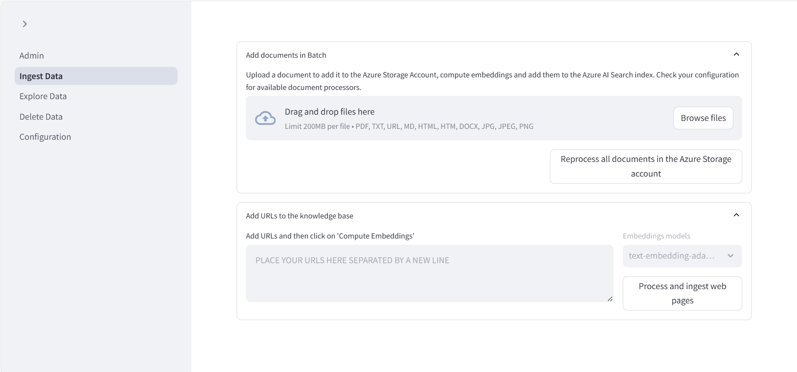
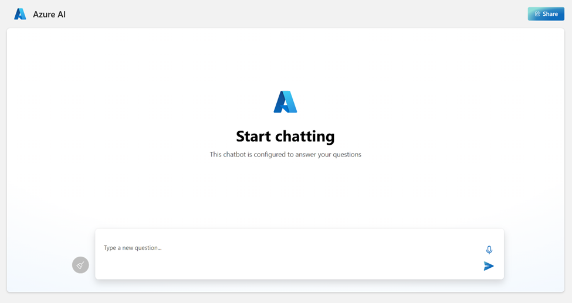

<!-- YAML front-matter schema: https://review.learn.microsoft.com/en-us/help/contribute/samples/process/onboarding?branch=main#supported-metadata-fields-for-readmemd -->

# Chat with your data - Solution accelerator

 ##### Table of Contents
- [Chat with your data - Solution accelerator](#chat-with-your-data---solution-accelerator)
        - [Table of Contents](#table-of-contents)
  - [User story](#user-story)
    - [About this repo](#about-this-repo)
    - [When should you use this repo?](#when-should-you-use-this-repo)
    - [Key features](#key-features)
    - [Target end users](#target-end-users)
    - [Industry scenario](#industry-scenario)
  - [Deploy](#deploy)
    - [Pre-requisites](#pre-requisites)
    - [Products used](#products-used)
    - [Required licenses](#required-licenses)
    - [Pricing Considerations](#pricing-considerations)
    - [Deploy instructions](#deploy-instructions)
    - [Testing the deployment](#testing-the-deployment)
  - [Supporting documentation](#supporting-documentation)
    - [Resource links](#resource-links)
    - [Licensing](#licensing)
  - [Disclaimers](#disclaimers)
## User story
Welcome to the *Chat with your data* Solution accelerator repository! The *Chat with your data* Solution accelerator is a powerful tool that combines the capabilities of Azure AI Search and Large Language Models (LLMs) to create a conversational search experience. This solution accelerator uses an Azure OpenAI GPT model and an Azure AI Search index generated from your data, which is integrated into a web application to provide a natural language interface, including [speech-to-text](docs/speech_to_text.md) functionality, for search queries. Users can drag and drop files, point to storage, and take care of technical setup to transform documents. Everything can be deployed in your own subscription to accelerate your use of this technology.

### About this repo

This repository provides an end-to-end solution for users who want to query their data with natural language. It includes a well designed ingestion mechanism for multiple file types, an easy deployment, and a support team for maintenance. The accelerator demonstrates both Push or Pull Ingestion; the choice of orchestration (Semantic Kernel, LangChain, OpenAI Functions or [Prompt Flow](docs/prompt_flow.md)) and should be the minimum components needed to implement a RAG pattern. It is not intended to be put into Production as-is without experimentation or evaluation of your data. It provides the following features:

* Chat with an Azure OpenAI model using your own data
* Upload and process your documents
* Index public web pages
* Easy prompt configuration
* Multiple chunking strategies

### When should you use this repo?

If you need to customize your scenario beyond what [Azure OpenAI on your data](https://learn.microsoft.com/azure/ai-services/openai/concepts/use-your-data) offers out-of-the-box, use this repository.
By default, this repo comes with one specific set of RAG configurations including but not limited to: chunk size, overlap, retrieval/search type and system prompt. It is important that you evaluate the retrieval/search and the generation of the answers for your data and tune these configurations accordingly before you use this repo in production. For a starting point to understand and perform RAG evaluations, we encourage you to look into the [RAG Experiment Accelerator](https://github.com/microsoft/rag-experiment-accelerator).

The accelerator presented here provides several options, for example:
* The ability to ground a model using both data and public web pages
* A backend with support for 'custom' and 'On Your Data' [conversation flows](./docs/conversation_flow_options.md)
* Advanced prompt engineering capabilities
* An admin site for ingesting/inspecting/configuring your dataset on the fly
* Push or Pull model for data ingestion:  See [integrated vectorization](./docs/integrated_vectorization.md) documentation for more details
* Running a Retrieval Augmented Generation (RAG) solution locally

*Have you seen [ChatGPT + Enterprise data with Azure OpenAI and AI Search demo](https://github.com/Azure-Samples/azure-search-openai-demo)? If you would like to experiment: Play with prompts, understanding RAG pattern different implementation approaches, see how different features interact with the RAG pattern and choose the best options for your RAG deployments, take a look at that repo.

Here is a comparison table with a few features offered by Azure, an available GitHub demo sample and this repo, that can provide guidance when you need to decide which one to use:

| Name	| Feature or Sample? |	What is it? | When to use? |
| ---------|---------|---------|---------|
|["Chat with your data" Solution Accelerator](https://aka.ms/ChatWithYourDataSolutionAccelerator) - (This repo)	| Azure sample | End-to-end baseline RAG pattern sample that uses Azure AI Search as a retriever.	| This sample should be used by Developers when the  RAG pattern implementations provided by Azure are not able to satisfy business requirements. This sample provides a means to customize the solution. Developers must add their own code to meet requirements, and adapt with best practices according to individual company policies. |
|[Azure OpenAI on your data](https://learn.microsoft.com/azure/ai-services/openai/concepts/use-your-data) | Azure feature | Azure OpenAI Service offers out-of-the-box, end-to-end RAG implementation that uses a REST API or the web-based interface in the Azure AI Foundry to create a solution that connects to your data to enable an enhanced chat experience with Azure OpenAI ChatGPT models and Azure AI Search. | This should be the first option considered for developers that need an end-to-end solution for Azure OpenAI Service with an Azure AI Search retriever. Simply select supported data sources, that ChatGPT model in Azure OpenAI Service , and any other Azure resources needed to configure your enterprise application needs. |
|[Azure Machine Learning prompt flow](https://learn.microsoft.com/azure/machine-learning/concept-retrieval-augmented-generation)	| Azure feature | RAG in Azure Machine Learning is enabled by integration with Azure OpenAI Service for large language models and vectorization. It includes support for Faiss and Azure AI Search as vector stores, as well as support for open-source offerings, tools, and frameworks such as LangChain for data chunking. Azure Machine Learning prompt flow offers the ability to test data generation, automate prompt creation, visualize prompt evaluation metrics, and integrate RAG workflows into MLOps using pipelines.  | When Developers need more control over processes involved in the development cycle of LLM-based AI applications, they should use Azure Machine Learning prompt flow to create executable flows and evaluate performance through large-scale testing. |
|[ChatGPT + Enterprise data with Azure OpenAI and AI Search demo](https://github.com/Azure-Samples/azure-search-openai-demo) | Azure sample | RAG pattern demo that uses Azure AI Search as a retriever. | Developers who would like to use or present an end-to-end demonstration of the RAG pattern should use this sample. This includes the ability to deploy and test different retrieval modes, and prompts to support business use cases. |
|[RAG Experiment Accelerator](https://github.com/microsoft/rag-experiment-accelerator) | Tool |The RAG Experiment Accelerator is a versatile tool that helps you conduct experiments and evaluations using Azure AI Search and RAG pattern. | RAG Experiment Accelerator is to make it easier and faster to run experiments and evaluations of search queries and quality of response from OpenAI. This tool is useful for researchers, data scientists, and developers who want to, Test the performance of different Search and OpenAI related hyperparameters. |

### Key features
- **Private LLM access on your data**: Get all the benefits of ChatGPT on your private, unstructured data.
- **Single application access to your full data set**: Minimize endpoints required to access internal company knowledgebases. Reuse the same backend with the [Microsoft Teams Extension](docs/teams_extension.md)
- **Natural language interaction with your unstructured data**: Use natural language to quickly find the answers you need and ask follow-up queries to get the supplemental details, including [Speech-to-text](docs/speech_to_text.md).
- **Easy access to source documentation when querying**: Review referenced documents in the same chat window for additional context.
- **Chat history**: Prior conversations and context are maintained and accessible through chat history.
- **Data upload**: Batch upload documents of [various file types](docs/supported_file_types.md)
- **Accessible orchestration**: Prompt and document configuration (prompt engineering, document processing, and data retrieval)
- **Database flexibility**: Dynamic database switching allows users to choose between PostgreSQL and Cosmos DB based on their requirements. If no preference is specified the platform defaults to PostgreSQL.

**Note**: The current model allows users to ask questions about unstructured data, such as PDF, text, and docx files. See the [supported file types](docs/supported_file_types.md).

### Target end users
Company personnel (employees, executives) looking to research against internal unstructured company data would leverage this accelerator using natural language to find what they need quickly.

This accelerator also works across industry and roles and would be suitable for any employee who would like to get quick answers with a ChatGPT experience against their internal unstructured company data.

Tech administrators can use this accelerator to give their colleagues easy access to internal unstructured company data. Admins can customize the system configurator to tailor responses for the intended audience.

### Use Case scenarios

#### Employee Onboarding Scenario
The sample data illustrates how this accelerator could be used for an employee onboarding scenario in across industries.

In this scenario, a newly hired employee is in the process of onboarding to their organization. Leveraging the solution accelerator, she navigates through the extensive offerings of her organization’s health and retirement benefits. With the newly integrated chat history capabilities, they can revisit previous conversations, ensuring continuity and context across multiple days of research. This functionality allows the new employee to efficiently gather and consolidate information, streamlining their onboarding experience. [For more details, refer to the README](docs/employee_assistance.md).

#### Financial Advisor Scenario
The sample data illustrates how this accelerator could be used in the financial services industry (FSI).

In this scenario, a financial advisor is preparing for a meeting with a potential client who has expressed interest in Woodgrove Investments’ Emerging Markets Funds. The advisor prepares for the meeting by refreshing their understanding of the emerging markets fund's overall goals and the associated risks.

Now that the financial advisor is more informed about Woodgrove’s Emerging Markets Funds, they're better equipped to respond to questions about this fund from their client.

#### Contract Review and Summarization Assistant scenario
Additionally, we have implemented a Legal Review and Summarization Assistant scenario to demonstrate how this accelerator can be utilized in any industry. The Legal Review and Summarization Assistant helps professionals manage and interact with a large collection of documents efficiently. For more details, refer to the [Contract Review and Summarization Assistant README](docs/contract_assistance.md).

Note: Some of the sample data included with this accelerator was generated using AI and is for illustrative purposes only.

---

## Deploy
### Pre-requisites
- Azure subscription - [Create one for free](https://azure.microsoft.com/free/) with owner access.
- Approval to use Azure OpenAI services with your Azure subcription. To apply for approval, see [here](https://learn.microsoft.com/en-us/azure/ai-services/openai/overview#how-do-i-get-access-to-azure-openai).
- [Enable custom Teams apps and turn on custom app uploading](https://learn.microsoft.com/en-us/microsoftteams/platform/concepts/build-and-test/prepare-your-o365-tenant#enable-custom-teams-apps-and-turn-on-custom-app-uploading) (optional: Teams extension only)

### Products used
- Azure App Service
- Azure Application Insights
- Azure Bot
- Azure OpenAI
- Azure Document Intelligence
- Azure Function App
- Azure Search Service
- Azure Storage Account
- Azure Speech Service
- Azure CosmosDB
- Azure PostgreSQL
- Teams (optional: Teams extension only)

### Required licenses
- Microsoft 365 (optional: Teams extension only)

### Pricing Considerations

This solution accelerator deploys multiple resources. Evaluate the cost of each component prior to deployment.

The following are links to the pricing details for some of the resources:
- [Azure OpenAI service pricing](https://azure.microsoft.com/pricing/details/cognitive-services/openai-service/). GPT and embedding models are charged separately.
- [Azure AI Search pricing](https://azure.microsoft.com/pricing/details/search/). AI Search core service and semantic ranker are charged separately.
- [Azure Blob Storage pricing](https://azure.microsoft.com/pricing/details/storage/blobs/)
- [Azure Functions pricing](https://azure.microsoft.com/pricing/details/functions/)
- [Azure AI Document Intelligence pricing](https://azure.microsoft.com/pricing/details/ai-document-intelligence/)
- [Azure Web App Pricing](https://azure.microsoft.com/pricing/details/app-service/windows/)

### Deployment options: PostgreSQL or Cosmos DB
With the addition of PostgreSQL, customers can leverage the power of a relationship-based AI solution to enhance historical conversation access, improve data privacy, and open the possibilities for scalability.

Customers have the option to deploy this solution with PostgreSQL or Cosmos DB. Consider the following when deciding which database to use:
- PostgreSQL enables a relationship-based AI solution and search indexing for Retrieval Augmented Generation (RAG)
- Cosmos DB enables chat history and is a NoSQL-based solution. With Cosmos DB, Azure AI Search is used for storing extracted documents and embeddings.

To review PostgreSQL configuration overview and steps, follow the link [here](docs/postgreSQL.md).

To review Cosmos DB configuration overview and steps, follow the link [here](docs/employee_assistance.md).

### Deploy instructions
The "Deploy to Azure" button offers a one-click deployment where you don’t have to clone the code. If you would like a developer experience instead, follow the [local deployment instructions](./docs/LOCAL_DEPLOYMENT.md).

Once you deploy to Azure, you will have the option to select PostgreSQL or Cosmos DB, see screenshot below.

Select either "PostgreSQL" or "Cosmos DB":

When Deployment is complete, follow steps in [Set Up Authentication in Azure App Service](./docs/azure_app_service_auth_setup.md) to add app authentication to your web app running on Azure App Service

**Note**: The default configuration deploys an OpenAI Model "gpt-35-turbo" with version 0613. However, not all
locations support this version. If you're deploying to a location that doesn't support version 0613, you'll need to
switch to a lower version. To find out which versions are supported in different regions, visit the
[GPT-35 Turbo Model Availability](https://learn.microsoft.com/en-us/azure/ai-services/openai/concepts/models#gpt-35-turbo-model-availability) page.

### Testing the deployment
1. Navigate to the admin site, where you can upload documents. It will be located at:

    `https://web-{RESOURCE_TOKEN}-admin.azurewebsites.net/`

    Where `{RESOURCE_TOKEN}` is uniquely generated during deployment. This is a combination of your subscription and the name of the resource group. Then select **Ingest Data** and add your data. You can find sample data in the `/data` directory.

    

2. Navigate to the web app to start chatting on top of your data. The web app can be found at:

    `https://web-{RESOURCE_TOKEN}.azurewebsites.net/`

    

## Supporting documentation

### Resource links

This solution accelerator deploys the following resources. It's critical to comprehend the functionality of each. Below are the links to their respective documentation:
- [Application Insights overview - Azure Monitor | Microsoft Learn](https://learn.microsoft.com/en-us/azure/azure-monitor/app/app-insights-overview?tabs=net)
- [Azure OpenAI Service - Documentation, quickstarts, API reference - Azure AI services | Microsoft Learn](https://learn.microsoft.com/en-us/azure/ai-services/openai/concepts/use-your-data)
- [Using your data with Azure OpenAI Service - Azure OpenAI | Microsoft Learn](https://learn.microsoft.com/en-us/azure/ai-services/openai/concepts/use-your-data)
- [Content Safety documentation - Quickstarts, Tutorials, API Reference - Azure AI services | Microsoft Learn](https://learn.microsoft.com/en-us/azure/ai-services/content-safety/)
- [Document Intelligence documentation - Quickstarts, Tutorials, API Reference - Azure AI services | Microsoft Learn](https://learn.microsoft.com/en-us/azure/ai-services/document-intelligence/?view=doc-intel-3.1.0)
- [Azure Functions documentation | Microsoft Learn](https://learn.microsoft.com/en-us/azure/azure-functions/)
- [Azure Cognitive Search documentation | Microsoft Learn](https://learn.microsoft.com/en-us/azure/search/)
- [Speech to text documentation - Tutorials, API Reference - Azure AI services - Azure AI services | Microsoft Learn](https://learn.microsoft.com/en-us/azure/ai-services/speech-service/index-speech-to-text)
- [Bots in Microsoft Teams - Teams | Microsoft Learn](https://learn.microsoft.com/en-us/microsoftteams/platform/bots/what-are-bots) (Optional: Teams extension only)

### Licensing

This repository is licensed under the [MIT License](LICENSE.md).

The data set under the /data folder is licensed under the [CDLA-Permissive-2 License](CDLA-Permissive-2.md).

## Disclaimers
This Software requires the use of third-party components which are governed by separate proprietary or open-source licenses as identified below, and you must comply with the terms of each applicable license in order to use the Software. You acknowledge and agree that this license does not grant you a license or other right to use any such third-party proprietary or open-source components.

To the extent that the Software includes components or code used in or derived from Microsoft products or services, including without limitation Microsoft Azure Services (collectively, “Microsoft Products and Services”), you must also comply with the Product Terms applicable to such Microsoft Products and Services. You acknowledge and agree that the license governing the Software does not grant you a license or other right to use Microsoft Products and Services. Nothing in the license or this ReadMe file will serve to supersede, amend, terminate or modify any terms in the Product Terms for any Microsoft Products and Services.

You must also comply with all domestic and international export laws and regulations that apply to the Software, which include restrictions on destinations, end users, and end use. For further information on export restrictions, visit https://aka.ms/exporting.

You acknowledge that the Software and Microsoft Products and Services (1) are not designed, intended or made available as a medical device(s), and (2) are not designed or intended to be a substitute for professional medical advice, diagnosis, treatment, or judgment and should not be used to replace or as a substitute for professional medical advice, diagnosis, treatment, or judgment. Customer is solely responsible for displaying and/or obtaining appropriate consents, warnings, disclaimers, and acknowledgements to end users of Customer’s implementation of the Online Services.

You acknowledge the Software is not subject to SOC 1 and SOC 2 compliance audits. No Microsoft technology, nor any of its component technologies, including the Software, is intended or made available as a substitute for the professional advice, opinion, or judgement of a certified financial services professional. Do not use the Software to replace, substitute, or provide professional financial advice or judgment.

BY ACCESSING OR USING THE SOFTWARE, YOU ACKNOWLEDGE THAT THE SOFTWARE IS NOT DESIGNED OR INTENDED TO SUPPORT ANY USE IN WHICH A SERVICE INTERRUPTION, DEFECT, ERROR, OR OTHER FAILURE OF THE SOFTWARE COULD RESULT IN THE DEATH OR SERIOUS BODILY INJURY OF ANY PERSON OR IN PHYSICAL OR ENVIRONMENTAL DAMAGE (COLLECTIVELY, “HIGH-RISK USE”), AND THAT YOU WILL ENSURE THAT, IN THE EVENT OF ANY INTERRUPTION, DEFECT, ERROR, OR OTHER FAILURE OF THE SOFTWARE, THE SAFETY OF PEOPLE, PROPERTY, AND THE ENVIRONMENT ARE NOT REDUCED BELOW A LEVEL THAT IS REASONABLY, APPROPRIATE, AND LEGAL, WHETHER IN GENERAL OR IN A SPECIFIC INDUSTRY. BY ACCESSING THE SOFTWARE, YOU FURTHER ACKNOWLEDGE THAT YOUR HIGH-RISK USE OF THE SOFTWARE IS AT YOUR OWN RISK.
