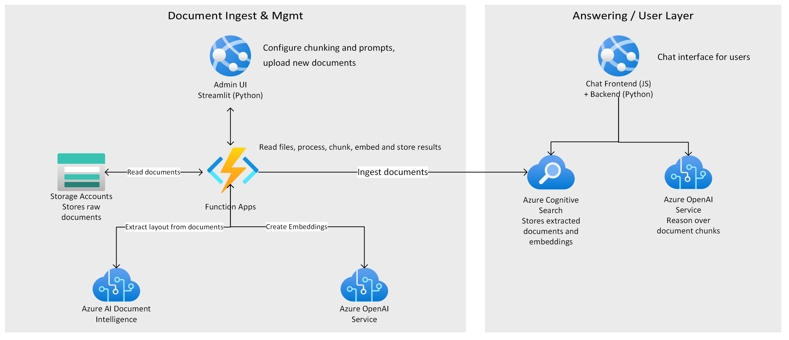

# "Chat with your data" Solution Accelerator  

Welcome to the "Chat with your data" Solution Accelerator repository!
The "Chat with your data" Solution Accelerator is a powerful tool that combines the capabilities of Azure Cognitive Search and Large Language Models (LLMs) to create a conversational search experience. This solution accelerator uses an Azure OpenAI GPT model and an Azure Cognitive Search index generated from your data, which is integrated into a web application to provide a natural language interface for search queries.



This repository provides a template for setting up the solution accelerator, along with detailed instructions on how to use and customize it to fit your specific needs.

## About this repo

This repository provides a template for setting up the solution accelerator, along with detailed instructions on how to use and customize it to fit your specific needs. It provides the following features:

* Chat with an Azure OpenAI model using your own data
* Upload and process your documents
* Index public web pages
* Easy prompt configuration
* Multiple chunking strategies

## When should you use this repo? 

You should use this repo when your scenario customization needs exceed the out-of-the-box experience offered by [Azure OpenAI on your data](https://learn.microsoft.com/azure/ai-services/openai/concepts/use-your-data) and you don't require to streamline the entire development cycle of your AI application, as you can with [Azure Machine Learning prompt flow](https://learn.microsoft.com/en-us/azure/machine-learning/prompt-flow/overview-what-is-prompt-flow). 

The accelerator presented here provides several options, for example:
* The ability to ground a model using both data and public web pages
* Advanced prompt engineering capabilities
* An admin site for ingesting/inspecting/configuring your dataset on the fly
* Running a Retrieval Augmented Generation (RAG) solution locally, as a Docker container

*Have you seen [ChatGPT + Enterprise data with Azure OpenAI and Cognitive Search demo](https://github.com/Azure-Samples/azure-search-openai-demo)? If you would like to play with prompts, understanding RAG pattern different implementation approaches and similar demo tasks, take a look at that repo. Note that the demo in that repo should not be used in Proof of Concepts (POCs) that later will be adapted for production environments. Instead, consider the use of this repo and follow the [Best Practices-TBD](TBD-link)*

Here is a comparison table with a few features offered by Azure, an available GitHub demo sample and this repo, that can provide guidance when you need to decide which one to use:

| Name	| Feature or Sample? |	What is it? | When to use? |
| ---------|---------|---------|---------|
|[Azure OpenAI on your data](https://learn.microsoft.com/azure/ai-services/openai/concepts/use-your-data) | Azure feature | Azure OpenAI Out-of-the-box, end-to-end RAG implementation that uses a REST API or the web-based interface in the Azure OpenAI Studio to create a solution that connects to your data to enable an enhanced chat experience with Azure OpenAI ChatGPT models and Azure Cognitive Search. | First option when you need an end-to-end solution for Azure OpenAI ChatGPT-based application with an Azure Cognitive Search as a retriever. You need to pick your supported data sources, Azure OpenAI ChatGPT model and any other Azure resources needed and configuration options for your Enterprise application needs. |
|[Azure Machine Learning prompt flow](https://learn.microsoft.com/azure/machine-learning/prompt-flow/overview-what-is-prompt-flow)	| Azure feature | Azure Machine Learning comprehensive solution that simplifies the process of prototyping, experimenting, iterating, and deploying your LLM-based AI applications. | You need more control of each process involved in the entire development cycle of LLM-based AI applications, create executable flows, evaluate performance through large-scale testing, among others. |
|["Chat with your data" Solution Accelerator](https://aka.ms/ChatWithYourDataSolutionAccelerator) - (This repo)	| Azure sample | End-to-end baseline RAG pattern sample that uses Azure Cognitive Search as a retriever.	| Your RAG pattern implementation has requirements that the features already provided by Azure to build a ChatGPT-based application are not able to satisfy and you need a baseline sample to create Proof of Concept (POC). You must add your own code to meet those requirements, and finally adapt with best practices and according to your company policies to deploy your own custom version in your production environment. |
|[ChatGPT + Enterprise data with Azure OpenAI and Cognitive Search demo](https://github.com/Azure-Samples/azure-search-openai-demo) | Azure sample | RAG pattern demo that uses Azure Cognitive Search as a retriever. |	You would like to use or present an end-to-end demo that shows what the RAG pattern is, deploy and test with different retrieval modes, understand the train of thought of the components while you test and play with different prompts to understand which ones you can adapt better to your use cases. |


## Supported file types

Out-of-the-box, you can upload the following file types:
* PDF
* JPEG
* JPG
* PNG
* TXT
* HTML
* MD (Markdown)
* DOCX

## Prerequisites

* Azure subscription - [Create one for free](https://azure.microsoft.com/free/) with contributor access.
* An [Azure OpenAI resource](https://learn.microsoft.com/azure/ai-services/openai/how-to/create-resource?pivots=web-portal) and a deployment for one of the following models:
    * GPT-3.5
    * GPT-4

## Getting started

1. Click the following deployment button to create the required resources for this accelerator directly in your Azure Subscription. 

    [](https://portal.azure.com/#create/Microsoft.Template/uri/https%3A%2F%2Fraw.githubusercontent.com%2FAzure-Samples%2Fazure-search-openai-solution-accelerator%2Fmain%2Finfrastructure%2Fdeployment.json%3Ftoken%3DGHSAT0AAAAAAB47C325DQBSNOF2UZNHQE2CZGTZSTA)

    

1. Add the following fields:

    
    |Field  |Description  |
    |---------|---------|
    |Resource group   | The resource group that will contain the resources for this accelerator. You can select **Create new** to create a new group.        |
    |Resource prefix   | A text string that will be appended to each resource that gets created, and used as the website name for the web app. This name cannot contain spaces or special characters.        |
    |Azure OpenAI resource    | The name of your Azure OpenAI resource. This resource must have already been created previously.         |
    |Azure OpenAI key    | The access key associated with your Azure OpenAI resource.        |
    
    You can find the [ARM template](./infrastructure/deployment.json) used, along with a [Bicep file](./infrastructure/deployment.bicep) for deploying this accelerator in the `/infrastructure` directory.
    
1. Navigate to the admin site, where you can upload documents. It will be located at:
    
    `https://{MY_RESOURCE_PREFIX}-website-admin.azurewebsites.net/`

    Where `{MY_RESOURCE_PREFIX}` is replaced with the resource prefix you used during deployment. Then select **Ingest Data** and add your data. You can find sample data in the `/data` directory.

    `<screenshot of admin site's data ingestion menu>`

2. Navigate to the web app to start chatting on top of your data. The web app can be found at:

    `https://{MY_RESOURCE_PREFIX}-website.azurewebsites.net/`

    Where `{MY_RESOURCE_PREFIX}` is replaced with the resource prefix you used during deployment. 

    `<screenshot of web app`

## Development and run the accelerator locally

To customize the accelerator or run it locally, first, copy the `.env.sample` file to your development environment's `.env` file, and edit it according to [environment variable values table](#environment-variables) below.

### Running the full solution locally

You can run the full solution locally with the following commands - this will spin up 3 different Docker containers:

|Container  |Description  |
|---------|---------|
|frontend | A container for the chat app, enabling you to chat on top of your data.         |
|backend     | A container for the "admin" site where you can upload and explore your data.         |
|batch processing functions     | A container helping with processing requests.          |

Run the following `docker compose` command.

```shell
cd docker
docker compose up
```

### Develop & run the frontend locally

if you want to develop and run the frontend container locally, use the following commands.

#### Running the frontend locally

```shell
python -m pip install -r requirements.txt
cd frontend
npm install
npm run build
python ./app.py
```

Then visit `http://127.0.0.1:5000/` for accessing the chat interface.

#### Building the frontend Docker image

```shell
docker build -f docker\WebApp.Dockerfile -t YOUR_DOCKER_REGISTRY/YOUR_DOCKER_IMAGE .
docker run --env-file .env -p 8080:80 YOUR_DOCKER_REGISTRY/YOUR_DOCKER_IMAGE
docker push YOUR_DOCKER_REGISTRY/YOUR_DOCKER_IMAGE
```

### Develop & run the backend

If you want to develop and run the backend container locally, use the following commands.

#### Running the backend locally

```shell
cd backend
python -m pip install -r requirements.txt
streamlit run Admin.py
```

Then access `http://localhost:8501/` for getting to the admin interface.

#### Building the backend Docker image

```shell
docker build -f docker\AdminWebApp.Dockerfile -t YOUR_DOCKER_REGISTRY/YOUR_DOCKER_IMAGE .
docker run --env-file .env -p 8081:80 YOUR_DOCKER_REGISTRY/YOUR_DOCKER_IMAGE
docker push YOUR_DOCKER_REGISTRY/YOUR_DOCKER_IMAGE
```

### Develop & run the batch processing functions

If you want to develop and run the batch processing functions container locally, use the following commands.

#### Running the batch processing locally

First, install [Azure Functions Core Tools](https://learn.microsoft.com/en-us/azure/azure-functions/functions-run-local?tabs=windows%2Cportal%2Cv2%2Cbash&pivots=programming-language-python).


```shell
cd backend
func start
```

Or use the [Azure Functions VS Code extension](https://marketplace.visualstudio.com/items?itemName=ms-azuretools.vscode-azurefunctions).

#### Building the batch processing Docker image

```shell
docker build -f docker\Backend.Dockerfile -t YOUR_DOCKER_REGISTRY/YOUR_DOCKER_IMAGE .
docker run --env-file .env -p 7071:80 YOUR_DOCKER_REGISTRY/YOUR_DOCKER_IMAGE
docker push YOUR_DOCKER_REGISTRY/YOUR_DOCKER_IMAGE
```

## Environment variables

| App Setting | Value | Note |
| --- | --- | ------------- |
|AZURE_SEARCH_SERVICE||The URL of your Azure Cognitive Search resource. e.g. https://<search-service>.search.windows.net|
|AZURE_SEARCH_INDEX||The name of your Azure Cognitive Search Index|
|AZURE_SEARCH_KEY||An **admin key** for your Azure Cognitive Search resource|
|AZURE_SEARCH_USE_SEMANTIC_SEARCH|False|Whether or not to use semantic search|
|AZURE_SEARCH_SEMANTIC_SEARCH_CONFIG||The name of the semantic search configuration to use if using semantic search.|
|AZURE_SEARCH_TOP_K|5|The number of documents to retrieve from Azure Cognitive Search.|
|AZURE_SEARCH_ENABLE_IN_DOMAIN|True|Limits responses to only queries relating to your data.|
|AZURE_SEARCH_CONTENT_COLUMNS||List of fields in your Azure Cognitive Search index that contains the text content of your documents to use when formulating a bot response. Represent these as a string joined with "|", e.g. `"product_description|product_manual"`|
|AZURE_SEARCH_CONTENT_VECTOR_COLUMNS||Field from your Azure Cognitive Search index for storing the content's Vector embeddings|
|AZURE_SEARCH_DIMENSIONS|1536| Azure OpenAI Embeddings dimensions. 1536 for `text-embedding-ada-002`|
|AZURE_SEARCH_FIELDS_ID|id|`AZURE_SEARCH_FIELDS_ID`: Field from your Azure Cognitive Search index that gives a unique idenitfier of the document chunk. `id` if you don't have a specific requirement.|
|AZURE_SEARCH_FILENAME_COLUMN||`AZURE_SEARCH_FILENAME_COLUMN`: Field from your Azure Cognitive Search index that gives a unique idenitfier of the source of your data to display in the UI.|
|AZURE_SEARCH_TITLE_COLUMN||Field from your Azure Cognitive Search index that gives a relevant title or header for your data content to display in the UI.|
|AZURE_SEARCH_URL_COLUMN||Field from your Azure Cognitive Search index that contains a URL for the document, e.g. an Azure Blob Storage URI. This value is not currently used.|
|AZURE_SEARCH_FIELDS_TAG|tag|Field from your Azure Cognitive Search index that contains tags for the document. `tag` if you don't have a specific requirement.|
|AZURE_SEARCH_FIELDS_METADATA|metadata|Field from your Azure Cognitive Search index that contains metadata for the document. `metadata` if you don't have a specific requirement.|
|AZURE_OPENAI_RESOURCE||the name of your Azure OpenAI resource|
|AZURE_OPENAI_MODEL||The name of your model deployment|
|AZURE_OPENAI_MODEL_NAME|gpt-35-turbo|The name of the model|
|AZURE_OPENAI_KEY||One of the API keys of your Azure OpenAI resource|
|AZURE_OPENAI_EMBEDDING_MODEL|text-embedding-ada-002|The name of you Azure OpenAI embeddings model deployment|
|AZURE_OPENAI_TEMPERATURE|0|What sampling temperature to use, between 0 and 2. Higher values like 0.8 will make the output more random, while lower values like 0.2 will make it more focused and deterministic. A value of 0 is recommended when using your data.|
|AZURE_OPENAI_TOP_P|1.0|An alternative to sampling with temperature, called nucleus sampling, where the model considers the results of the tokens with top_p probability mass. We recommend setting this to 1.0 when using your data.|
|AZURE_OPENAI_MAX_TOKENS|1000|The maximum number of tokens allowed for the generated answer.|
|AZURE_OPENAI_STOP_SEQUENCE||Up to 4 sequences where the API will stop generating further tokens. Represent these as a string joined with "|", e.g. `"stop1|stop2|stop3"`|
|AZURE_OPENAI_SYSTEM_MESSAGE|You are an AI assistant that helps people find information.|A brief description of the role and tone the model should use|
|AZURE_OPENAI_API_VERSION|2023-06-01-preview|API version when using Azure OpenAI on your data|
|AzureWebJobsStorage||The connection string to the Azure Blob Storage for the Azure Functions Batch processing|
|BACKEND_URL||The URL for the Backend Batch Azure Function. Use http://localhost:7071 for local execution and http://backend for docker compose|
|DOCUMENT_PROCESSING_QUEUE_NAME|doc-processing|The name of the Azure Queue to handle the Batch processing|
|AZURE_BLOB_ACCOUNT_NAME||The name of the Azure Blob Storage for storing the original documents to be processed|
|AZURE_BLOB_ACCOUNT_KEY||The key of the Azure Blob Storage for storing the original documents to be processed|
|AZURE_BLOB_CONTAINER_NAME||The name of the Container in the Azure Blob Storage for storing the original documents to be processed|
|AZURE_FORM_RECOGNIZER_ENDPOINT||The name of the Azure Form Recognizer for extracting the text from the documents|
|AZURE_FORM_RECOGNIZER_KEY||The key of the Azure Form Recognizer for extracting the text from the documents|
|APPINSIGHTS_CONNECTION_STRING||The Application Insights connection string to store the application logs|

## Licensing

This repository is licensed under the [MIT License](LICENSE.md).

The data set under the /data folder is licensed under the [CDLA-Permissive-2 License](CDLA-Permissive-2.md).

## Data Set

The data set under the /data folder has been generated with Azure OpenAI GPT and DALL-E 2 models.

# DISCLAIMER
This presentation, demonstration, and demonstration model are for informational purposes only and (1) are not subject to SOC 1 and SOC 2 compliance audits, and (2) are not designed, intended or made available as a medical device(s) or as a substitute for professional medical advice, diagnosis, treatment or judgment. Microsoft makes no warranties, express or implied, in this presentation, demonstration, and demonstration model. Nothing in this presentation, demonstration, or demonstration model modifies any of the terms and conditions of Microsoft’s written and signed agreements. This is not an offer and applicable terms and the information provided are subject to revision and may be changed at any time by Microsoft.

This presentation, demonstration, and demonstration model do not give you or your organization any license to any patents, trademarks, copyrights, or other intellectual property covering the subject matter in this presentation, demonstration, and demonstration model.

The information contained in this presentation, demonstration and demonstration model represents the current view of Microsoft on the issues discussed as of the date of presentation and/or demonstration, for the duration of your access to the demonstration model. Because Microsoft must respond to changing market conditions, it should not be interpreted to be a commitment on the part of Microsoft, and Microsoft cannot guarantee the accuracy of any information presented after the date of presentation and/or demonstration and for the duration of your access to the demonstration model.

No Microsoft technology, nor any of its component technologies, including the demonstration model, is intended or made available as a substitute for the professional advice, opinion, or judgment of (1) a certified financial services professional, or (2) a certified medical professional. Partners or customers are responsible for ensuring the regulatory compliance of any solution they build using Microsoft technologies.
