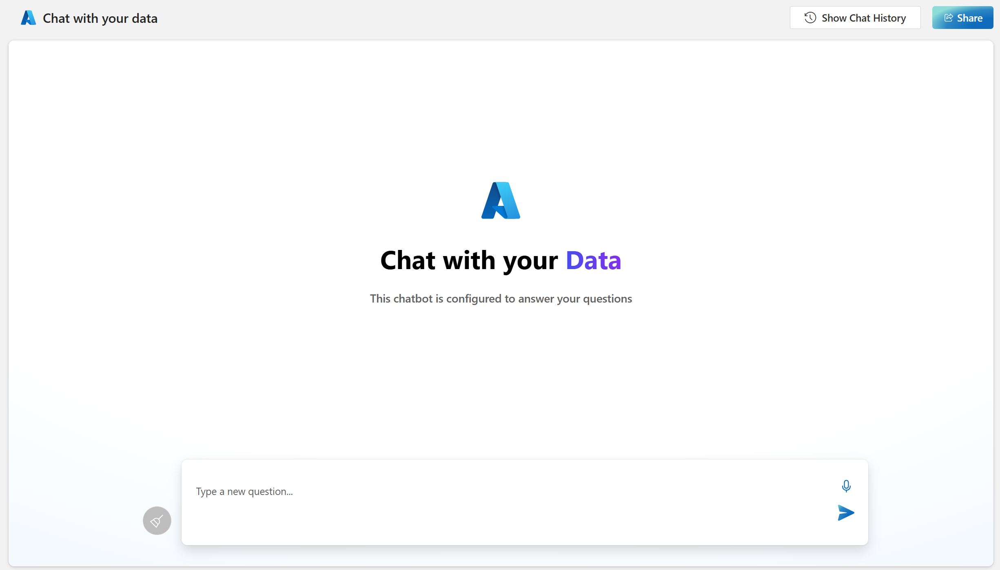

# AVM Post Deployment Guide

> **📋 Note**: This guide is specifically for post-deployment steps after using the AVM template. For complete deployment from scratch, see the main [deployment guide](../Readme.md).

---

This document provides guidance on post-deployment steps after deploying the Chat with your data - Solution accelerator from the [AVM (Azure Verified Modules) repository](https://github.com/Azure/bicep-registry-modules/tree/main/avm/ptn/sa/chat-with-your-data).

## Pre-requisites

Ensure you have a **Deployed Infrastructure** - A successful Chat with your data - Solution accelerator deployment from the [AVM repository](https://github.com/Azure/bicep-registry-modules/tree/main/avm/ptn/sa/chat-with-your-data)

## Post Deployment Steps

### Step 1: Configure App Authentication

1. After deployment is complete, navigate to your Azure App Service in the Azure portal
2. Follow the detailed instructions in [Set Up Authentication in Azure App Service](./azure_app_service_auth_setup.md) to add authentication to your web app
3. This will ensure only authorized users can access your application

### Step 2: Access and Configure the Admin Site

1. **Navigate to the admin site** using the following URL pattern:
   ```
   https://web-{unique-token}-admin.azurewebsites.net/
   ```

2. **Upload your documents**:
   - Select **Ingest Data** from the admin interface
   - Upload your documents using the drag-and-drop interface
   - For testing purposes, you can use the sample data located in the `/data` directory of this repository

   

3. **Monitor the ingestion process**:
   - Wait for the documents to be processed and indexed
   - Verify successful ingestion through the admin interface

### Step 3: Access the Chat Application

1. **Navigate to the main chat application** using this URL pattern:
   ```
   https://web-{unique-token}.azurewebsites.net/
   ```

2. **Test the chat functionality**:
   - Start a conversation by asking questions about your uploaded documents
   - Verify that the AI responds with relevant information from your data

   

## Next Steps

Consider these additional configurations for enhanced functionality:

- 📚 **[Advanced Image Processing](./advanced_image_processing.md)** - Enable enhanced document processing
- 🔄 **[Integrated Vectorization](./integrated_vectorization.md)** - Configure advanced AI search features
- 💬 **[Conversation Flow Options](./conversation_flow_options.md)** - Customize the chat experience
- 🎤 **[Speech-to-Text](./speech_to_text.md)** - Add voice interaction capabilities
