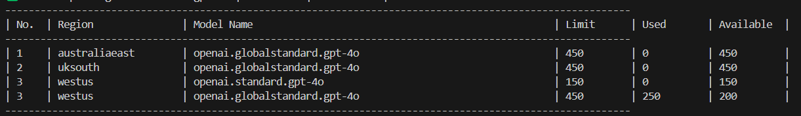
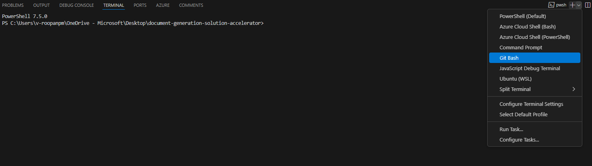

## Check Quota Availability Before Deployment

Before deploying the accelerator, **ensure sufficient quota availability** for the required model.

> **For Global Standard |GPT-4.1- the capacity to at least 150k tokens post-deployment for optimal performance.**

### Login if you have not done so already
```
azd auth login
```


### 📌 Default Models & Capacities:
```
gpt4.1:30, text-embedding-ada-002:30
```
### 📌 Default Regions:
```
francecentral, australiaeast, uksouth, eastus2, northcentralus, swedencentral, westus, westus2, southcentralus
```
### Usage Scenarios:
- No parameters passed → Default models and capacities will be checked in default regions.
- Only model(s) provided → The script will check for those models in the default regions.
- Only region(s) provided → The script will check default models in the specified regions.
- Both models and regions provided → The script will check those models in the specified regions.
- `--verbose` passed → Enables detailed logging output for debugging and traceability.

### **Input Formats**
> Use the --models, --regions, and --verbose options for parameter handling:

✔️ Run without parameters to check default models & regions without verbose logging:
   ```
  ./quota_check_params.sh
   ```
✔️ Enable verbose logging:
   ```
  ./quota_check_params.sh --verbose
   ```
✔️ Check specific model(s) in default regions:
  ```
  ./quota_check_params.sh --models gpt4.1:30,text-embedding-ada-002:30
  ```
✔️ Check default models in specific region(s):
  ```
./quota_check_params.sh --regions eastus2,westus
  ```
✔️ Passing Both models and regions:
  ```
  ./quota_check_params.sh --models gpt4.1:30 --regions eastus2,westus
  ```
✔️ All parameters combined:
  ```
 ./quota_check_params.sh --models gpt4.1:30,text-embedding-ada-002:30 --regions eastus2,westus --verbose
  ```

### **Sample Output**
The final table lists regions with available quota. You can select any of these regions for deployment.



---
### **If using Azure Portal and Cloud Shell**

1. Navigate to the [Azure Portal](https://portal.azure.com).
2. Click on **Azure Cloud Shell** in the top right navigation menu.
3. Run the appropriate command based on your requirement:

   **To check quota for the deployment**

    ```sh
    curl -L -o quota_check_params.sh "https://raw.githubusercontent.com/Azure-Samples/chat-with-your-data-solution-accelerator/main/scripts/quota_check_params.sh"
    chmod +x quota_check_params.sh
    ./quota_check_params.sh
    ```
    - Refer to [Input Formats](#input-formats) for detailed commands.

### **If using VS Code or Codespaces**
1. Open the terminal in VS Code or Codespaces.
2. If you're using VS Code, click the dropdown on the right side of the terminal window, and select `Git Bash`.
   
3. Navigate to the `scripts` folder where the script files are located and make the script as executable:
   ```sh
    cd scripts
    chmod +x quota_check_params.sh
    ```
4. Run the appropriate script based on your requirement:

   **To check quota for the deployment**

    ```sh
    ./quota_check_params.sh
    ```
   - Refer to [Input Formats](#input-formats) for detailed commands.

5. If you see the error `_bash: az: command not found_`, install Azure CLI:

    ```sh
    curl -sL https://aka.ms/InstallAzureCLIDeb | sudo bash
    az login
    ```
6. Rerun the script after installing Azure CLI.
