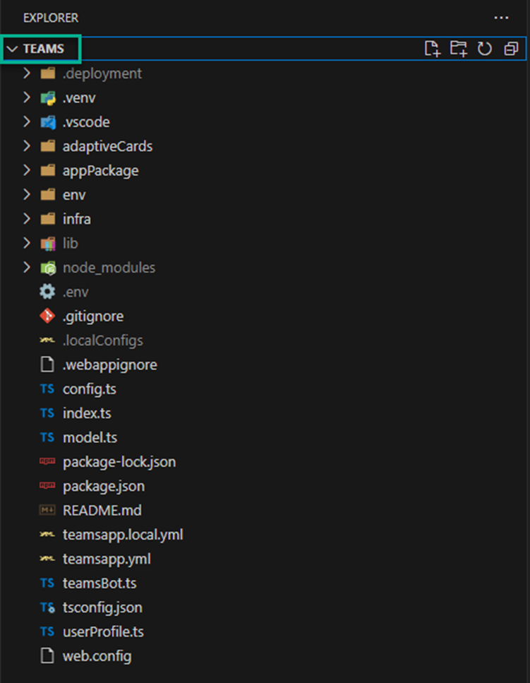

[Back to *Teams Extension* README](./teams_extension.md)

## Local deployment for Teams

To customize the accelerator or run it locally, first, copy the `.env.sample` file to your development environment's `.env` file, and edit it according to [environment variable values table](#environment-variables) below.

### Develop & run the Teams Backend

If you want to develop and run the Teams backend function container locally, use the following commands.

#### Running the Teams Backend locally

First, install [Azure Functions Core Tools](https://learn.microsoft.com/en-us/azure/azure-functions/functions-run-local?tabs=windows%2Cportal%2Cv2%2Cbash&pivots=programming-language-python).


```shell
cd code\batch
func start
```

Or use the [Azure Functions VS Code extension](https://marketplace.visualstudio.com/items?itemName=ms-azuretools.vscode-azurefunctions).


### Develop & run the Teams Frontend
1. Open the “extensions/teams” folder with Visual Studio Code



2. Open the file env\\.env.local
3. Locate the environment variable _AZURE_FUNCTION_URL_.

4. Replace the `<AZURE_FUNCTION_URL>` with your local Teams Backend URL (i.e., http://localhost:7071/api/GetConversationResponse)
    ```env
    AZURE_FUNCTION_URL=http://localhost:7071/api/GetConversationResponse
    ```
    

5. Save the file.
6. Select Teams Toolkit from the navigation panel.
7. Verify your signed into O365 and Azure with sideloading enabled.
8. Select the "play" button next to Local.


## Environment variables

| App Setting | Value | Note |
| --- | --- | ------------- |
|AZURE_SEARCH_SERVICE||The URL of your Azure AI Search resource. e.g. https://<search-service>.search.windows.net|
|AZURE_SEARCH_INDEX||The name of your Azure AI Search Index|
|AZURE_SEARCH_KEY||An **admin key** for your Azure AI Search resource|
|AZURE_SEARCH_USE_SEMANTIC_SEARCH|False|Whether or not to use semantic search|
|AZURE_SEARCH_SEMANTIC_SEARCH_CONFIG|default|The name of the semantic search configuration to use if using semantic search.|
|AZURE_SEARCH_TOP_K|5|The number of documents to retrieve from Azure AI Search.|
|AZURE_SEARCH_ENABLE_IN_DOMAIN|True|Limits responses to only queries relating to your data.|
|AZURE_SEARCH_CONTENT_COLUMN||List of fields in your Azure AI Search index that contains the text content of your documents to use when formulating a bot response. Represent these as a string joined with "|", e.g. `"product_description|product_manual"`|
|AZURE_SEARCH_CONTENT_VECTOR_COLUMN||Field from your Azure AI Search index for storing the content's Vector embeddings|
|AZURE_SEARCH_DIMENSIONS|1536| Azure OpenAI Embeddings dimensions. 1536 for `text-embedding-ada-002`. A full list of dimensions can be found [here](https://learn.microsoft.com/en-us/azure/ai-services/openai/concepts/models#embeddings-models). |
|AZURE_SEARCH_FIELDS_ID|id|`AZURE_SEARCH_FIELDS_ID`: Field from your Azure AI Search index that gives a unique idenitfier of the document chunk. `id` if you don't have a specific requirement.|
|AZURE_SEARCH_FILENAME_COLUMN||`AZURE_SEARCH_FILENAME_COLUMN`: Field from your Azure AI Search index that gives a unique idenitfier of the source of your data to display in the UI.|
|AZURE_SEARCH_TITLE_COLUMN||Field from your Azure AI Search index that gives a relevant title or header for your data content to display in the UI.|
|AZURE_SEARCH_URL_COLUMN||Field from your Azure AI Search index that contains a URL for the document, e.g. an Azure Blob Storage URI. This value is not currently used.|
|AZURE_SEARCH_FIELDS_TAG|tag|Field from your Azure AI Search index that contains tags for the document. `tag` if you don't have a specific requirement.|
|AZURE_SEARCH_FIELDS_METADATA|metadata|Field from your Azure AI Search index that contains metadata for the document. `metadata` if you don't have a specific requirement.|
|AZURE_SEARCH_FILTER||Filter to apply to search queries.|
|AZURE_OPENAI_RESOURCE||the name of your Azure OpenAI resource|
|AZURE_OPENAI_MODEL||The name of your model deployment|
|AZURE_OPENAI_MODEL_NAME|gpt-4.1|The name of the model|
|AZURE_OPENAI_API_KEY||One of the API keys of your Azure OpenAI resource|
|AZURE_OPENAI_EMBEDDING_MODEL|text-embedding-ada-002|The name of you Azure OpenAI embeddings model deployment|
|AZURE_OPENAI_TEMPERATURE|0|What sampling temperature to use, between 0 and 2. Higher values like 0.8 will make the output more random, while lower values like 0.2 will make it more focused and deterministic. A value of 0 is recommended when using your data.|
|AZURE_OPENAI_TOP_P|1.0|An alternative to sampling with temperature, called nucleus sampling, where the model considers the results of the tokens with top_p probability mass. We recommend setting this to 1.0 when using your data.|
|AZURE_OPENAI_MAX_TOKENS|1000|The maximum number of tokens allowed for the generated answer.|
|AZURE_OPENAI_STOP_SEQUENCE||Up to 4 sequences where the API will stop generating further tokens. Represent these as a string joined with "|", e.g. `"stop1|stop2|stop3"`|
|AZURE_OPENAI_SYSTEM_MESSAGE|You are an AI assistant that helps people find information.|A brief description of the role and tone the model should use|
|AZURE_OPENAI_API_VERSION|2024-02-01|API version when using Azure OpenAI on your data|
|AzureWebJobsStorage||The connection string to the Azure Blob Storage for the Azure Functions Batch processing|
|BACKEND_URL||The URL for the Backend Batch Azure Function. Use http://localhost:7071 for local execution|
|DOCUMENT_PROCESSING_QUEUE_NAME|doc-processing|The name of the Azure Queue to handle the Batch processing|
|AZURE_BLOB_ACCOUNT_NAME||The name of the Azure Blob Storage for storing the original documents to be processed|
|AZURE_BLOB_ACCOUNT_KEY||The key of the Azure Blob Storage for storing the original documents to be processed|
|AZURE_BLOB_CONTAINER_NAME||The name of the Container in the Azure Blob Storage for storing the original documents to be processed|
|AZURE_FORM_RECOGNIZER_ENDPOINT||The name of the Azure Form Recognizer for extracting the text from the documents|
|AZURE_FORM_RECOGNIZER_KEY||The key of the Azure Form Recognizer for extracting the text from the documents|
|APPLICATIONINSIGHTS_CONNECTION_STRING||The Application Insights connection string to store the application logs|
|ORCHESTRATION_STRATEGY | openai_function | Orchestration strategy. Use Azure OpenAI Functions (openai_function), Semantic Kernel (semantic_kernel),  LangChain (langchain) or Prompt Flow (prompt_flow) for messages orchestration. If you are using a new model version 0613 select any strategy, if you are using a 0314 model version select "langchain". Note that both `openai_function` and `semantic_kernel` use OpenAI function calling. Prompt Flow option is still in development and does not support RBAC or integrated vectorization as of yet.|
|AZURE_CONTENT_SAFETY_ENDPOINT | | The endpoint of the Azure AI Content Safety service |
|AZURE_CONTENT_SAFETY_KEY | | The key of the Azure AI Content Safety service|
|AZURE_SPEECH_SERVICE_KEY | | The key of the Azure Speech service|
|AZURE_SPEECH_SERVICE_REGION | | The region (location) of the Azure Speech service|
