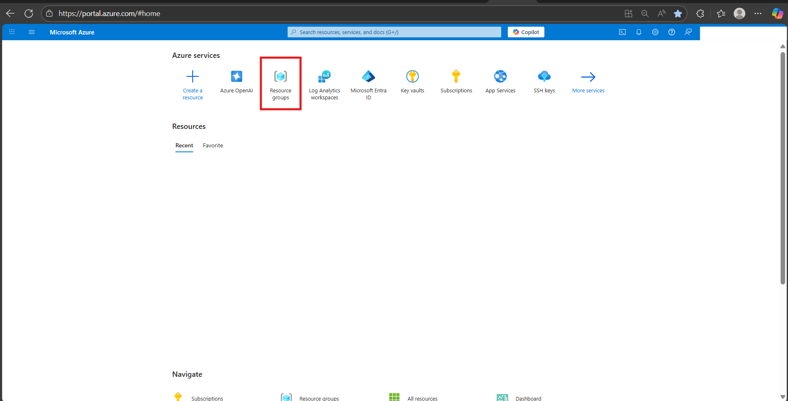

# 🛠️ Troubleshooting

When deploying Azure resources, you may come across different error codes that stop or delay the deployment process. This section lists some of the most common errors along with possible causes and step-by-step resolutions.

Use these as quick reference guides to unblock your deployments.

## ⚡ Most Frequently Encountered Errors

| Error Code | Common Cause | Full Details |
|------------|--------------|--------------|
| **InsufficientQuota** | Not enough quota available in subscription | [View Solution](#quota--capacity-limitations) |
| **MissingSubscriptionRegistration** | Required feature not registered in subscription | [View Solution](#subscription--access-issues) |
| **ResourceGroupNotFound** | RG doesn't exist or using old .env file | [View Solution](#resource-group--deployment-management) |
| **DeploymentModelNotSupported** | Model not available in selected region | [View Solution](#regional--location-issues) |
| **DeploymentNotFound** | Deployment record not found or was deleted | [View Solution](#resource-group--deployment-management) |
| **ResourceNotFound** | Resource does not exist or cannot be found | [View Solution](#resource-identification--references) |
| **SpecialFeatureOrQuotaIdRequired** | Subscription lacks access to specific model | [View Solution](#subscription--access-issues) |
| **ServiceUnavailable** | Service not available in selected region | [View Solution](#regional--location-issues) |
| **BadRequest - DatabaseAccount is in a failed provisioning state** | Previous deployment failed | [View Solution](#resource-state--provisioning) |
| **Unauthorized - Operation cannot be completed<br> without additional quota** | Insufficient quota for requested operation | [View Solution](#subscription--access-issues) |
| **ResourceGroupBeingDeleted** | Resource group deletion in progress | [View Solution](#resource-group--deployment-management) |
| **FlagMustBeSetForRestore** | Soft-deleted resource requires restore flag or purge | [View Solution](#miscellaneous) |
| **ParentResourceNotFound** | Parent resource does not exist or cannot be found | [View Solution](#resource-identification--references) |
| **AccountProvisioningStateInvalid** | Resource used before provisioning completed | [View Solution](#resource-state--provisioning) |
| **InternalSubscriptionIsOverQuotaForSku** | Subscription quota exceeded for the requested SKU | [View Solution](#quota--capacity-limitations) |
| **InvalidResourceGroup** | Invalid resource group configuration | [View Solution](#resource-group--deployment-management) |
| **RequestDisallowedByPolicy** | Azure Policy blocking the requested operation | [View Solution](#subscription--access-issues) |

## 📖 Table of Contents

- [Subscription & Access Issues](#subscription--access-issues)
- [Quota & Capacity Limitations](#quota--capacity-limitations)
- [Regional & Location Issues](#regional--location-issues)
- [Resource Naming & Validation](#resource-naming--validation)
- [Resource Identification & References](#resource-identification--references)
- [Network & Infrastructure Configuration](#network--infrastructure-configuration)
- [Configuration & Property Errors](#configuration--property-errors)
- [Resource State & Provisioning](#resource-state--provisioning)
- [Miscellaneous](#miscellaneous)

## Subscription & Access Issues

| Issue/Error Code | Description | Steps to Resolve |
|-----------|-------------|------------------|
| **ReadOnlyDisabledSubscription** | Subscription is disabled or in read-only state | <ul><li> Check if you have an active subscription before starting the deployment</li><li> Depending on the type of the Azure Subscription, the expiration date might have been reached</li><li> You have to activate the Azure Subscription before creating any Azure resource</li><li> Refer to [Reactivate a disabled Azure subscription](https://learn.microsoft.com/en-us/azure/cost-management-billing/manage/subscription-disabled) documentation</li></ul>|
| **MissingSubscriptionRegistration/<br>AllowBringYourOwnPublicIpAddress** | Required feature not registered in subscription | **Enable `AllowBringYourOwnPublicIpAddress` Feature**<br><br>Before deploying the resources, you may need to enable the **Bring Your Own Public IP Address** feature in Azure. This is required only once per subscription.<br><br>**Steps:**<br><ul><li> Run the following command to register the feature:<br>`az feature register --namespace Microsoft.Network --name AllowBringYourOwnPublicIpAddress`</li><li> Wait for the registration to complete. Check the status using:<br>`az feature show --namespace Microsoft.Network --name AllowBringYourOwnPublicIpAddress --query properties.state`</li><li> The output should show: "Registered"</li><li> Once the feature is registered, refresh the provider:<br>`az provider register --namespace Microsoft.Network`</li></ul>💡 Note: Feature registration may take several minutes to complete. This needs to be done only once per Azure subscription. |
| **Unauthorized - Operation cannot be completed without additional quota** | Insufficient quota for requested operation | <ul><li>Check your quota usage using:<br>`az vm list-usage --location "<Location>" -o table`</li><li> To request more quota refer to [VM Quota Request](https://techcommunity.microsoft.com/blog/startupsatmicrosoftblog/how-to-increase-quota-for-specific-types-of-azure-virtual-machines/3792394)</li></ul> |
| **CrossTenantDeploymentNotPermitted** | Deployment across different Azure AD tenants not allowed | <ul><li> **Check tenant match:** Ensure your deployment identity (user/SP) and the target resource group are in the same tenant:<br>`az account show`<br>`az group show --name <RG_NAME>`</li><li> **Verify pipeline/service principal:** If using CI/CD, confirm the service principal belongs to the same tenant and has permissions on the resource group</li><li> **Avoid cross-tenant references:** Make sure your Bicep doesn't reference subscriptions, resource groups, or resources in another tenant</li><li> **Test minimal deployment:** Deploy a simple resource to the same resource group to confirm identity and tenant are correct</li><li> **Guest/external accounts:** Avoid using guest users from other tenants; use native accounts or SPs in the tenant</li></ul> |
| **RequestDisallowedByPolicy** | Azure Policy blocking the requested operation | <ul><li> This typically indicates that an Azure Policy is preventing the requested action due to policy restrictions in your subscription</li><li> For more details and guidance on resolving this issue, refer to: [RequestDisallowedByPolicy](https://learn.microsoft.com/en-us/troubleshoot/azure/azure-kubernetes/create-upgrade-delete/error-code-requestdisallowedbypolicy) </li></ul> |
| **SpecialFeatureOrQuotaIdRequired** | Subscription lacks access to specific Azure OpenAI models | This error occurs when your subscription does not have access to certain Azure OpenAI models.<br><br>**Example error message:**<br>`SpecialFeatureOrQuotaIdRequired: The current subscription does not have access to this model 'Format:OpenAI,Name:o3,Version:2025-04-16'.`<br><br>**Resolution:**<br>To gain access, submit a request using the official form:<br>👉 [Azure OpenAI Model Access Request](https://customervoice.microsoft.com/Pages/ResponsePage.aspx?id=v4j5cvGGr0GRqy180BHbR7en2Ais5pxKtso_Pz4b1_xUQ1VGQUEzRlBIMVU2UFlHSFpSNkpOR0paRSQlQCN0PWcu)<br><br>You'll need to use this form if you require access to the following restricted models:<br><ul><li> gpt-5</li><li> o3</li><li> o3-pro</li><li> deep research</li><li> reasoning summary</li><li> gpt-image-1</li></ul>Once your request is approved, redeploy your resource. |
| **ResourceProviderError** | Resource provider not registered in subscription | <ul><li> This error occurs when the resource provider is not registered in your subscription</li><li> To register it, refer to [Register Resource Provider](https://learn.microsoft.com/en-us/azure/azure-resource-manager/troubleshooting/error-register-resource-provider?tabs=azure-cli) documentation </li></ul>|

--------------------------------

## Quota & Capacity Limitations

| Issue/Error Code | Description | Steps to Resolve |
|-----------------|-------------|------------------|
| **InternalSubscriptionIsOverQuotaForSku/<br>ManagedEnvironmentProvisioningError** | Subscription quota exceeded for the requested SKU | Quotas are applied per resource group, subscriptions, accounts, and other scopes. For example, your subscription might be configured to limit the number of vCPUs for a region. If you attempt to deploy a virtual machine with more vCPUs than the permitted amount, you receive an error that the quota was exceeded.<br><br>For PowerShell, use the `Get-AzVMUsage` cmdlet to find virtual machine quotas:<br>`Get-AzVMUsage -Location "West US"`<br><br>Based on available quota you can deploy application otherwise, you can request for more quota |
| **InsufficientQuota** | Not enough quota available in subscription | <ul><li>Check if you have sufficient quota available in your subscription before deployment</li><li>To verify, refer to the [QuotaCheck](QuotaCheck.md) file for details</li></ul> |
| **MaxNumberOfRegionalEnvironmentsInSubExceeded** | Maximum Container App Environments limit reached for region |This error occurs when you attempt to create more **Azure Container App Environments** than the regional quota limit allows for your subscription. Each Azure region has a specific limit on the number of Container App Environments that can be created per subscription.<br><br>**Common Causes:**<br><ul><li>Deploying to regions with low quota limits (e.g., Sweden Central allows only 1 environment)</li><li>Multiple deployments without cleaning up previous environments</li><li>Exceeding the standard limit of 15 environments in most major regions</li></ul><br>**Resolution:**<br><ul><li>**Delete unused environments** in the target region, OR</li><li>**Deploy to a different region** with available capacity, OR</li><li>**Request quota increase** via [Azure Support](https://go.microsoft.com/fwlink/?linkid=2208872)</li></ul><br>**Reference:**<br><ul><li>[Azure Container Apps quotas](https://learn.microsoft.com/en-us/azure/container-apps/quotas)</li><li>[Azure subscription and service limits](https://learn.microsoft.com/en-us/azure/azure-resource-manager/management/azure-subscription-service-limits)</li></ul> |
| **SkuNotAvailable** | Requested SKU not available in selected location or zone | You receive this error in the following scenarios:<br><ul><li>When the resource SKU you've selected, such as VM size, isn't available for a location or zone</li><li>If you're deploying an Azure Spot VM or Spot scale set instance, and there isn't any capacity for Azure Spot in this location. For more information, see Spot error messages</li></ul> |
| **Conflict - No available instances to satisfy this request** | Azure App Service has insufficient capacity in the region | This error occurs when Azure App Service doesn't have enough available compute instances in the selected region to provision or scale your app.<br><br>**Common Causes:**<br><ul><li>High demand in the selected region (e.g., East US, West Europe)</li><li>Specific SKUs experiencing capacity constraints (Free, Shared, or certain Premium tiers)</li><li>Multiple rapid deployments in the same region</li></ul><br>**Resolution:**<br><ul><li>**Wait and Retry** (15-30 minutes): `azd up`</li><li>**Deploy to a New Resource Group** (Recommended for urgent cases):<br>```<br>azd down --force --purge<br>azd up<br>```</li><li>**Try a Different Region:**<br>Update region in `main.bicep` or `azure.yaml` to a less congested region (e.g., `westus2`, `centralus`, `northeurope`)</li><li>**Use a Different SKU/Tier:**<br>If using Free/Shared tier, upgrade to Basic or Standard<br>Check SKU availability: `az appservice list-locations --sku <sku-name>`</li></ul><br>**Reference:** [Azure App Service Plans](https://learn.microsoft.com/en-us/azure/app-service/overview-hosting-plans) |

--------------------------------

## Resource Group & Deployment Management

| Issue/Error Code | Description | Steps to Resolve |
|-----------------|-------------|------------------|
| **ResourceGroupNotFound** | Specified resource group does not exist | **Option 1:**<br><ul><li>Go to [Azure Portal](https://portal.azure.com/#home)</li><li>Click on **"Resource groups"** option<br></li><li>Search for the resource group in the search bar. If it exists, you can proceed<br></li></ul><br>**Option 2:**<br><ul><li>This error can occur if you deploy using the same .env file from a previous deployment</li><li>Create a new environment before redeploying:<br>`azd env new <env-name>`</li></ul> |
| **ResourceGroupBeingDeleted** | Resource group is currently being deleted | **Steps:**<br><ul><li>Go to [Azure Portal](https://portal.azure.com/#home)</li><li>Go to resource group option and search for targeted resource group</li><li>If the resource group is being deleted, you cannot use it. Create a new one or use a different resource group</li></ul> |
| **DeploymentActive** | Another deployment is already in progress in this resource group | <ul><li>This occurs when a deployment is already in progress and another deployment is triggered in the same resource group</li><li>Cancel the ongoing deployment before starting a new one</li><li>Do not initiate a new deployment until the previous one is completed</li></ul> |
| **DeploymentCanceled** | Deployment was canceled before completion | <ul><li>**Check deployment history:**<br>Go to Azure Portal → Resource Group → Deployments<br>Review the detailed error message</li><li>**Identify the root cause:**<br>Dependent resource failed to deploy<br>Validation error occurred<br>Manual cancellation was triggered</li><li>**Validate template:**<br>`az deployment group validate --resource-group <rg-name> --template-file main.bicep`</li><li>**Check resource limits/quotas**</li><li>**Fix the failed dependency**</li><li>**Retry deployment:**<br>`az deployment group create --resource-group <rg-name> --template-file main.bicep`</li></ul><br>💡 **Note:** DeploymentCanceled is a wrapper error — check inner errors in deployment logs |
| **DeploymentCanceled(user.canceled)** | User manually canceled the deployment | <ul><li>Deployment was manually canceled by the user (Portal, CLI, or pipeline)</li><li>Check deployment history and logs to confirm who/when it was canceled</li><li>If accidental, retry the deployment</li><li>For pipelines, ensure no automation or timeout is triggering cancellation</li><li>Use deployment locks or retry logic to prevent accidental cancellations</li></ul> |
| **DeploymentNotFound** | Deployment record not found or was deleted | <ul><li>This occurs when the user deletes a previous deployment along with the resource group, then redeploys the same RG with the same environment name but in a different location</li><li>Do not change the location when redeploying a deleted RG, OR</li><li>Use new names for the RG and environment during redeployment</li></ul> |
| **ResourceGroupDeletionTimeout** | Resource group deletion exceeded timeout limit | <ul><li>Some resources may be stuck deleting or have dependencies; check RG resources and status</li><li>Ensure no resource locks or Azure Policies are blocking deletion</li><li>Retry deletion via CLI/PowerShell:<br>`az group delete --name <RG_NAME> --yes --no-wait`</li><li>Check Activity Log to identify failing resources</li><li>Escalate to Azure Support if deletion is stuck</li></ul> |

--------------------------------

## Regional & Location Issues

| Issue/Error Code | Description | Steps to Resolve |
|-----------------|-------------|------------------|
| **LocationNotAvailableForResourceType** | Resource type not supported in selected region | This error occurs when you attempt to deploy a resource to a region that does not support that specific resource type or SKU.<br><br>**Resolution:**<br><ul><li>**Verify resource availability by region:**<br>`az provider show --namespace <provider-namespace> --query "resourceTypes[?resourceType=='<resource-type>'].locations" -o table`</li><li>**Check Azure Products by Region:**<br>[Azure Products by Region](https://azure.microsoft.com/en-us/explore/global-infrastructure/products-by-region/)</li><li>**Supported regions for this deployment:**<br><ul><li>`australiaeast`</li><li>`centralus`</li><li>`eastasia`</li><li>`eastus2`</li><li>`japaneast`</li><li>`northeurope`</li><li>`southeastasia`</li><li>`uksouth`</li></ul></li><li>**Redeploy:**<br>`azd up`</li></ul> |
| **InvalidResourceLocation** | Cannot change region for already deployed resources | This error occurs when you attempt to modify the location/region of a resource that has already been deployed. Azure resources **cannot change regions** after creation.<br><br>**Resolution:**<br><ul><li>**Option 1: Delete and Redeploy:**<br>`azd down --force --purge`<br> after purge redeploy app `azd up`</li><li>**Option 2: Create new environment with different region:**<br>`azd env new <new-env-name>`<br>`azd env set AZURE_LOCATION <new-region>`<br>`azd up`</li><li>**Option 3: Keep existing deployment:**<br>Revert configuration files to use the original region</li></ul><br>⚠️ **Important:** Backup critical data before deleting resources.<br><br>**Reference:** [Move Azure resources across regions](https://learn.microsoft.com/en-us/azure/resource-mover/overview) |
| **ServiceUnavailable/ResourceNotFound** | Service unavailable or restricted in selected region | <ul><li>Regions are restricted to guarantee compatibility with paired regions and replica locations for data redundancy and failover scenarios based on articles [Azure regions list](https://learn.microsoft.com/en-us/azure/reliability/regions-list) and [Azure Database for MySQL Flexible Server - Azure Regions](https://learn.microsoft.com/azure/mysql/flexible-server/overview#azure-regions)</li><li>You can request more quota, refer [Quota Request](https://learn.microsoft.com/en-us/azure/cosmos-db/nosql/create-support-request-quota-increase) Documentation</li></ul> |
| **ResourceOperationFailure/<br>ProvisioningDisabled** | Resource provisioning restricted or disabled in region | <ul><li>This error occurs when provisioning of a resource is restricted in the selected region. It usually happens because the service is not available in that region or provisioning has been temporarily disabled</li><li>Regions are restricted to guarantee compatibility with paired regions and replica locations for data redundancy and failover scenarios based on articles [Azure regions list](https://learn.microsoft.com/en-us/azure/reliability/regions-list) and [Azure Database for MySQL Flexible Server - Azure Regions](https://learn.microsoft.com/azure/mysql/flexible-server/overview#azure-regions)</li><li>If you need to use the same region, you can request a quota or provisioning exception. Refer [Quota Request](https://docs.microsoft.com/en-us/azure/sql-database/quota-increase-request) for more details</li></ul> |
| **RedundancyConfigurationNotAvailableInRegion** | Redundancy configuration not supported in selected region | <ul><li>This issue happens when you try to create a **Storage Account** with a redundancy configuration (e.g., `Standard_GRS`) that is **not supported in the selected Azure region**</li><li>Example: Creating a storage account with **GRS** in **italynorth** will fail with error:<br>`az storage account create -n mystorageacct123 -g myResourceGroup -l italynorth --sku Standard_GRS --kind StorageV2`</li><li>To check supported SKUs for your region:<br>`az storage account list-skus -l italynorth -o table`</li><li>Use a supported redundancy option (e.g., Standard_LRS) in the same region or deploy the Storage Account in a region that supports your chosen redundancy</li><li>For more details, refer to [Azure Storage redundancy documentation](https://learn.microsoft.com/en-us/azure/storage/common/storage-redundancy?utm_source=chatgpt.com)</li></ul> |

--------------------------------

## Resource Naming & Validation

| Issue/Error Code | Description | Steps to Resolve |
|-----------------|-------------|------------------|
| **ResourceNameInvalid** | Resource name violates naming convention rules | <ul><li>Ensure the resource name is within the allowed length and naming rules defined for that specific resource type, you can refer [Resource Naming Convention](https://learn.microsoft.com/en-us/azure/azure-resource-manager/management/resource-name-rules) document</li></ul> |
| **Workspace Name - InvalidParameter** | Workspace name does not meet required format | To avoid this errors in workspace ID follow below rules:<br><ul><li>Must start and end with an alphanumeric character (letter or number)</li><li>Allowed characters: `a–z`, `0–9`, `- (hyphen)`</li><li>Cannot start or end with a hyphen -</li><li>No spaces, underscores (_), periods (.), or special characters</li><li>Must be unique within the Azure region & subscription</li><li>Length: 3–33 characters (for AML workspaces)</li></ul> |
| **VaultNameNotValid** | Key Vault name does not meet naming requirements | In this template Vault name will be unique everytime, but if you trying to hard code the name then please make sure below points:<br><ul><li>**Check name length** - Ensure the Key Vault name is between 3 and 24 characters</li><li>**Validate allowed characters** - The name can only contain letters (a–z, A–Z) and numbers (0–9). Hyphens are allowed, but not at the beginning or end, and not consecutive (--)</li><li>**Ensure proper start and end** - The name must start with a letter. The name must end with a letter or digit (not a hyphen)</li><li>**Test with a new name** - Example of a valid vault name: ✅ `cartersaikeyvault1`, ✅ `securevaultdemo`, ✅ `kv-project123`</li></ul> |
| **BadRequest: Dns record under zone Document is already taken** | DNS record name already in use | This error can occur only when user hardcoding the CosmosDB Service name. To avoid this you can try few below suggestions:<br><ul><li>Verify resource names are globally unique</li><li>If you already created an account/resource with same name in another subscription or resource group, check and delete it before reusing the name</li><li>By default in this template we are using unique prefix with every resource/account name to avoid this kind for errors</li></ul> |

---------------------------------

## Resource Identification & References

| Issue/Error Code | Description | Steps to Resolve |
|-----------------|-------------|------------------|
| **LinkedInvalidPropertyId/<br>ResourceNotFound/<br>DeploymentOutputEvaluationFailed/<br>CanNotRestoreANonExistingResource/<br>The language expression property array index is out of bounds** | Invalid or non-existent resource ID reference | <ul><li>Before using any resource ID, ensure it follows the correct format</li><li>Verify that the resource ID you are passing actually exists</li><li>Make sure there are no typos in the resource ID</li><li>Verify that the provisioning state of the existing resource is `Succeeded` by running the following command to avoid this error while deployment or restoring the resource:<br>`az resource show --ids <Resource ID> --query "properties.provisioningState"`</li><li>Sample Resource IDs format:<br>Log Analytics Workspace Resource ID: `/subscriptions/{subscriptionId}/resourceGroups/{resourceGroupName}/providers/Microsoft.OperationalInsights/workspaces/{workspaceName}`<br>Azure AI Foundry Project Resource ID: `/subscriptions/{subscriptionId}/resourceGroups/{resourceGroupName}/providers/Microsoft.MachineLearningServices/workspaces/{name}`</li><li>You may encounter the error `The language expression property array index '8' is out of bounds` if the resource ID is incomplete. Please ensure your resource ID is correct and contains all required information, as shown in sample resource IDs</li><li>For more information refer [Resource Not Found errors solutions](https://learn.microsoft.com/en-us/azure/azure-resource-manager/troubleshooting/error-not-found?tabs=bicep)</li></ul> |
| **ParentResourceNotFound** | Parent resource does not exist or cannot be found | <ul><li>You can refer to the [Parent Resource Not found](https://learn.microsoft.com/en-us/azure/azure-resource-manager/troubleshooting/error-parent-resource?tabs=bicep) documentation if you encounter this error</li></ul> |
| **PrincipalNotFound** | Principal ID does not exist in Azure AD tenant | This error occurs when the **principal ID** (Service Principal, User, or Group) specified in a role assignment or deployment does not exist in the Azure Active Directory tenant. It can also happen due to **replication delays** right after creating a new principal.<br><br>**Example causes:**<br><ul><li>The specified **Object ID** is invalid or belongs to another tenant</li><li>The principal was recently created but Azure AD has not yet replicated it</li><li>Attempting to assign a role to a non-existing or deleted Service Principal/User/Group</li></ul><br>**How to fix:**<br><ul><li>Verify that the **principal ID is correct** and exists in the same directory/tenant:<br>`az ad sp show --id <object-id>`</li><li>If the principal was just created, wait a few minutes and retry</li><li>Explicitly set the principalType property (ServicePrincipal, User, or Group) in your ARM/Bicep template to avoid replication delays</li><li>If the principal does not exist, create it again before assigning roles</li><li>For more details, see [Azure PrincipalType documentation](https://learn.microsoft.com/en-us/azure/role-based-access-control/troubleshooting?tabs=bicep)</li></ul> |
| **SubscriptionDoesNotHaveServer** | Referenced SQL Server does not exist in subscription | This issue happens when you try to reference an **Azure SQL Server** (`Microsoft.Sql/servers`) that does not exist in the selected subscription.<br><br>**It can occur if:**<br><ul><li>The SQL server name is typed incorrectly</li><li>The SQL server was **deleted** but is still being referenced</li><li>You are working in the **wrong subscription context**</li><li>The server exists in a **different subscription/tenant** where you don't have access</li></ul><br>**Reproduce:**<br>Run an Azure CLI command with a non-existent server name:<br>`az sql db list --server sql-doesnotexist --resource-group myResourceGroup`<br>or<br>`az sql server show --name sql-caqfrhxr4i3hyj --resource-group myResourceGroup`<br><br>**Resolution:**<br><ul><li>Verify the SQL Server name exists in your subscription:<br>`az sql server list --output table`</li><li>Make sure you are targeting the correct subscription:<br>`az account show`<br>`az account set --subscription <subscription-id>`</li><li>If the server was deleted, either restore it (if possible) or update references to use a valid existing server</li></ul> |

---------------------------------

## Network & Infrastructure Configuration

| Issue/Error Code | Description | Steps to Resolve |
|-----------------|-------------|------------------|
| **NetcfgSubnetRangeOutsideVnet** | Subnet IP range outside virtual network address space | <ul><li>Ensure the subnet's IP address range falls within the virtual network's address space</li><li>Always validate that the subnet CIDR block is a subset of the VNet range</li><li>For Azure Bastion, the AzureBastionSubnet must be at least /27</li><li>Confirm that the AzureBastionSubnet is deployed inside the VNet</li></ul> |
| **DisableExport_PublicNetworkAccessMustBeDisabled** | Public network access must be disabled when export is disabled | <ul><li>**Check container source:** Confirm whether the deployment is using a Docker image or Azure Container Registry (ACR)</li><li>**Verify ACR configuration:** If ACR is included, review its settings to ensure they comply with Azure requirements</li><li>**Check export settings:** If export is disabled in ACR, make sure public network access is also disabled</li><li>**Redeploy after fix:** Correct the configuration and redeploy. This will prevent the Conflict error during deployment</li><li>For more information refer [ACR Data Loss Prevention](https://learn.microsoft.com/en-us/azure/container-registry/data-loss-prevention) document</li></ul> |

---------------------------------

## Configuration & Property Errors

| Issue/Error Code | Description | Steps to Resolve |
|-----------------|-------------|------------------|
| **InvalidRequestContent** | Deployment contains unrecognized or missing required values | <ul><li>The deployment values either include values that aren't recognized, or required values are missing. Confirm the values for your resource type</li><li>You can refer [Invalid Request Content error](https://learn.microsoft.com/en-us/azure/azure-resource-manager/troubleshooting/common-deployment-errors#:~:text=InvalidRequestContent,Template%20reference) documentation</li></ul> |
| **Conflict - Cannot use the SKU Basic with File Change Audit for site** | File Change Audit not supported on Basic SKU | <ul><li>This error happens because File Change Audit logs aren't supported on Basic SKU App Service Plans</li><li>Upgrading to Premium/Isolated SKU (supports File Change Audit), or</li><li>Disabling File Change Audit in Diagnostic Settings if you must stay on Basic</li><li>Always cross-check the [supported log types](https://aka.ms/supported-log-types) before adding diagnostic logs to your Bicep templates</li></ul> |
| **AccountPropertyCannotBeUpdated** | Read-only property cannot be modified after creation | The property **`isHnsEnabled`** (Hierarchical Namespace for Data Lake Gen2) is **read-only** and can only be set during **storage account creation**. Once a storage account is created, this property **cannot be updated**. Trying to update it via ARM template, Bicep, CLI, or Portal will fail.<br><br>**Resolution:**<br><ul><li>Create a **new storage account** with `isHnsEnabled=true` if you require hierarchical namespace</li><li>Migration may be needed if you already have data</li><li>Refer to [Storage Account Update Restrictions](https://aka.ms/storageaccountupdate) for more details</li></ul> |


----------------------------------

## Resource State & Provisioning

| Issue/Error Code | Description | Steps to Resolve |
|-----------------|-------------|------------------|
| **AccountProvisioningStateInvalid** | Resource used before provisioning completed | <ul><li>The AccountProvisioningStateInvalid error occurs when you try to use resources while they are still in the Accepted provisioning state</li><li>This means the deployment has not yet fully completed</li><li>To avoid this error, wait until the provisioning state changes to Succeeded</li><li>Only use the resources once the deployment is fully completed</li></ul> |
| **BadRequest - DatabaseAccount is in a failed provisioning state because the previous attempt to create it was not successful** | Database account failed to provision previously | <ul><li>This error occurs when a user attempts to redeploy a resource that previously failed to provision</li><li>To resolve the issue, delete the failed deployment first, then start a new deployment</li><li>For guidance on deleting a resource from a Resource Group, refer to the following link: [Delete an Azure Cosmos DB account](https://learn.microsoft.com/en-us/azure/cosmos-db/nosql/manage-with-powershell#delete-account:~:text=%3A%24enableMultiMaster-,Delete%20an%20Azure%20Cosmos%20DB%20account,-This%20command%20deletes)</li></ul> |
| **ServiceDeleting** | Cannot provision service because deletion is still in progress | This error occurs when you attempt to create an Azure Search service with the same name as one that is currently being deleted. Azure Search services have a **soft-delete period** during which the service name remains reserved.<br><br>**Common causes:**<br><ul><li>Deleting a Search service and immediately trying to recreate it with the same name</li><li>Rapid redeployments using the same service name in Bicep/ARM templates</li><li>The deletion operation is asynchronous and takes several minutes to complete</li></ul><br>**Resolution:**<br><ul><li>**Wait for deletion to complete** (10-15 minutes) before redeploying</li><li>**Use a different service name** - append timestamp or unique identifier to the name</li><li>**Implement retry logic** with exponential backoff as suggested in the error message</li><li>**Check deletion status** before recreating:<br>`az search service show --name <service-name> --resource-group <rg-name>`</li><li>For Bicep deployments, ensure your naming strategy includes unique suffixes to avoid conflicts</li><li>For more details, refer to [Azure Search service limits](https://learn.microsoft.com/en-us/azure/search/search-limits-quotas-capacity)</li></ul> |

---------------------------------

## Miscellaneous

| Issue/Error Code | Description | Steps to Resolve |
|-------------|-------------|------------------|
| **DeploymentModelNotSupported/<br>ServiceModelDeprecated/<br>InvalidResourceProperties** | Model not supported or deprecated in selected region | <ul><li>The updated model may not be supported in the selected region. Please verify its availability in the [Azure AI Foundry models](https://learn.microsoft.com/en-us/azure/ai-foundry/openai/concepts/models?tabs=global-standard%2Cstandard-chat-completions) document</li></ul> |
| **FlagMustBeSetForRestore/<br>NameUnavailable/<br>CustomDomainInUse** | Soft-deleted resource requires restore flag or purge | This error occurs when you try to deploy a Cognitive Services resource that was **soft-deleted** earlier. Azure requires you to explicitly set the **`restore` flag** to `true` if you want to recover the soft-deleted resource. If you don't want to restore the resource, you must **purge the deleted resource** first before redeploying.<br><br>**Example causes:**<br><ul><li>Trying to redeploy a Cognitive Services account with the same name as a previously deleted one</li><li>The deleted resource still exists in a **soft-delete retention state**</li></ul><br>**How to fix:**<br><ul><li>If you want to restore → add `"restore": true` in your template properties</li><li>If you want a fresh deployment → purge the resource using:<br>`az cognitiveservices account purge --name <resource-name> --resource-group <resource-group> --location <location>`</li><li>For more details, refer to [Soft delete and resource restore](https://learn.microsoft.com/en-us/azure/azure-resource-manager/management/delete-resource-group?tabs=azure-powershell)</li></ul> |

---------------------------------

💡 Note: If you encounter any other issues, you can refer to the [Common Deployment Errors](https://learn.microsoft.com/en-us/azure/azure-resource-manager/troubleshooting/common-deployment-errors) documentation.
If the problem persists, you can also raise an bug in our [CWYD Github Issues](https://github.com/Azure-Samples/chat-with-your-data-solution-accelerator/issues) for further support.
