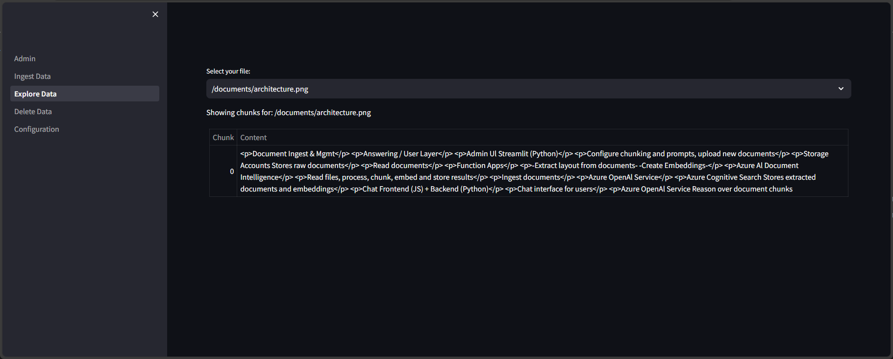

# Advanced Image Processing

The Chat With Your Data solution accelerator supports advanced image processing using Azure AI Vision and GPT-4 Vision to obtain more meaningful data from images.

With advanced image processing enabled, GPT-4 vision is used to generate rich captions of images, and Azure Computer Vision is used to generate embeddings of images, in addition to the text embeddings generated from the image captions.

When querying data in Azure AI Search, vector search is performed using embeddings created for the search query using both Azure OpenAI and Azure Computer Vision.

Finally, if any image documents are retrieved from Azure AI Search, the images themselves are passed to the LLM as well as the text caption generated for the image.

All of this allows a user to ask questions about the meaning of images in the knowledge store, rather than just the text in an image.

Compare the results when uploading the following image:


Without advanced image processing:



With advanced image processing:


## Enabling Advanced Image Processing

To enable advanced image processing:

- If deploying from the UI, set "Use Advanced Image Processing" to "true".

- If deploying using azd, run the following before deploying:

```bash
azd env set USE_ADVANCED_IMAGE_PROCESSING true
```

Once enabled, advanced image processing will be enabled for all supported image types, however it can be enabled/disabled for individual image types in the Admin app.


The `ADVANCED_IMAGE_PROCESSING_MAX_IMAGES` environment variable can be used to control the maximum number of images passed to GPT-4 vision in a single request (default is `1`).
Increasing the number of images consumes more tokens and may result in throttled requests.

```bash
azd env set ADVANCED_IMAGE_PROCESSING_MAX_IMAGES 2
```

Advanced image processing is only used in the `custom` conversation flow and not the `byod` flow, as Azure OpenAI On Your Data only supports Ada embeddings. It is currently not possible to use advanced image processing when integrated vectorization is enabled.
