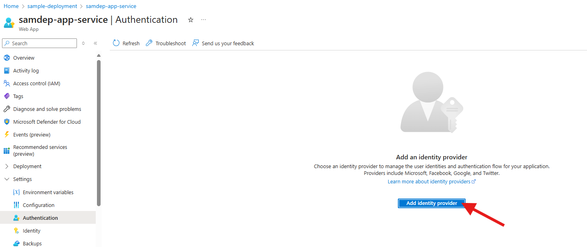
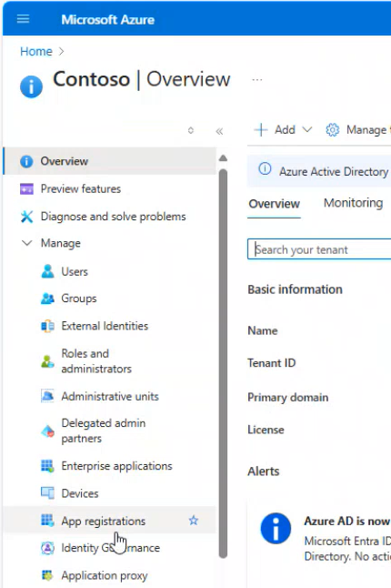
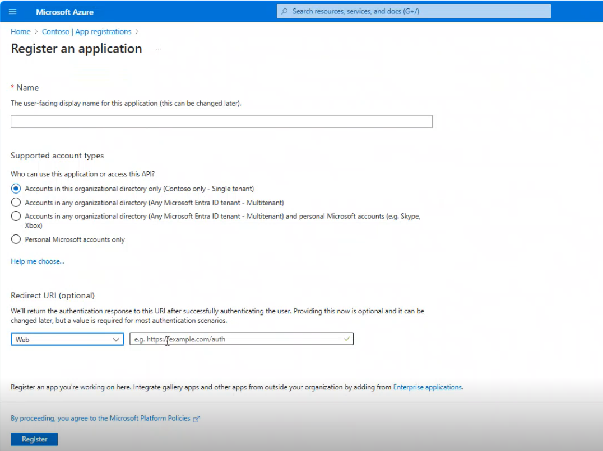
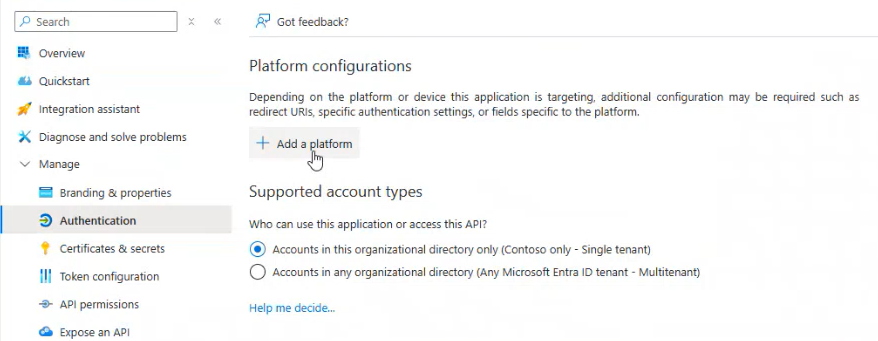

# Set Up Authentication in Azure App Service

## Step 1: Add Authentication in Azure App Service configuration

1. Click on `Authentication` from left menu.

2. Click on `+ Add Provider` to see a list of identity providers.

3. Click on `+ Add Provider` to see a list of identity providers.

4. Select the first option `Microsoft Entra Id` from the drop-down list. If `Create new app registration` is disabled, go to [Step 1a](#step-1a-creating-a-new-app-registration).

5. Accept the default values and click on `Add` button to go back to the previous page with the identify provider added.

### Step 1a: Creating a new App Registration

1. Click on `Home` and select `Microsoft Entra ID`.

2. Click on `App registrations`.

3. Click on `+ New registration`.

4. Provide the `Name`, select supported account types as `Accounts in this organizational directory only(Contoso only - Single tenant)`, select platform as `Web`, enter/select the `URL` and register.

5. After application is created sucessfully, then click on `Add a Redirect URL`.

6. Click on `+ Add a platform`.

7. Click on `Web`.

8. Enter the `web app URL` (Provide the app service name in place of XXXX) and Save. Then go back to [Step 1](#step-1-add-authentication-in-azure-app-service-configuration) and follow from _Point 4_ choose `Pick an existing app registration in this directory` from the Add an Identity Provider page and provide the newly registered App Name.
E.g. https://appservicename.azurewebsites.net/.auth/login/aad/callback

