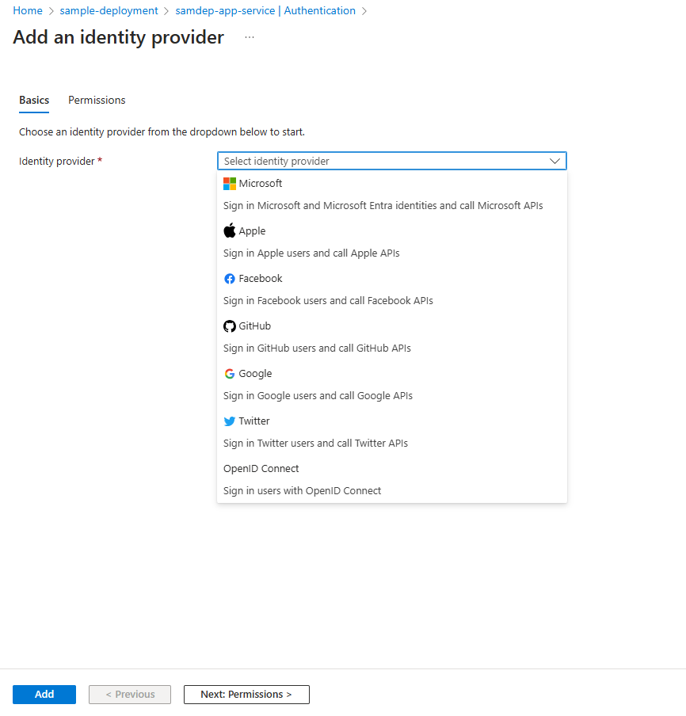
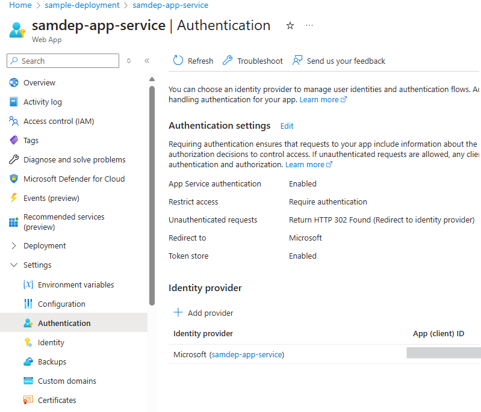

# Set Up Authentication in Azure App Service

This document provides step-by-step instructions to configure Azure App Registrations for a front-end application.

## Prerequisites

- Access to **Microsoft Entra ID**
- Necessary permissions to create and manage **App Registrations**
  
## Step 1: Add Authentication in Azure App Service configuration

1. Click on `Authentication` from left menu.

2. Click on `+ Add identity provider` to see a list of identity providers.

3. Click on `Identity Provider` dropdown to see a list of identity providers.

4. Select the first option `Microsoft Entra Id` from the drop-down list and select `client secret expiration` under App registration.
> NOTE: If `Create new app registration` is disabled, then go to [Create new app registration](/docs/create_new_app_registration.md) and come back to this step to complete the app authentication.

5. Accept the default values and click on `Add` button to go back to the previous page with the identify provider added.

6. You have successfully added app authentication, and now required to log in to access the application.
