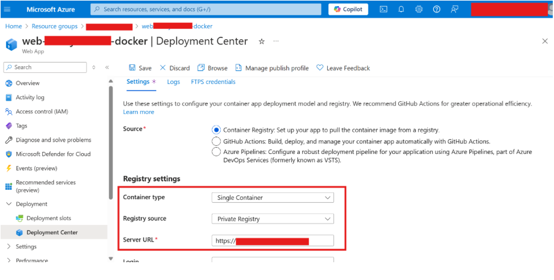

# Guide: Migrating Azure Web App Service to a New Container Registry

## Overview

### Current Problem:
- The **CWYD Container Image** is being published in the **External ACR** (Azure Container Registry).

### Goal:
- The goal is to **migrate container images** from various applications to a common **CSA CTO Production Azure Container Registry**, ensuring all the different images are consolidated in one centralized location.

---

## Step-by-Step Guide: Migrating Azure Web App Service to a New Container Registry

This guide will help you seamlessly switch the container registry for your **Azure Web App Service** from Azure Container Registry (ACR) to the new registry **`cwydcontainerreg`**.

Follow the steps below to ensure a smooth migration.

### Prerequisites:
Before you begin, ensure you have the following:
- Access to the **Azure Portal**.
- The **container image** in the new registry is ready and accessible.

---

### Step 1: Obtain Details for the New Registry

Before you begin, ensure you have the following information:
- **Registry URL**: The URL of the new registry (`https://cwydcontainerreg.azurecr.io`).
- **Image Name and Tag**: The full name and tag of the image you want to use:
  - **Web App Image**: `rag-webapp:latest`
  - **Admin Web App Image**: `rag-adminwebapp:latest`
  - **Function App Image**: `rag-backend:latest`

---

### Step 2: Update Azure Web App Service Configuration Using Azure Portal

1. **Log in to Azure Portal**:
   - Open [Azure Portal](https://portal.azure.com/).

2. **Locate Your Resource Group and Web App Service**:
   - Navigate to resource group which you have created for CWYD.
   - Navigate to **Web App Service**: From the list of resources, find and select **App Service**

3. **Go to the Deployment Center**:
   - In the left-hand menu, click on **Deployment**.

  

4. **Update Image Source**:
   - Change the **Registry Source** to **Private**.
   - Set the **Server URL** to the new container registry (`https://cwydcontainerreg.azurecr.io`), as shown in the screenshot below.
   - Set the **Full Image name** to the relevant image name and tag:
     - For Web App: `rag-webapp:latest`

   

5. **Save Changes**:
   - Click **Save** to save the configuration.

---

### Step 3: Restart the Web App Service

After updating the configuration, restart your **Web App Service** to apply the changes:

1. In the **Web App Service overview page**, click on **Restart**.
2. Confirm the restart operation.

---

### Step 4: Update Azure Admin Web App Service Configuration Using Azure Portal

1. **Locate Your Resource Group and Admin Web App Service**:
   - Navigate to resource group which you have created for CWYD.
   - Navigate to **Admin App Service**: From the list of resources, find and select **App Service** that contains `admin` in its name

2. **Go to the Deployment Center**:
   - In the left-hand menu, click on **Deployment**.

3. **Update Image Source for Admin Web App**:
   - Change the **Registry Source** to **Private**.
   - Set the **Server URL** to the new container registry (`https://cwydcontainerreg.azurecr.io`).
   - Set the **Full Image name** to the relevant image name and tag:
     - For **Admin Web App**: `rag-adminwebapp:latest`

4. **Save Changes**:
   - Click **Save** to save the configuration.

---

### Step 5: Restart the Admin Web App Service

After updating the configuration, restart your **Admin Web App Service** to apply the changes:

1. In the **Admin Web App Service overview page**, click on **Restart**.
2. Confirm the restart operation.

---

### Step 6: Update Azure Function App Service Configuration Using Azure Portal

1. **Locate Your Resource Group and Function App Service**:
   - Navigate to resource group which you have created for CWYD.
   - Navigate to **Function App**: From the list of resources, find and select **Function App**

2. **Go to the Deployment Center**:
   - In the left-hand menu, click on **Deployment**.

3. **Update Image Source for Function App**:
   - Change the **Registry Source** to **Private**.
   - Set the **Server URL** to the new container registry (`https://cwydcontainerreg.azurecr.io`).
   - Set the **Full Image name** to the relevant image name and tag:
     - For **Function App**: `rag-backend:latest`

4. **Save Changes**:
   - Click **Save** to save the configuration.

---

### Step 7: Restart the Function App Service

After updating the configuration, restart your **Function App Service** to apply the changes:

1. In the **Function App Service overview page**, click on **Restart**.
2. Confirm the restart operation.

---

### Step 8: Validate the Deployment

1. **Access Your Web App**:
   - Open the **Web App URL** in a browser to ensure it’s running correctly.

2. **Access Your Admin Web App**:
   - Open the **Admin Web App URL** in a browser to ensure it’s running correctly.

---

By following these steps, your **Azure Web App Service** will now use the new container from the **CWYD registry**.

For further assistance, feel free to reach out to your support team or log an issue on GitHub.

---
