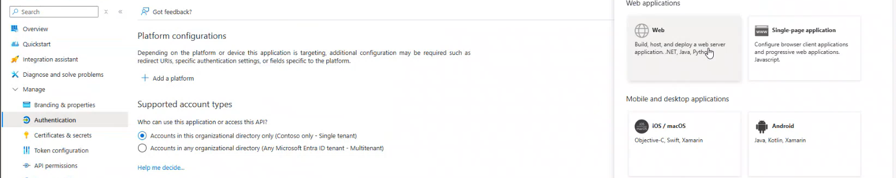

# Creating a new App Registration

1. Click on `Home` and select `Microsoft Entra ID`.

2. Click on `App registrations`.

3. Click on `+ New registration`.

4. Provide the `Name`, select supported account types as `Accounts in this organizational directory only(Contoso only - Single tenant)`, select platform as `Web`, enter/select the `URL` and register.

5. After application is created successfully, then click on `Add a Redirect URL`.

6. Click on `+ Add a platform`.

7. Click on `Web`.

8. Enter the `web app URL` (Provide the app service name in place of XXXX) and Save. Then go back to [Set Up Authentication in Azure App Service](/docs/azure_app_service_auth_setup.md) Step 1 page and follow from _Point 4_ choose `Pick an existing app registration in this directory` from the Add an Identity Provider page and provide the newly registered App Name.

E.g. <<https://<< appservicename >>.azurewebsites.net/.auth/login/aad/callback>>

