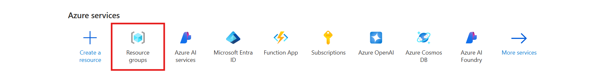
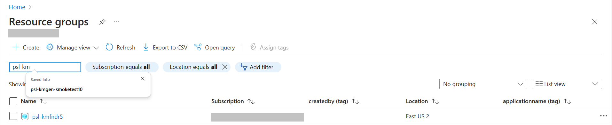
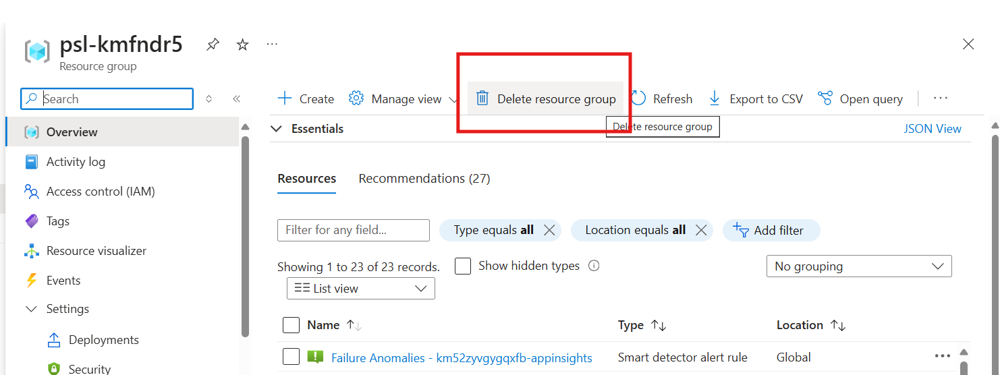
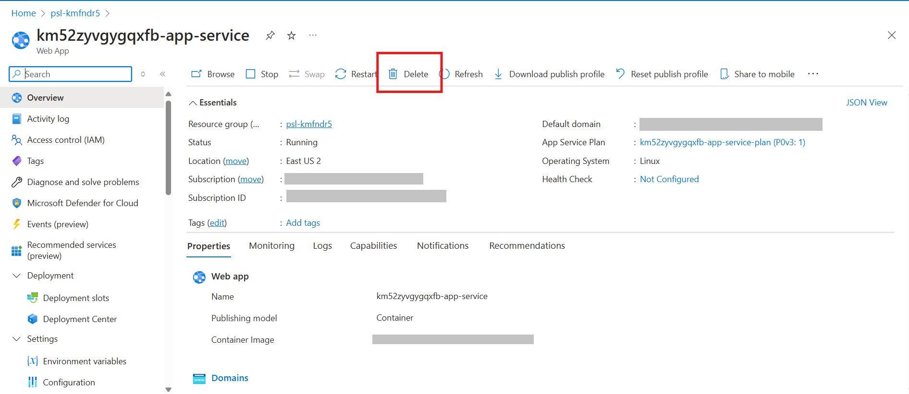

# Deleting Resources After a Failed Deployment in Azure Portal

If your deployment fails and you need to clean up the resources manually, follow these steps in the Azure Portal.

---

## **1. Navigate to the Azure Portal**
1. Open [Azure Portal](https://portal.azure.com/).
2. Sign in with your Azure account.

---

## **2. Find the Resource Group**
1. In the search bar at the top, type **"Resource groups"** and select it.
2. Locate the **resource group** associated with the failed deployment.

---

## **3. Delete the Resource Group**
1. Click on the **resource group name** to open it.
2. Click the **Delete resource group** button at the top.

3. Type the resource group name in the confirmation box and click **Delete**.

📌 **Note:** Deleting a resource group will remove all resources inside it.

---

## **4. Delete Individual Resources (If Needed)**
If you don’t want to delete the entire resource group, follow these steps:

1. Open **Azure Portal** and go to the **Resource groups** section.
2. Click on the specific **resource group**.
3. Select the **resource** you want to delete (e.g., App Service, Storage Account).
4. Click **Delete** at the top.

---

## **5. Verify Deletion**
- After a few minutes, refresh the **Resource groups** page.
- Ensure the deleted resource or group no longer appears.

📌 **Tip:** If a resource fails to delete, check if it's **locked** under the **Locks** section and remove the lock.
