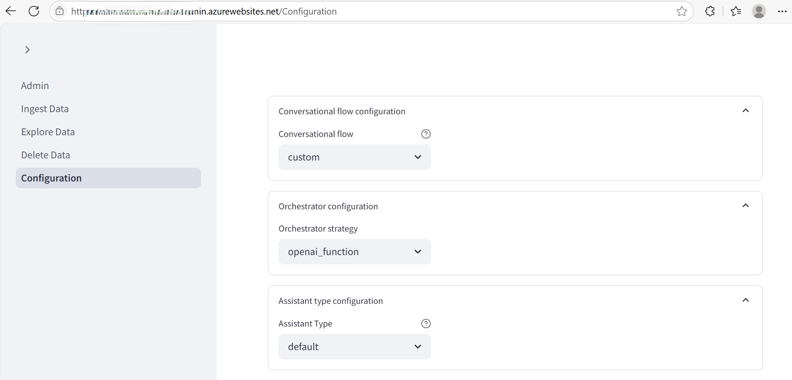
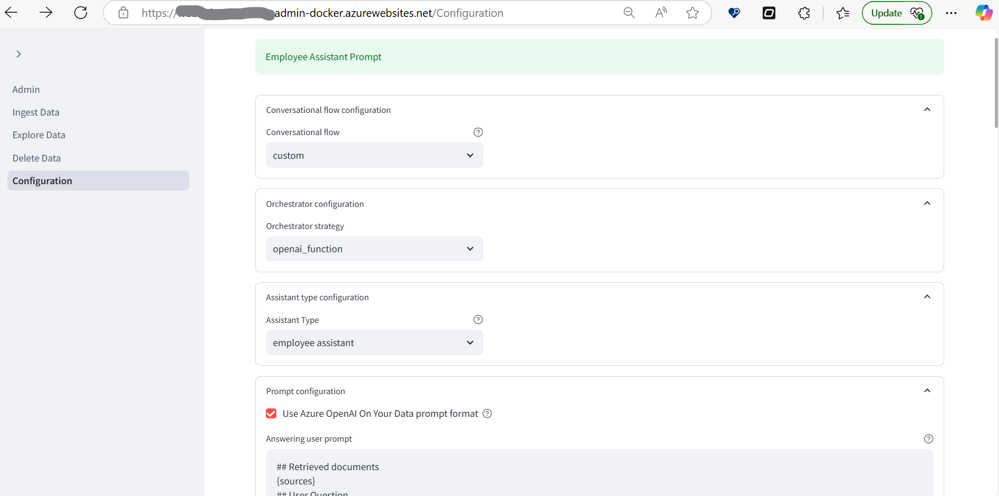

# Chat With Your Employee Assistant

## Overview
The Chat With Your Employee Assistant is designed to help professionals efficiently navigate their organizations and stay up to date with the latest policies and requirements.

## Employee Assistant Infrastructure Configuration

The following is the Chat With Your Data infrastructure configuration that we suggest to optimize the performance and functionality of the Employee Assistant:

- **Azure Semantic Search**: Utilize Azure Semantic Search to efficiently index and search employee handbooks and corporate policy documents. This provides powerful search capabilities and integration with other Azure services.
- **Azure Cognitive Search Top K 15**: Set the Top K parameter to 15 to retrieve the top 15 most relevant documents. This configuration helps in providing precise and relevant search results for user queries.
- **Azure Search Integrated Vectorization**: Enable integrated vectorization in Azure Search to improve the semantic understanding and relevance of search results. This enhances the Contract Assistant's ability to provide contextually accurate answers.
- **Azure OpenAI Model gpt-4.1**: Leverage the Azure OpenAI model gpt-4.1 for advanced natural language processing capabilities. This model is well-suited for handling complex legal queries and providing detailed and contextually appropriate responses.
- **Orchestration Strategy: Semantic Kernel**: Implement the Semantic Kernel orchestration strategy to effectively manage the integration and interaction between different components of the infrastructure. This strategy ensures seamless operation and optimal performance of the Employee Assistant.
- **Conversation Flow Options**: Setting `CONVERSATION_FLOW` enables running advanced AI models like GPT-4.1 on your own enterprise data without needing to train or fine-tune models.

By following these infrastructure configurations, you can enhance the efficiency, accuracy, and overall performance of the Chat With Your Data Employee Assistant, ensuring it meets the high demands and expectations of  professionals.

## Updating Configuration Fields

To apply the suggested configurations in your deployment, update the following fields accordingly:
- **Azure Semantic Search**: Set `AZURE_SEARCH_USE_SEMANTIC_SEARCH` to `true`
- **Azure Cognitive Search Top K 15**: Set `AZURE_SEARCH_TOP_K` to `15`.
- **Azure Search Integrated Vectorization**: Set `AZURE_SEARCH_USE_INTEGRATED_VECTORIZATION` to `true`.
- **Azure OpenAI Model Info**: Set `AZURE_OPENAI_MODEL_INFO`  to `{"model":"gpt-4.1","modelName":"gpt-4.1","modelVersion":"2025-04-14"}`.(model could be different based on the name of the Azure OpenAI model deployment).
- **Conversation Flow Options**: Set `CONVERSATION_FLOW` to `byod`
- **Orchestration Strategy**: Set `ORCHESTRATION_STRATEGY` to `Semantic Kernel`.


## Admin Configuration
In the admin panel, there is a dropdown to select the Chat With Your Employee Assistant. The options are:

- **Default**: Chat With Your Data default prompt.



- **Selected**: Employee Assistant prompt.



When the user selects "Employee Assistant," the user prompt textbox will update to the Employee Assistant prompt. When the user selects the default, the user prompt textbox will update to the default prompt. Note that if the user has a custom prompt in the user prompt textbox, selecting an option from the dropdown will overwrite the custom prompt with the default or contract assistant prompt. Ensure to **Save the Configuration** after making this change.

## Employee Assistant Prompt
The Employee Review and Summarization Assistant prompt configuration ensures that the AI responds accurately based on the given context, handling a variety of tasks such as listing documents, filtering based on specific criteria, and summarizing document content. Below is the detailed prompt configuration:

```plaintext
## Summary Contracts
Context:
{sources}
- You are a contract assistant.
```
You can see the [Employee Assistant Prompt](../code/backend/batch/utilities/helpers/config/default_employee_assistant_prompt.txt) file for more details.

## Sample Employee Policy and Handbook Data
We have added sample Employee data in the [data](../data/) folder. This data can be used to test and demonstrate the Employee Assistant's capabilities.

## Conclusion
This README provides an overview of the Chat With Your Data Employee Assistant prompt, instructions for updating the prompt configuration, and examples of questions and answers. Ensure you follow the guidelines for updating the prompt to maintain consistency and accuracy in responses.
