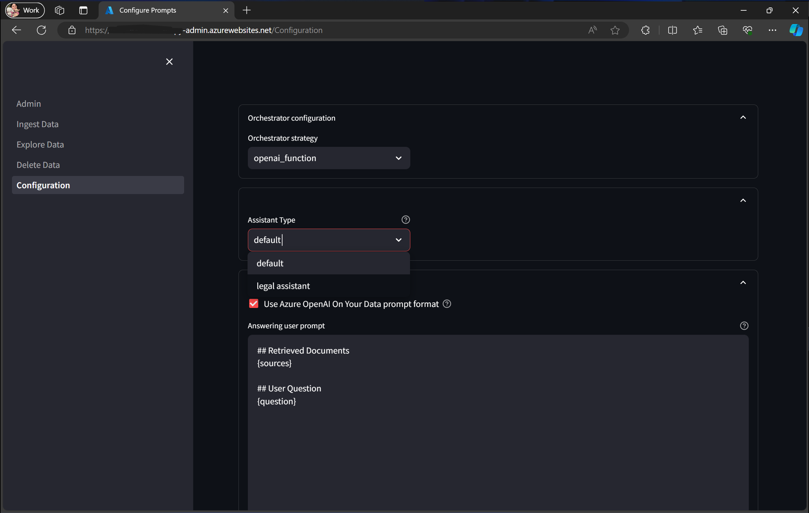
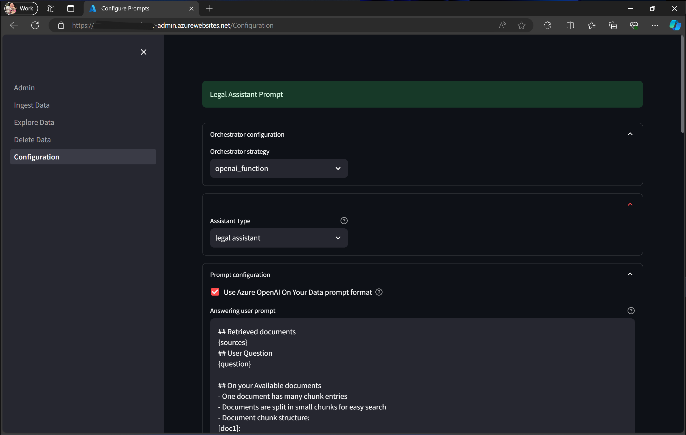

# CWYD Legal Assistant

## Overview
The CWYD Legal Assistant is designed to help legal professionals efficiently manage and interact with a large collection of legal documents. It utilizes advanced natural language processing capabilities to provide accurate and contextually relevant responses to user queries about the documents.

## Legal Assistant Infrastructure configuration


The following is the CWYD infrastructure configuration that we suggest to optimize the performance and functionality of the Legal Assistant:

- **Azure Semantic Search**: Utilize Azure Semantic Search to efficiently index and search legal documents. This provides powerful search capabilities and integration with other Azure services.

- **Azure Cognitive Search Top K 15**: Set the Top K parameter to 15 to retrieve the top 15 most relevant documents. This configuration helps in providing precise and relevant search results for user queries.

- **Azure Search Integrated Vectorization**: Enable integrated vectorization in Azure Search to improve the semantic understanding and relevance of search results. This enhances the Legal Assistant's ability to provide contextually accurate answers.

- **Azure OpenAI Model gpt-4o**: Leverage the Azure OpenAI model gpt-4o for advanced natural language processing capabilities. This model is well-suited for handling complex legal queries and providing detailed and contextually appropriate responses.

- **Azure OpenAI Model Version 2024-05-13**: Ensure that the Legal Assistant is using the latest version of the Azure OpenAI model (version 2024-05-13) to take advantage of the most recent improvements and features.

- **Orchestration Strategy: Semantic Kernel**: Implement the Semantic Kernel orchestration strategy to effectively manage the integration and interaction between different components of the infrastructure. This strategy ensures seamless operation and optimal performance of the Legal Assistant.

- **Conversation Flow Options**: Setting Set `CONVERSATION_FLOW=byod` enables running advanced AI models like GPT-4o on your own enterprise data without needing to train or fine-tune models.

- **Chunking Strategy**: Setting the chunking strategy to maximum page length size of 1200 characters to optimizing relevance, preserving context

By following these infrastructure configurations, you can enhance the efficiency, accuracy, and overall performance of the CWYD Legal Assistant, ensuring it meets the high demands and expectations of legal professionals.


### Admin Configuration
In the admin panel, there is a dropdown to  select the CWYD legal Assistant. The options are:

- **Default**  CWYD default prompt




- **Selected** Legal Assistant prompt




When the user selects "Legal Assistant", the user prompt textbox will update to the Legal Assistant prompt. When the user select the default, the user prompt textbox will update to the default prompt. Note that if the user has a custom prompt in the user prompt textbox, selecting an option from the dropdown will overwrite the custom prompt with the default or legal assistant prompt.

### Legal Assistant Prompt
The Legal Assistant prompt configuration ensures that the AI responds accurately based on the given context, handling a variety of tasks such as listing documents, filtering based on specific criteria, and summarizing document content. Below is the detailed prompt configuration:

```plaintext
## Summary Contracts
Context:
{sources}
- You are a legal assistant.
etc
```
You can see here the [Legal Assistant Prompt](../code/backend/batch/utilities/helpers/config/default_legal_assistant_prompt.txt) file.
### Sample Legal Data
We have added sample legal data in the [Legal Assistant sample Docs](../data/legal_data). `data/legal_data` folder. This data can be used to test and demonstrate the legal assistant capabilities.

### Example Updates
If you need to add a new filtering criterion based on "industry":

```plaintext
## When asked to filter the list of documents based on a specific criterion (e.g., industry)
- you answer:
  - Filter the list of documents based on the specified criterion:
    - Extract documents from the previously listed documents that match the specified criterion (e.g., industry).
    - Format the filtered list with document titles and their metadata.
```

## Question and Answer Examples

### Example 1: Listing All Uploaded Documents
**Question:** Can you list all the documents uploaded?
**Answer:**
```plaintext
#    Name of the document    Format
1    Master_Agreement_V1 (1).pdf    PDF
2    NASPO_VP_SVAR_Insight_AL_PA.pdf    PDF
<!-- More rows as needed -->
```

### Example 2: Filtering by State
**Question:** Show me the list of contracts for the state of Alabama.
**Answer:**
```plaintext
#    Name of the document    Format
1    State_of_Alabama_NASPO_Cloud_Services_PA_032224_.docx 1.pdf    PDF
2    State_of_Alabama_NASPO_Cloud_Services_PA_032224_.docx.pdf    PDF
<!-- More rows as needed -->
```

### Example 3: Filtering by Date Range
**Question:** Show me a list of contracts for the state of Alabama that were published between 2022 and 2024.
**Answer:**
```plaintext
#    Name of the document    Format
1    State_of_Alabama_NASPO_Cloud_Services_PA_032224_.docx 1.pdf    PDF
2    State_of_Alabama_NASPO_Cloud_Services_PA_032224_.docx.pdf    PDF
<!-- More rows as needed -->
```

### Example 4: Summarizing a Document
**Question:** Can you give me a summary of Legal contract_20240411112609.pdf?
**Answer:**
```plaintext
Summary of Legal contract_20240411112609.pdf:
- Parties Involved: [Party A], [Party B]
- Key Dates:
  - Effective date: [Date]
  - Expire date: [Date]
- Obligations:
  - [Party A] is responsible for [obligation 1]
  - [Party B] is responsible for [obligation 2]
- Terms:
  - Payment terms: [details]
  - Termination clauses: [details]
```

## Conclusion
This README provides an overview of the CWYD Legal Assistant prompt, instructions for updating the prompt configuration, and examples of questions and answers. Ensure you follow the guidelines for updating the prompt to maintain consistency and accuracy in responses.
