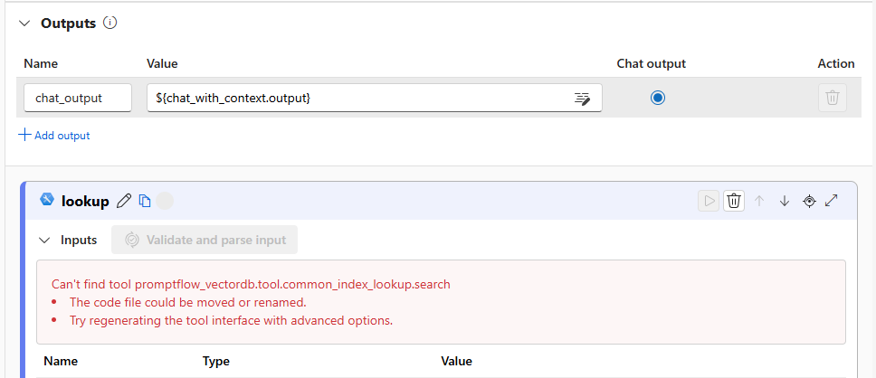
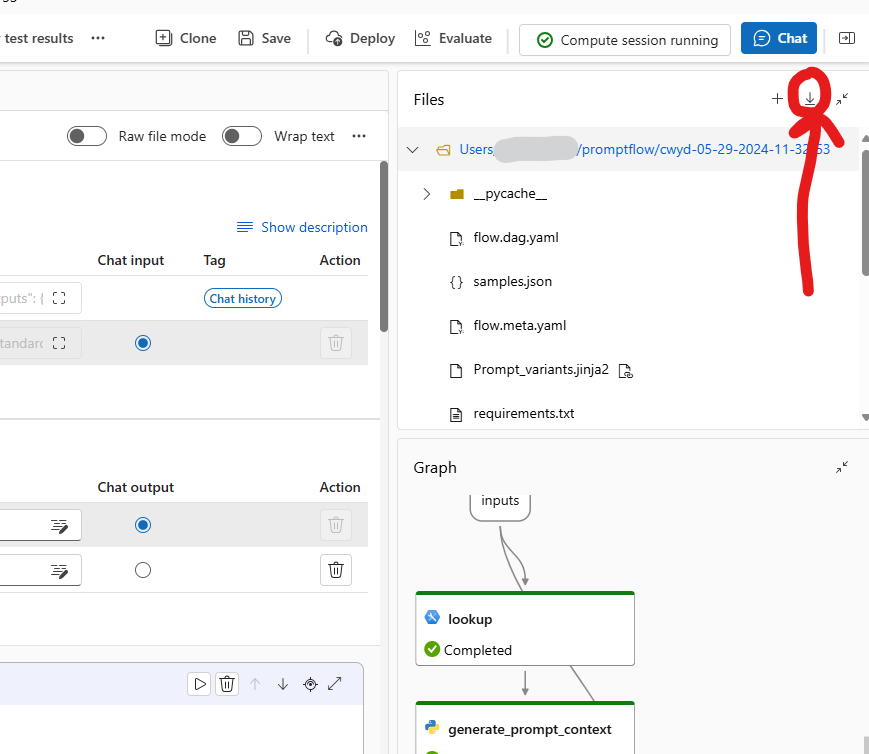

[Back to *Chat with your data* README](../README.md)

# Prompt flow


## User Story

The Chat With Your Data Solution Accelerator has included prompt flow as an orchestration strategy as an alternative,
low code option. This allows you to modify and experiment with the orchestration using Azure Machine Learning studio. To
learn more about prompt flow see:
[Azure Machine Learning PromptFlow](https://learn.microsoft.com/en-us/azure/machine-learning/prompt-flow/overview-what-is-prompt-flow?view=azureml-api-2).

## Limitations

> :warning: This feature is still in development and not ready for use

> :warning: It is required to deploy the accelerator using `azd` to utilize this feature

The implementation does not currently support enabling features such as
[integrated vectorization](integrated_vectorization.md) or [advanced image processing](advanced_image_processing.md)
along side setting the orchestration strategy to prompt flow. It is intended to be a simple use case that you can then
take and modify for your use case.

## Enabling

To configure prompt flow as your orchestration strategy, execute the following commands:

```bash
azd env set ORCHESTRATION_STRATEGY prompt_flow
azd up
```

These commands will provision the necessary Azure Machine Learning resources and establish the flow in
[../infra/prompt_flow/cwyd/](../infra/prompt_flow/cwyd/) as a managed endpoint.


Upon first accessing the deployed flow in Azure Machine Learning Studio, you may encounter errors as shown below:



This is a known issue and can be resolved by initiating a compute session. Once the session starts, refresh the flow.

## Updating the flow

Follow these steps to update the flow:

1. Navigate to the flow in Azure Machine Learning Studio and make the necessary changes
1. Download the updated flow files to the [../infra/prompt_flow/cwyd/](../infra/prompt_flow/cwyd/) directory by clicking the download button in the Files tab

1. Replace the content of `flow.dag.template.yaml` with your new flow from the `flow.dag.yaml` file
1. In the `flow.dag.template.yaml` file, locate the `inputs.mlindex_content` section for the `lookup` node and replace
   the following values
   - `embeddings.api_base`: Replace with `<openai_api_base>`
   - `embeddings.connection.id`: Replace with `<openai_connection_id>`
   - `embeddings.deployment`: Replace with `<openai_embedding_model>`
   - `embeddings.model`: Replace with `<openai_embedding_model>`
   - `index.connection.id`: Replace with `<aisearch_connection_id>`
   - `index.endpoint`: Replace with `<aisearch_endpoint>`
   - `index.index`: Replace with `<aisearch_index>`
1. To apply the changes, run either `azd provision` or `azd up`
