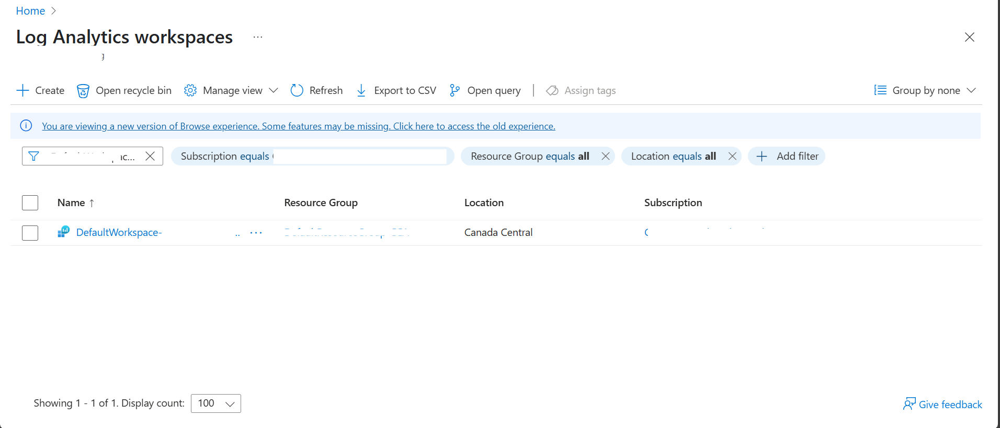
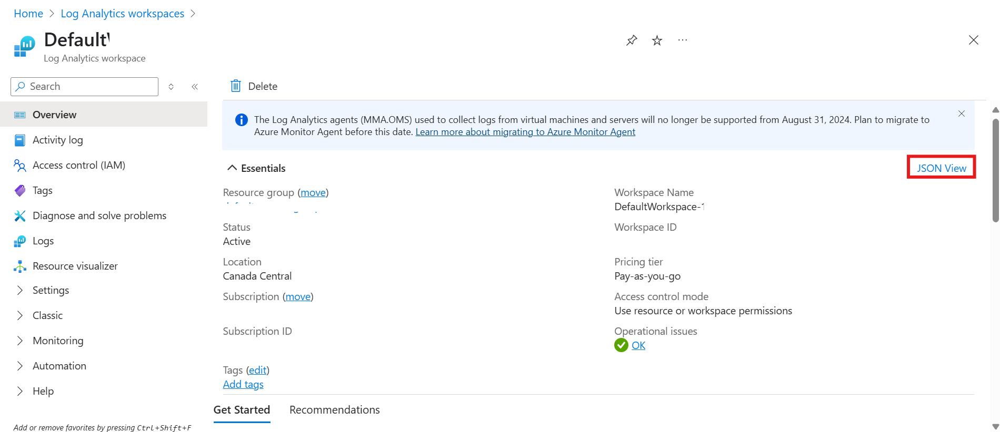
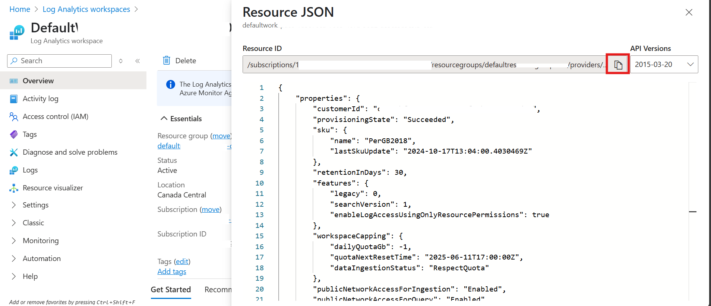

[← Back to *LOCAL_DEPLOYMENT* guide](../docs/LOCAL_DEPLOYMENT.md)

# Reusing an Existing Log Analytics Workspace
To configure your environment to use an existing Log Analytics Workspace, follow these steps:
---
### 1. Go to Azure Portal
Go to https://portal.azure.com

### 2. Search for Log Analytics
In the search bar at the top, type "Log Analytics workspaces" and click on it and click on the workspace you want to use.



### 3. Copy Workspace id
In the Overview pane, Click on JSON View



Copy Resource ID that is your Workspace ID



### 4. Set the Workspace ID in Your Environment
Run the following command in your terminal
```bash
azd env set AZURE_ENV_LOG_ANALYTICS_WORKSPACE_ID '<Existing Log Analytics Workspace Id>'
```
Replace `<Existing Log Analytics Workspace Id>` with the value   obtained from Step 3.

### 5. Continue Deployment
Proceed with the next steps in the [Chat with your data local deployment guide](../docs/LOCAL_DEPLOYMENT.md).
