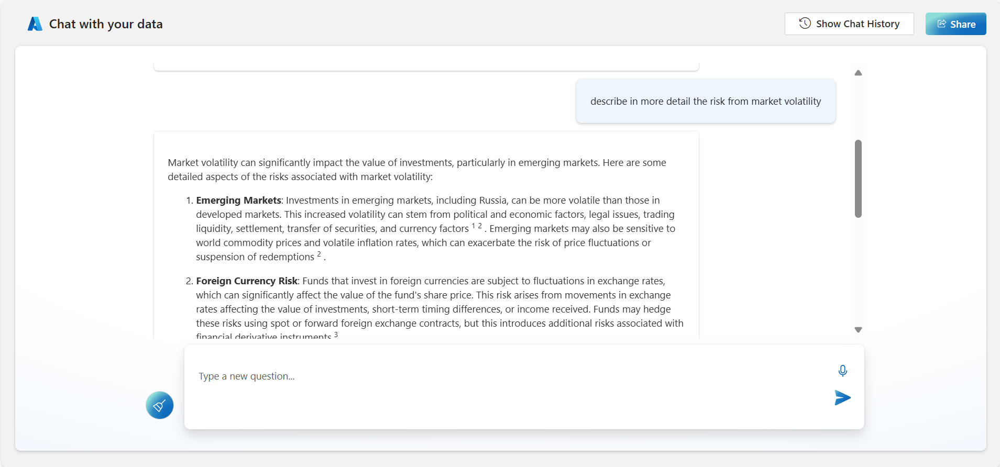

[Back to *Chat with your data* README](../README.md)

# Speech-to-text functionality
Many users are used to the convenience of speech-to-text functionality in their consumer products. With hybrid work increasing, speech-to-text supports a more flexible way for users to chat with their data, whether they’re at their computer or on the go with their mobile device. The speech-to-text capability is combined with NLP capabilities to extract intent and context from spoken language, allowing the chatbot to understand and respond to user requests more intelligently.

Chat with your unstructured data

Get responses using natural language
