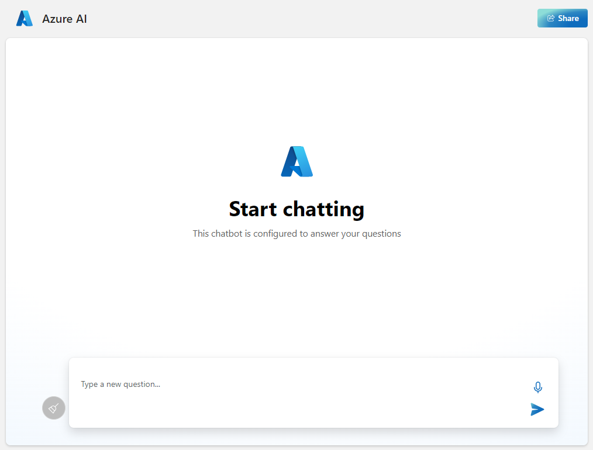

# Using the web apps in the "Chat with your data" solution accelerator  

## Chat app

This solution accelerator provides a web app used for chatting with the LLM using the data you ingest with the [Admin site](#admin-site). This app has a simple interface that enables you and your users to enter prompts and receive responses.

## Admin site

This solution accelerator provides an "admin" site that enables you to upload, ingest, and explore your data, along with accessing prompt configuration settings. 

### Ingesting data

Using the **Ingest data** tab, you can add documents and index public web pages to be used as grounding data for Large Language Model (LLM) responses. Files that you upload will be chunked according to one of several strategies.

`<how is a chunking strategy chosen?>`

|Strategy |Description  |
|---------|---------|
|Layout    |  TBD       |
|Page   | TBD         |
|Fixed size overlap     | TBD         |
|Paragraph     | TBD         |

You can see the chunks extracted from your files in the **Explore data** tab.

### Prompt configuration

TBD

## Adding authentication for your web apps

By default, the web apps have no authentication and can be accessed through the internet by anyone with the apps' URLs. To add authentication (for example, restrict access to the app to members of your Azure tenant):

1. Go to the [Azure portal](https://portal.azure.com/#home) and search for the app name you specified during publishing. Select the web app, and go to the **Authentication** tab on the left navigation menu. Then select **Add an identity provider**. 

    
    

1. Select Microsoft as the identity provider. The default settings on this page will restrict the app to your tenant only, so you don't need to change anything else here. Then select **Add**.
    
    Now users will be asked to sign in with their Azure Active Directory account to be able to access your app. You can follow a similar process to add another identity provider if you prefer. The app doesn't use the user's login information in any other way other than verifying they are a member of your tenant.
