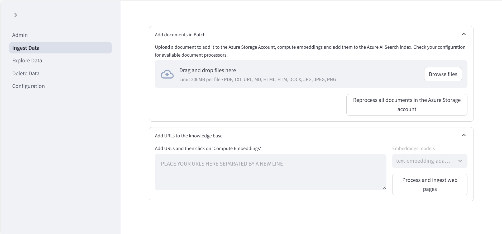

# Using the web apps in the "Chat with your data" solution accelerator

## Chat app

This solution accelerator provides a web app used for chatting with the LLM using the data you ingest with the [Admin site](#admin-site). This app has a simple interface that enables you and your users to enter prompts and receive responses.

## Admin site

This solution accelerator provides an "admin" site that enables you to upload, ingest, and explore your data, along with accessing prompt configuration settings.

### Ingesting data

Using the **Ingest data** tab, you can add documents and index public web pages to be used as grounding data for Large Language Model (LLM) responses. Files that you upload will be chunked according to one of several strategies.

`<how is a chunking strategy chosen?>`

|Strategy |Description  |
|---------|---------|
|Layout    |  TBD       |
|Page   | TBD         |
|Fixed size overlap     | TBD         |
|Paragraph     | TBD         |

You can see the chunks extracted from your files in the **Explore data** tab.

### Prompt configuration

TBD

## Add Authentication in Azure App Service configuration

1. Click on `Authentication` from left menu.

  

2. Click on `+ Add Provider` to see a list of identity providers.

  

3. Click on `+ Add Provider` to see a list of identity providers.

  

4. Select the first option `Microsoft Entra Id` from the drop-down list.
 

5. Accept the default values and click on `Add` button to go back to the previous page with the identify provider added.
 
