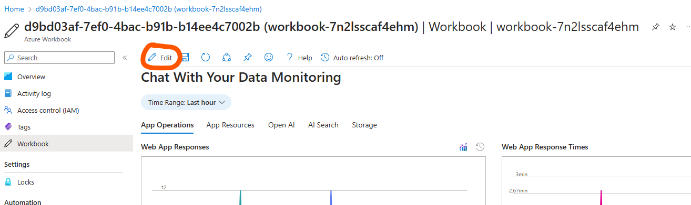
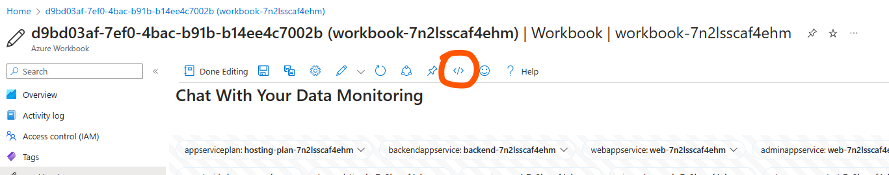
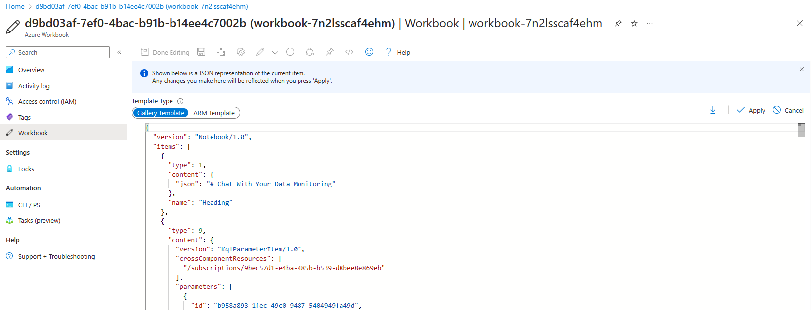
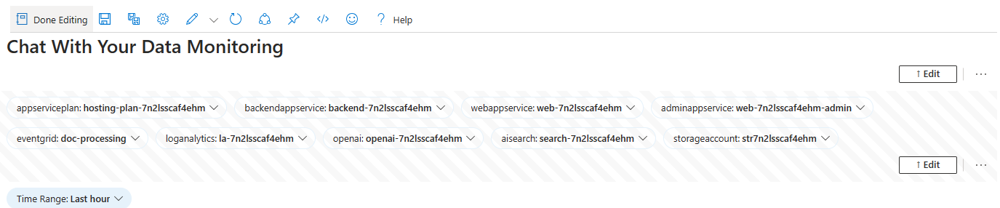
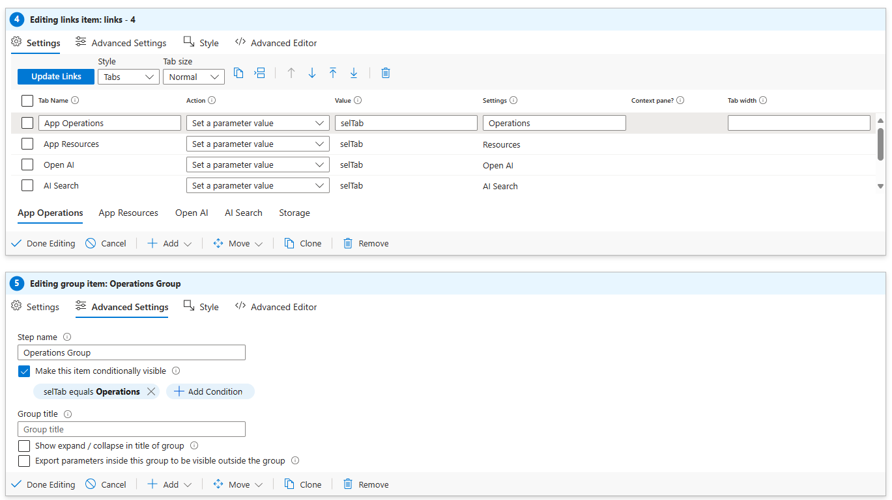

# Workbook

This project leverages [Azure Workbooks](https://learn.microsoft.com/en-us/azure/azure-monitor/visualize/workbooks-overview)
to aggregate monitoring data from various Azure resources.

The workbook's exported JSON is located in the [../infra/workbooks/workbook.json](../infra/workbooks/workbook.json)
file. The actual resource names have been replaced with placeholders, which get populated during the workbook's deployment.

## Modifying the Workbook

The most straightforward method to modify the workbook is through the UI, followed by re-exporting the JSON file.

To do this, navigate to the workbook resource and:

1. Click on 'Edit'
   
2. Click on 'Advanced Editor'
   
3. Copy or download the contents into the [../infra/workbooks/workbook.json](../infra/workbooks/workbook.json) file
   
4. Replace the actual resource names with the corresponding placeholders:
   - `/subscriptions/00000000-0000-0000-0000-00000000000` -> `{subscription-id}`
   - `rg-<your-resource-group-name>` -> `{resource-group}`
   - `hosting-plan-<your-resource-token>` -> `{app-service-plan}`
   - `backend-<your-resource-token>` -> `{backend-app-service}`
   - `web-<your-resource-token>` -> `{web-app-service}`
   - `web-<your-resource-token>-admin` -> `{admin-app-service}`
   - `doc-processing` -> `{event-grid}`
   - `la-<your-resource-token>` -> `{log-analytics}`
   - `openai-<your-resource-token>` -> `{open-ai}`
   - `search-<your-resource-token>` -> `{ai-search}`
   - `str<your-resource-token>` -> `{storage-account}`

## Adding New Resources to the Workbook

To simplify the process of replacing resource names with placeholders, we've added hidden parameters that reference the
resources. These parameters are visible when you're editing the workbook:

If you need to add a new resource to the workbook, please add this as a hidden parameter, then reference that parameter
in your metric or query. The easiest way to do this is to duplicate an existing parameter and change it to the resource
type you require.

## Recommended Graph Settings

To enhance the workbook's usability, we recommend the following settings, which can be found under `Advanced Settings`:
- `Show open in Metrics Explorer button when not editing`: This allows users to easily modify or edit the query if
required for a specific reason.
- `Enable time range brushing` + `Export selected time range as parameter: timerange`: This allows users to easily
modify the time range and zoom in on data by simply highlighting the time range on the graph.

## Tabs

To implement tab functionality, we first need to organize our graphs into groups. Then, in `Advanced Settings` for the
groups, we enable the setting `Make this item conditionally visible`, adding a condition of `selTab equals <tab-name>`.

We then add a new links section to the workbook, of type tabs. Where the action of each tab is `Set a parameter value`
where the value is `selTab` and the settings is the name of the tab.

