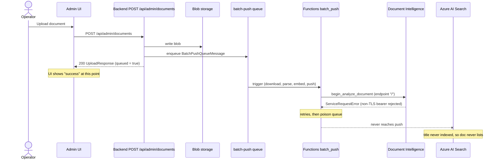

## Summary

A document uploaded through the admin Add-data UI returns `200` with an `UploadResponse` (the UI shows success), but the document never appears in the admin documents list and is therefore never available for grounding. The upload endpoint is a two-step **store blob, then enqueue** operation that returns `200` *before* indexing runs; indexing happens asynchronously in the Functions `batch_push` queue trigger. Every PDF dies in the **parse** step because `DocumentIntelligenceParser` builds its client endpoint from `settings.foundry.services_endpoint` (`AZURE_AI_SERVICES_ENDPOINT`), and when that setting is empty the endpoint resolves to `"/"` — a URL with no `https` scheme. The Azure SDK's bearer-token policy refuses to attach the managed-identity token to a non-TLS URL and raises before any request leaves the process, so the message is retried, dead-lettered, and the document never reaches the index.

- **Area**: functions
- **Severity**: high
- **Status**: open (found 2026-06-14, root-caused 2026-06-16)
- **Registry entry**: [bugs.md → BUG-0034](bugs.md)

## Symptom

1. An operator uploads a document (for example a PDF) through the admin Add-data UI.
2. The request returns `200` with an `UploadResponse`; the UI reports success.
3. The document never appears in the admin documents list (the Delete-data grid), so it cannot be managed or used for grounding.

There is no error surfaced to the operator — the failure is entirely downstream of the synchronous response.

## Pipeline under test

The admin upload is intentionally asynchronous. `POST /api/admin/documents` (`backend.services.ingestion.upload_document`) writes the blob and enqueues a `BatchPushQueueMessage`, then returns `200`. The actual indexing — download, parse, embed, push to Azure AI Search — runs later in the Functions `batch_push` queue trigger. The list endpoint (`GET /api/admin/documents` → `search.list_sources`) reads distinct `title` values from the Search index, so a document lists **only after** it has been successfully indexed.



## Root cause

The break is in the **parse** step for PDFs. `DocumentIntelligenceParser._get_client` derives the client endpoint like this:

```python
endpoint = f"{self._settings.foundry.services_endpoint.rstrip('/')}/"
```

When `services_endpoint` (`AZURE_AI_SERVICES_ENDPOINT`, env prefix `AZURE_AI_`) is empty, this computes `f"{''.rstrip('/')}/"` → `"/"`, a URL with no `https` scheme. The SDK then constructs a `DocumentIntelligenceClient` whose `BearerTokenCredentialPolicy` refuses to attach the managed-identity token to a non-TLS URL and raises:

```text
azure.core.exceptions.ServiceRequestError:
Bearer token authentication is not permitted for non-TLS protected (non-https) URLs.
```

This throws before any request leaves the process. `batch_push` therefore fails on every PDF, the message is retried and dead-lettered (poison), and the document never reaches the index. Because the upload-plus-enqueue step already returned `200`, the UI reports success while indexing silently fails.

The chain in one line: empty `AZURE_AI_SERVICES_ENDPOINT` → endpoint `"/"` → non-HTTPS URL → SDK bearer-token policy rejects auth → `ServiceRequestError` in `parse` → retries → poison queue → document never indexed → never lists.

## Diagnostic trace

The diagnosis ran end to end on 2026-06-16:

1. **Wiring** — confirmed identical between the backend enqueue and the Functions trigger: queue name, storage account, and container all match, with identity-based auth (not Azurite).
2. **Queue state** — the main queue was empty; the **poison queue held 22 messages** (14 `.pdf` and 8 extension-less, all dated 2026-06-10) with valid envelopes (`filename`, `container_name`, `ingestion_job_id` all present). A valid envelope means the failure is downstream of message validation — in parse, embed, or push.
3. **In-process reproduction** — running the exact `functions.batch_push.blueprint._execute` seam against a sample PDF reproduced the failure: `ServiceRequestError` in `DocumentIntelligenceParser.parse` at `begin_analyze_document`, because `services_endpoint` resolved to `""`. The `v2/.env` the script loads is missing `AZURE_AI_SERVICES_ENDPOINT`.
4. **Config-corrected re-run** — re-running the same seam with the Functions host's `local.settings.json` values loaded (which **do** carry an `https` `AZURE_AI_SERVICES_ENDPOINT`) **succeeded — 4 chunks pushed** — and the sample PDF then appeared in `GET /api/admin/documents`. So the code and host config are now correct; the 22 poison messages are stale failures from before the endpoint was present in the host config.

The key finding from steps 3 and 4 is a **config split**: `v2/.env` is missing `AZURE_AI_SERVICES_ENDPOINT`, while the Functions host's `local.settings.json` has it. The host is now correct, but the backend's synchronous `ingest_url` path and the ingestion scripts read `.env` and still break.

## Classification

This is primarily a **configuration gap** (empty `AZURE_AI_SERVICES_ENDPOINT`) compounded by a **code-hardening gap**: an empty or non-HTTPS endpoint fails with a cryptic SDK auth error and silently poisons every PDF while the UI shows success, with no fail-fast validation and no surfacing of the ingestion failure to the operator.

## Fix plan

Each item is a separate, test-first unit:

1. **Fail-fast guard (the real code fix).** Validate `services_endpoint` is non-empty and `https`-schemed at the point the `DocumentIntelligenceParser` derives its endpoint, raising a clear, actionable error that names `AZURE_AI_SERVICES_ENDPOINT` instead of the opaque SDK "non-TLS" message. This prevents silent PDF-poisoning: a misconfigured endpoint now fails loudly with an actionable message rather than dead-lettering every document.
2. **`v2/.env` backfill.** Add `AZURE_AI_SERVICES_ENDPOINT` so the backend's synchronous `ingest_url` path and the ingestion scripts work. Only the Functions host's `local.settings.json` was repaired; tracked files keep the placeholder, the real value lives only in the gitignored environment.
3. **Operational cleanup.** Redrive the 22 poison messages (or `POST /api/admin/documents/reprocess`) now that the configuration is correct.

## Adjacent observations

These are not part of BUG-0034 and are tracked separately:

- The in-process `_execute` run logged `aiohttp` "Unclosed client session / Unclosed connector" warnings — the Document Intelligence client and the embedder are not closed on the `batch_push` path (a low-severity resource leak, candidate for a separate bug).
- The locally running Functions host (restarted after an overnight DNS/credential crash) was not draining the main queue during the trace. This is a local-dev session listener artifact cleared by a clean host restart, not a code defect.

## References

- [bugs.md → BUG-0034](bugs.md) — defect registry entry.
- [worklog/2026-06-16.md](worklog/2026-06-16.md) — the diagnosis session.
- [worklog/2026-06-14.md](worklog/2026-06-14.md) — when the defect was first observed.
- BUG-0003 — the same `list_sources` documents list (healthy after its facet-to-paging fix); BUG-0034 is upstream of it, in ingestion.
