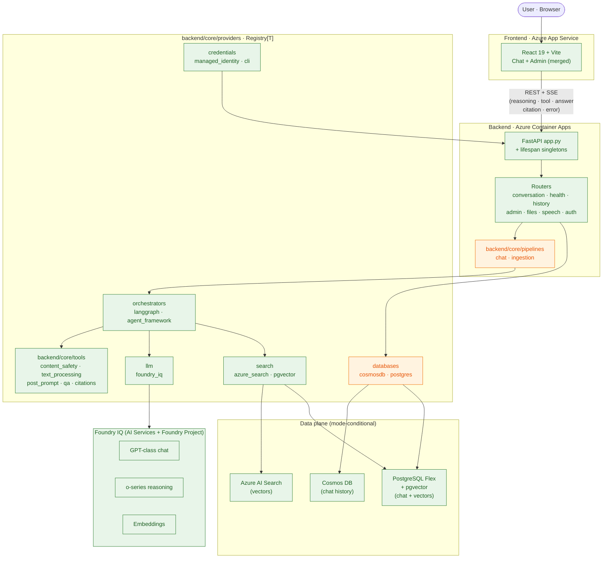
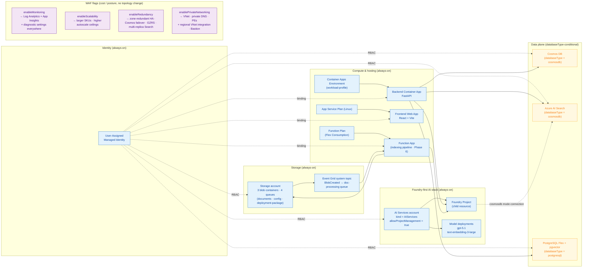
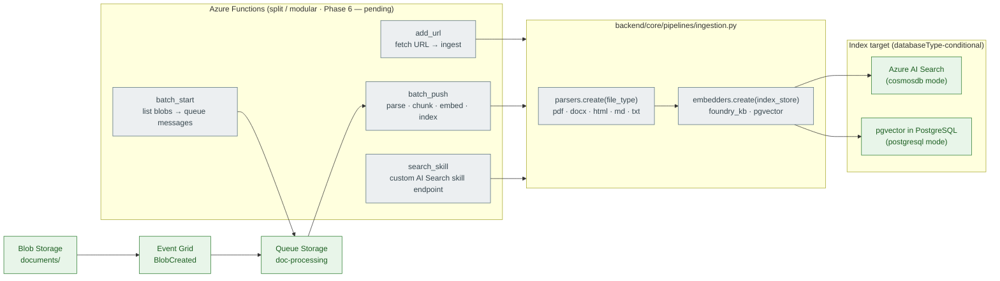
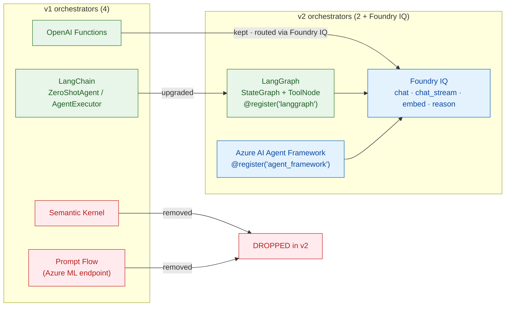

# CWYD v2 — Status Presentation

> Executive-ready status deck for the **Chat With Your Data Solution Accelerator v2** modernization. Status numbers, dates, and architectural facts are quoted from the live source-of-truth docs in `v2/docs/`. Diagrams are Mermaid; they render natively in GitHub and VS Code preview.

---

## Contents

1. [Executive summary](#1-executive-summary)
2. [Program status at a glance](#2-program-status-at-a-glance)
3. [v1 → v2 transformation](#3-v1--v2-transformation)
4. [Architecture — application (Diagram A)](#4-architecture--application-diagram-a)
5. [Architecture — Azure infrastructure (Diagram B)](#5-architecture--azure-infrastructure-diagram-b)
6. [Architecture — RAG indexing pipeline (Diagram C)](#6-architecture--rag-indexing-pipeline-diagram-c)
7. [Architecture — orchestrator migration (Diagram D)](#7-architecture--orchestrator-migration-diagram-d)
8. [Key improvements](#8-key-improvements)
9. [Pillars-of-development alignment](#9-pillars-of-development-alignment)
10. [Architecture Decision Records (ADRs)](#10-architecture-decision-records-adrs)
11. [Roadmap — what's left](#11-roadmap--whats-left)
12. [Appendix — source-of-truth links](#12-appendix--source-of-truth-links)

---

## 1. Executive summary

**What CWYD v2 is.** A ground-up rewrite of the *Chat With Your Data Solution Accelerator* on a modular **FastAPI + LangGraph + Azure AI Agent Framework + Foundry IQ** stack, deployed to Azure entirely through `azd up` against an **AVM-first Bicep** substrate that uses a single User-Assigned Managed Identity and **no Key Vault for app secrets**.

**Why we are doing it.** v1 had accumulated significant tech debt — a monolithic Flask app with four parallel orchestrators, a 150+-variable `EnvHelper` god-singleton, beta SDKs, Key Vault for app config, no native async, and a Streamlit admin app on a separate service. v2 collapses that surface area onto modern, async-first primitives, makes every pluggable concern selectable through a single `Registry[T]` recipe, and replaces direct Azure OpenAI SDK calls with **Foundry IQ** so model access, knowledge-base management, and reasoning models are governed centrally.

**Where we are today.** Phases **1, 2, 3, and the 3.5 QA-remediation pass** are complete and green. Phase 4 (chat history + both databases) has its hardening blockers cleared (B1 / H1 / H3) and is mid-implementation; phases 5–7 are queued. Test counts: **263 / 263 passing** as of the most recent Phase 4 audit. Both the default `azd up` profile and the WAF (private + monitored + redundant) profile build cleanly.

**What ships in the box.** Two deployment-time database modes — `cosmosdb` (Cosmos DB chat history + Azure AI Search vectors) and `postgresql` (PostgreSQL Flexible Server with pgvector for both). Two runtime orchestrators — **LangGraph** and **Azure AI Agent Framework** — both behind the same `OrchestratorBase` async contract and emitting on the same typed SSE reasoning channel. One UAMI, RBAC end-to-end.

---

## 2. Program status at a glance

> Source: [`development_plan.md`](development_plan.md) §0 status snapshot + Phase 4 hardening rows. Status legend: ✅ done · ⏳ in progress · ⏭ next · ☐ not started.

| Phase | Title | Status | Headline |
|---|---|---|---|
| 1 | Infrastructure + Project Skeleton | ✅ done | AVM-first Bicep, UAMI + RBAC, no Key Vault, two-mode `databaseType`, frontend + backend + functions stubs, P1 polish shipped. |
| 2 | Configuration + LLM Integration | ✅ done | `Registry[T]` primitive · Pydantic `AppSettings` · credentials + LLM provider domains · health split (always-200 vs ready) · per-app singleton via lifespan. **55 / 55 tests.** |
| 3 | Conversation + RAG (Core Chat) | ✅ done (BE) | Two orchestrators (LangGraph + Agent Framework) · 4 cross-cutting tools (content_safety, text_processing, post_prompt, qa) · Azure AI Search provider · SSE chat router + chat pipeline · citations · reasoning model routing · indexing scripts. **186 / 186 tests.** Frontend SSE wiring (#24) belongs to the FE team. |
| 3.5 | QA Remediation (post-Phase-3 audit) | ✅ done | 6 deployability blockers cleared (Q2–Q8), structural realignment Q10 (`providers/` + `pipelines/` folded under `backend/core/`, `chat_history` collapsed into `databases`). 186 / 186 BE · 20 / 20 FE · both compose profiles green. |
| 4 | Chat History + Both Databases | ⏳ in progress | Hardening pass complete: B1 (pgvector lifespan dispatch via `index_store`), H1 (`get_user_id` 401 fail-closed in production), H3 (`_ensure_pool` TOCTOU). **263 / 263 tests.** Remaining: tasks #27–#31 (`databases` domain — cosmosdb + postgres clients, caller wiring, pgvector search, chat history router) + #32 (FE history panel). |
| 5 | Admin + Frontend Merge | ☐ not started | Admin/files/speech/auth routers + admin pages in React; permanently retire Streamlit references. (Speech router #38 cleared early on 2026-05-08 as ledger row **S1 / SPEECH-MVP** — pulled forward into Phase 4 polish for the boss demo; see [development_plan.md](development_plan.md) §0.1.) |
| 6 | RAG Indexing Pipeline (Split Functions) | ☐ not started | `function_app.py` + 4 blueprints (`batch_start` / `batch_push` / `add_url` / `search_skill`) · parsers domain (5 file types) · embedders domain (foundry_kb + pgvector) · ingestion pipeline · default config bootstrap. |
| 7 | Testing + Documentation | ☐ not started | E2E tests across both orchestrators + both DB modes · v1→v2 migration guide · final greppable-cleanliness audit. |

**Test totals (cumulative)**: Phase 2 → **55 / 55** · Phase 3 → **186 / 186** · Phase 3.5 → **186 / 186** (no regressions) · Phase 4 hardening → **263 / 263**.

**Deployment story**: every completed phase ends with `azd up` green (Hard Rule #8). Both `main.parameters.json` (default, public) and `main.waf.parameters.json` (private + monitored + redundant) profiles build.

---

## 3. v1 → v2 transformation

> Source: [`development_plan.md`](development_plan.md) §2.1 (Removals), §2.2 (Additions), §2.3 (Updates).

### 3.1 Removed in v2

| Component | Reason |
|---|---|
| **One-click "Deploy to Azure" ARM button** | `azd`-only; ARM template was costly to maintain. |
| **Poetry references** | Standardized on `uv`. |
| **Prompt Flow orchestrator** | Replaced by Azure AI Agent Framework; drops the Azure ML dependency. |
| **Semantic Kernel orchestrator** | Consolidated to two strategic orchestrators. |
| **Streamlit admin app** | Admin features merged into the React/Vite frontend. |
| **Direct Azure OpenAI SDK** | Replaced by Foundry IQ for model + KB + embeddings access. |
| **Azure Bot Service + Teams extension** | Deferred to a future version. |
| **Key Vault for app secrets** | Replaced by RBAC + UAMI + Bicep-output env vars (MACAE pattern). |

### 3.2 Added in v2

| Component | Purpose |
|---|---|
| **Azure AI Agent Framework** | Modern agent orchestration, reasoning-model support, agent lifecycle / tool management / tracing. |
| **Foundry IQ** (Knowledge Base + Embeddings) | Centralized model access — GPT-class chat, o-series reasoning, embeddings — under one Foundry Project. |

### 3.3 Updated in v2

| Component | From → To |
|---|---|
| Web framework | Flask → **FastAPI** (async-native, OpenAPI docs, dependency injection) |
| LangChain orchestrator | `ZeroShotAgent` / `AgentExecutor` → **LangGraph** (`StateGraph` + `ToolNode`) |
| Azure Functions | Monolithic → **modular RAG indexing pipeline** (4 blueprints) |
| Configuration | `EnvHelper` singleton → **Pydantic `BaseSettings`** (typed, validated, nested) |
| Project structure | Monolithic `code/` → **modular `v2/src/`** (backend, backend/core, frontend, functions, functions/core) |
| Admin UI | Standalone Streamlit app → **merged into React/Vite frontend** |
| Bicep infrastructure | Updated to add Foundry IQ resources, remove Azure ML / one-click ARM |

---

## 4. Architecture — application (Diagram A)

> Logical view of the v2 backend at runtime. Source: [`development_plan.md`](development_plan.md) §3.1 + §3.4 (project layout) + §3.5 (registry contract).

**Reading the diagram**

- **Backend is registry-driven.** `Pipelines` and `Routers` never `if/elif` over provider names — they call `domain.create(key, ...)` (Hard Rule #4). Adding a new orchestrator / search / DB / embedder / parser is a 3-step recipe (§3.5 of the dev plan). All swappable concerns live under `backend/core/providers/<domain>/` (renamed from `shared/providers/` in Phase 5.5 REFACTOR-B).
- **One LLM provider, one Foundry Project.** Both orchestrators reach Foundry IQ through the same `BaseLLMProvider` — `chat`, `chat_stream`, `embed`, and `reason` (the o-series fast-path).
- **Reasoning is a first-class SSE channel.** The `OrchestratorEvent` model (ADR 0007) keeps `reasoning`, `tool`, `answer`, `citation`, and `error` as separate streams so the frontend can render reasoning in a collapsible panel without parsing it out of the answer string.

---

## 5. Architecture — Azure infrastructure (Diagram B)

> Source: [`infrastructure.md`](infrastructure.md) §1 (design principles), §2 (resource topology), §4 (networking deep-dive).

**Five design principles encoded above** (verbatim from `infrastructure.md` §1):

1. **Foundry-first.** A single `kind='AIServices'` account with `allowProjectManagement: true` is the unified surface for both orchestrators. All chat / reasoning / embedding models are deployments of that account; the Foundry Project is a child resource.
2. **One database parameter, two modes.** `databaseType` selects **both** chat-history storage **and** vector-index storage — `cosmosdb` ⇒ Cosmos + AI Search; `postgresql` ⇒ Postgres Flex + pgvector (no AI Search deployed).
3. **AAD-only, no Key Vault.** Every workload binds the same UAMI; every data-plane resource has `disableLocalAuth` / `disableLocalAuthentication` / `allowSharedKeyAccess: false`. There are no connection strings or API keys to rotate.
4. **AVM-first.** Every primary resource is an Azure Verified Module (`br/public:avm/res/…`). Custom modules exist only where AVM lacks coverage (Foundry Project + child connections, opinionated VNet wrapper).
5. **Plug-and-play preserved.** Backend (Container App), frontend (Web App), and indexing pipeline (Function App) are independent units behind their own ingress. The frontend reads only `VITE_BACKEND_URL`; the backend has no compile-time dependency on the SPA.

**Four flags drive cost / posture without changing topology.** WAF flags only adjust SKU, replica count, or VNet integration on existing resources — they never branch the resource graph.

---

## 6. Architecture — RAG indexing pipeline (Diagram C)

> Source: [`development_plan.md`](development_plan.md) §3.2 + Phase 6 task table. **Phase 6 is not yet started** — the diagram shows the target shape.

**Why this shape.** Blueprints are thin — they own the trigger contract and call `pipelines.ingestion.run(...)`. Parse + chunk + embed code lives in the providers behind the registry, never in a blueprint. Adding a new file type or embedder is the same 3-step recipe as everywhere else.

---

## 7. Architecture — orchestrator migration (Diagram D)

> Source: [`development_plan.md`](development_plan.md) §3.3.

**Net result.** Four orchestrators in v1 become **two** in v2 — both implementing the same async `OrchestratorBase.run()` contract and emitting the same typed `OrchestratorEvent` SSE stream. Reasoning models (o-series) are reachable via `BaseLLMProvider.reason()` regardless of which orchestrator the user picks.

---

## 8. Key improvements

> Each row links to the ADR or doc that captures the decision and the rationale.

| # | Improvement | What it means in practice | Source |
|---|---|---|---|
| 1 | **Registry-first plug-and-play** | Every swappable concern lives under `backend/core/providers/<domain>/` and self-registers via `@registry.register("key")`. Caller code is one line: `domain.create(key, ...)`. **Zero `if/elif` provider dispatch in `v2/src/` outside tests.** Adding a new orchestrator / search / DB / embedder / parser is 3 steps (drop a file · decorate · 1 import). | [ADR 0001](adr/0001-registry-over-factory-dispatch.md) · dev_plan §3.5 |
| 2 | **No Key Vault for app secrets** | One UAMI, RBAC end-to-end. Bicep outputs flow straight into Container App / Web App / Function App env vars. `disableLocalAuth` / `allowSharedKeyAccess: false` everywhere. No secrets to rotate, no Key Vault cold-start latency, simpler local dev (`.env` from `azd env get-values`). | [ADR 0002](adr/0002-no-key-vault-uami-rbac.md) · infra §1 |
| 3 | **Pydantic `AppSettings` over `EnvHelper` god-singleton** | Typed, validated, nested per Azure service. 9 nested `BaseSettings` (Identity, Foundry, OpenAI, Database, Search, Storage, Observability, Network, Orchestrator). `model_validator` enforces db-mode ↔ endpoint consistency at startup. `get_settings()` cached. **No secret fields in any model.** | [ADR 0003](adr/0003-pydantic-settings-over-envhelper.md) · `backend/core/settings.py` |
| 4 | **Foundry IQ — no `openai` SDK import in v2 runtime** | `BaseLLMProvider` wraps `azure.ai.projects.aio.AIProjectClient.get_openai_client()`. The runtime never imports `openai` directly (greppable gate). All chat / streaming / embeddings / reasoning go through one provider — keys, regions, and quotas are governed centrally. | [ADR 0004](adr/0004-foundry-iq-no-openai-sdk-import.md) |
| 5 | **Per-app credential + LLM singleton via FastAPI lifespan** | `app.state.credential` and `app.state.llm` are constructed **once** at startup, closed in reverse order at shutdown. DI reads them — no per-request credential construction (a v1 leak). | [ADR 0005](adr/0005-credential-and-llm-singleton-via-lifespan.md) · `backend/app.py` |
| 6 | **Health endpoint split** | `/api/health` always returns 200 (cheap diagnostic for orchestrators / probes). `/api/health/ready` returns 503 on dependency failure (real readiness). `skip` is neutral in aggregation so pgvector mode doesn't false-fail. | [ADR 0006](adr/0006-health-endpoint-split.md) |
| 7 | **Typed `OrchestratorEvent` SSE channel** | Five typed channels — `reasoning` · `tool` · `answer` · `citation` · `error`. Reasoning is **never** buried in the answer string. Frontend renders reasoning in a collapsible panel; o-series output flows there. | [ADR 0007](adr/0007-orchestrator-event-typed-sse-channel.md) |
| 8 | **AVM-first Bicep (≈95% coverage)** | Every primary resource is `br/public:avm/res/…`. Custom modules only where AVM lacks coverage (Foundry Project + connection, VNet wrapper). 4 WAF flags (`enableMonitoring` · `enableScalability` · `enableRedundancy` · `enablePrivateNetworking`) tune cost / posture without branching topology. | [`infrastructure.md`](infrastructure.md) |
| 9 | **One `databaseType` param, two modes — uniform output contract** | `cosmosdb` ⇒ Cosmos DB + AI Search · `postgresql` ⇒ Postgres Flex + pgvector. Both modes export the same `AZURE_*` env-var names so backend code is mode-agnostic. Adding a third mode means adding one conditional module that conforms to the same output contract. | dev_plan §3.6 · infra §2.2 |
| 10 | **Modular Functions ready** | v1's monolithic Function App splits into 4 blueprints (`batch_start` · `batch_push` · `add_url` · `search_skill`). Blueprints are thin shells that call `pipelines.ingestion.run(...)`; parse / chunk / embed code lives behind the registry. *Implementation lands in Phase 6.* | dev_plan §3.2 + Phase 6 |
| 11 | **Unified frontend — admin merged in** | React 19 + Vite 7 SPA hosts both the chat experience and the admin pages. No second container, no Streamlit, no separate auth domain. Frontend reads **only** `VITE_BACKEND_URL`. | dev_plan §2.1 + Phase 5 |
| 12 | **`uv` everywhere · Poetry banned** | Single Python toolchain across root + `v2/`. `uv sync` from the repo root sets up the workspace. Dev compose mounts `src/backend` so providers + pipelines hot-reload. | dev_plan §2.1 + tech-stack note |

**Phase 4 hardening highlights** (cleared 2026-04-28 → 2026-05-04 window):

- **B1 BLOCKER** — pgvector dead code in lifespan. Lifespan now dispatches `search.create(settings.database.index_store, ...)` directly (no name-string translation) and DI-injects the postgres pool only when `search_key == "pgvector"`. Search registry key aligned to `AzureSearch` to equal the `index_store` Literal value (Hard Rule #4). **+2 lifespan tests, 261 / 261.**
- **H1 HIGH** — `get_user_id` silent auth bypass. Added `AppSettings.environment: Literal["local","production"]`; production now raises `401 Unauthorized` when the Easy Auth header is missing — fail closed. **+1 test, 262 / 262.**
- **H3 HIGH** — `_ensure_pool` TOCTOU race. Renamed `_schema_lock` → `_init_lock` and wrapped both pool creation **and** schema bootstrap in one `async with self._init_lock`. Fast path stays lock-free. **+1 test, 263 / 263.**

---

## 9. Pillars-of-development alignment

> Read-only product policy. Source: [`pillars_of_development.md`](pillars_of_development.md). Every new core element in `v2/src/**` declares its pillar in its docstring header.

| Pillar | What lives here in CWYD v2 |
|---|---|
| **1 · Stable Core** | Bicep substrate (`v2/infra/`), `backend/core/registry.py`, `backend/core/settings.py`, `backend/core/types.py`, FastAPI `app.py` + lifespan, `BaseLLMProvider` / `OrchestratorBase` / `BaseSearch` ABCs, the registry recipe itself, the typed SSE channel. **What every fork must keep.** |
| **2 · Scenario Packs** | Future industry / persona overlays (data + UI + ruleset bundles) layered on top of the Stable Core via the registry. Not in the MVP — extensibility surface is built and waiting. |
| **3 · Configuration Layer** | `active.json` (system prompt, document processors, UI branding), `default.json` (post-provision-loaded defaults), `AppSettings` env-var surface, the `databaseType` Bicep param, `enableMonitoring` / `enableScalability` / `enableRedundancy` / `enablePrivateNetworking` WAF flags. **Customer-tunable without code.** |
| **4 · Customization Layer** | Out-of-tree provider plug-ins (e.g. `customer_aoai.py` dropped under `backend/core/providers/embedders/` with `@register("customer_aoai")`), production network isolation profile, custom auth / RBAC overlays, brand assets. **Forks add code without upstream patches.** |

---

## 10. Architecture Decision Records (ADRs)

> [`v2/docs/adr/`](adr/) — MADR-lite, one decision per file, read-only once Accepted. Index source: [`adr/README.md`](adr/README.md).

| # | Title | Status | Phase |
|---|---|---|---|
| [0001](adr/0001-registry-over-factory-dispatch.md) | Generic `Registry[T]` over factory functions and `if/elif` dispatch | Accepted | 0 (foundational) |
| [0002](adr/0002-no-key-vault-uami-rbac.md) | No Key Vault for app secrets — UAMI + RBAC + Bicep-output env vars | Accepted | 1 |
| [0003](adr/0003-pydantic-settings-over-envhelper.md) | Pydantic `BaseSettings` (nested) replacing `EnvHelper` singleton | Accepted | 2 |
| [0004](adr/0004-foundry-iq-no-openai-sdk-import.md) | Foundry IQ via `AIProjectClient` + `AsyncOpenAI` — no `openai` SDK import in v2 | Accepted | 2 |
| [0005](adr/0005-credential-and-llm-singleton-via-lifespan.md) | Per-app credential + LLM provider singleton via FastAPI lifespan | Accepted | 2 |
| [0006](adr/0006-health-endpoint-split.md) | Split `/api/health` (always 200) from `/api/health/ready` (503 on fail) | Accepted | 2 |
| [0007](adr/0007-orchestrator-event-typed-sse-channel.md) | `OrchestratorEvent` typed SSE channel — `reasoning` separate from `answer` | Accepted | 2 |

---

## 11. Roadmap — what's left

| Phase | Goal | Headline tasks (from dev_plan §4) |
|---|---|---|
| **4 — finish** | Conversations persist across sessions on either Cosmos DB or PostgreSQL; pgvector search live for Postgres deployments. | #27 `databases.cosmosdb` client (chat-history CRUD on the client) · #28 `databases.postgres` (asyncpg pool + CRUD) · #29 caller wiring (registry IS the factory; no separate `chat_history` domain) · #30 `pgvector` search provider (DI-injected postgres pool) · #31 chat history router (CRUD + feedback + status) · #32 FE history panel. |
| **5** | Unified frontend with admin capabilities; Streamlit references permanently retired. | #35 admin router · #36 admin React pages · #37 files router · ~~#38 speech router~~ ✅ cleared 2026-05-08 (S1 / SPEECH-MVP, pulled forward into Phase 4 polish) · #39 auth router + middleware · #40 Streamlit-removal greppable gate. |
| **6** | End-to-end ingestion: upload doc → functions process → index → chat. | #41 `function_app.py` + `batch_start` blueprint · #42 `batch_push` · #43 `add_url` · #44 `search_skill` · #45 parsers domain (5 file types) · #46 embedders domain (`foundry_kb` + `pgvector`) · #47 ingestion pipeline · #48 default config bootstrap. |
| **7** | Production-ready: tests + docs + final cleanup gates. | #49 `httpx.AsyncClient` E2E across both orchestrators · #50 frontend Jest/Vitest for admin · #51 README + v2 quickstart · #52 v1 → v2 migration guide · #53 docs refresh · #54 final greppable cleanliness audit (no Prompt Flow / SK / Streamlit / Poetry / direct OpenAI SDK / one-click ARM left in tree). |

**Discipline.** Every phase ends with `azd up` green (Hard Rule #8). Debt items discovered mid-phase land in `development_plan.md` §0.1 Debt Queue and clear in a single end-of-phase audit turn (Hard Rule #12).

---

## 12. Appendix — source-of-truth links

**Plan + status (live)**

- [`development_plan.md`](development_plan.md) — phase ordering, file paths, scope, removals, additions. The **what** and **when**.
- [`infrastructure.md`](infrastructure.md) — operator guide for the v2 substrate (resource topology, SKU table per WAF flag, networking deep-dive, deploy commands, troubleshooting).
- [`pillars_of_development.md`](pillars_of_development.md) — read-only product policy: Stable Core / Scenario Pack / Configuration Layer / Customization Layer.
- [`qa_report_v2.md`](qa_report_v2.md) — Phase 3.5 audit narrative (6 deployability blockers + 5 medium risks + Re-Run Update table).
- [`cleanup_audit.md`](cleanup_audit.md) — running cleanup ledger.

**Background reading**

- [`plan/modernization-plan.md`](plan/modernization-plan.md) — v1 → v2 library upgrades, key architectural changes, configuration-architecture layers.
- [`plan/mvp-release.md`](plan/mvp-release.md) — milestones M1 – M7, in-scope vs deferred features, release criteria.
- [`plan/business-cases.md`](plan/business-cases.md) — business framing for the modernization.
- [`plan/README.md`](plan/README.md) — index of the plan folder.

**Architecture Decision Records**

- [`adr/README.md`](adr/README.md) · [`adr/0001`](adr/0001-registry-over-factory-dispatch.md) · [`adr/0002`](adr/0002-no-key-vault-uami-rbac.md) · [`adr/0003`](adr/0003-pydantic-settings-over-envhelper.md) · [`adr/0004`](adr/0004-foundry-iq-no-openai-sdk-import.md) · [`adr/0005`](adr/0005-credential-and-llm-singleton-via-lifespan.md) · [`adr/0006`](adr/0006-health-endpoint-split.md) · [`adr/0007`](adr/0007-orchestrator-event-typed-sse-channel.md)

**External pattern references** (read-only architectural sources, never copied wholesale)

- [Microsoft Multi-Agent Custom Automation Engine (MACAE)](https://github.com/microsoft/Multi-Agent-Custom-Automation-Engine-Solution-Accelerator) — managed-identity + RBAC + no-Key-Vault env-var pattern; agent-to-agent message bus; SSE streaming pattern.
- [Microsoft Content Generation Solution Accelerator (CGSA)](https://github.com/microsoft/content-generation-solution-accelerator) — React/Vite + FastAPI plug-and-play surface; admin merged into frontend; reasoning visualization.
- [Azure Verified Modules public registry](https://aka.ms/avm) — every `br/public:avm/res/…` reference in `v2/infra/main.bicep`.

---

*To export this deck to slides: `npx -y @marp-team/marp-cli v2/docs/status_presentation.md --pptx -o cwyd-v2-status.pptx` (Mermaid diagrams render via the marp-mermaid plug-in).*
